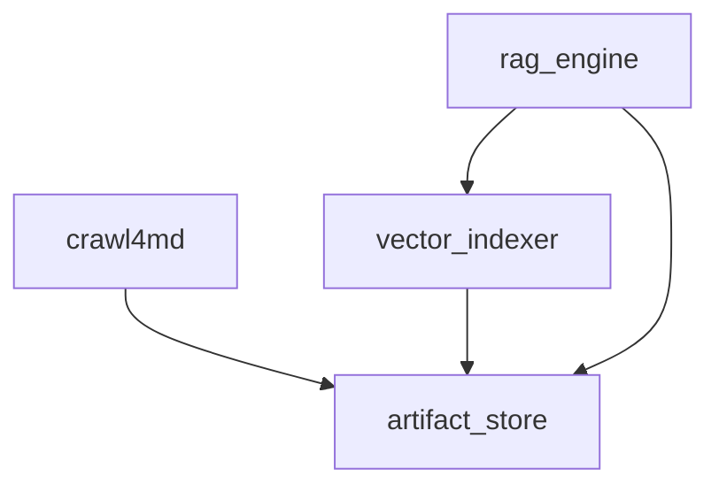

# rag-playground

[](https://codespaces.new/prakosd/rag-playground)
[](https://rag-playground-prakosd.streamlit.app/)

> **Live demo:** a hosted instance runs on Streamlit Community Cloud at **<https://rag-playground-prakosd.streamlit.app/>** — crawl a small site, build an index, and try Steps 3–5 right in the browser (the offline echo model answers when no cloud credentials are configured).

A practical RAG playground that bundles five independent Python libraries plus a browser-based Streamlit app. **Step 1** crawls websites into clean Markdown (wrapping [Crawl4AI](https://github.com/unclecode/crawl4ai) with a synchronous Python API that also works in Jupyter) and **Step 2** builds a searchable vector index from those outputs. **Steps 3–5** add semantic search, single-turn RAG Q&A, and conversational (history-aware) RAG over those indexes — all runnable offline with a built-in echo model when no cloud credentials are set.

**Naming:** the pip **distribution** is `rag-playground`. The **import packages** are unchanged — `import crawl4md`, `import vector_indexer`, `import rag_engine`, `import artifact_store`, `import log4py` (and `app_support` for the app). Installing `rag-playground` does not create an `import rag_playground`; you import the individual libraries you need.

## What's inside

| Package | Role |
|---|---|
| [`crawl4md`](src/crawl4md/README.md) | Core crawling library — crawl, extract, sort, write Markdown |
| [`log4py`](src/log4py/README.md) | Logging base layer — zero-dependency `get_logger`/`configure_logging` (pure stdlib) |
| [`artifact_store`](src/artifact_store/README.md) | Shared foundation — naming, path safety, archives, crawl-result discovery (pure stdlib) |
| [`vector_indexer`](src/vector_indexer/README.md) | UI-independent chunking + embedding + vector store (LangChain embeddings + langchain-chroma) |
| [`rag_engine`](src/rag_engine/README.md) | UI-independent retrieval + RAG — semantic search, QA, and conversational answers (LangChain chat models, offline echo fallback) |
| [`apps/streamlit`](apps/streamlit/README.md) | Browser UI adapter for non-technical users (Steps 1–5 implemented) |

The libraries are UI-independent and enforced separate by boundary tests; the Streamlit app is a reference adapter over them.

## Features

- **Synchronous API** — no `async`/`await`; works seamlessly in Jupyter Notebooks
- **PDF support** — detects and extracts PDF URLs via pymupdf4llm; scanned PDFs via OCR (requires [Tesseract](https://github.com/tesseract-ocr/tesseract))
- **Word (.docx) support** — detects and extracts `.docx` URLs via mammoth, converting them to Markdown alongside crawled pages (legacy `.doc` is not supported)
- **Smart content extraction** — trafilatura with markdownify fallback, plus supplementary recovery for FAQs, accordions, and product metadata
- **WAF / bot-detection handling** — two-stage detection with automatic retry rounds and cooldown (round 1 uses the standard stealth browser; retries escalate to Crawl4AI's undetected browser), plus opt-in escalation: direct-first proxy rotation and a last-resort scraping-API fallback, each used at most once per crawl and logged to `logs/network_usage.csv` for cost tracking (see [Configuration](docs/CONFIGURATION.md))
- **Size-limited, sorted output** — pages are never split across files; final files are sorted by URL path
- **Real-time progress** — browser charts in Streamlit, spider widget in Jupyter, plain-text ETA in terminal
- **Stop-safe output** — stopping a crawl still writes final output for completed pages
- **Vector indexing (Step 2)** — index `.md` / `.txt` / `.zip` outputs into a langchain-chroma (ChromaDB) vector store with configurable chunking and embedding backends (Amazon Titan, OpenAI, or an offline default); crawl run metadata is dropped and every chunk is stamped with its page `Source: [title](url)`
- **RAG Q&A (Steps 3–4)** — semantic search plus a Basic RAG Q&A page that retrieves knowledge, builds an editable, grounded prompt, and streams a language-model answer with token/latency stats
- **Conversational RAG (Step 5)** — history-aware chat that rewrites each follow-up before retrieving, keeping in-session memory
- **LangChain backends** — embeddings, vector store, and chat models are wrapped with LangChain; an offline echo model lets RAG run with no cloud credentials

## Set up local development

These steps install **all four libraries** (`artifact_store`, `crawl4md`, `vector_indexer`, `rag_engine`) and the **Streamlit app** so you can work on everything.

### 1. Prerequisites

- **Python 3.10+** (3.12 recommended).
- **Tesseract OCR** — only needed to read scanned/image PDFs while crawling:
  - macOS: `brew install tesseract tesseract-lang`
  - Debian/Ubuntu: `sudo apt-get install -y tesseract-ocr tesseract-ocr-eng tesseract-ocr-msa`
  - Windows: see the [Tesseract project](https://github.com/tesseract-ocr/tesseract).

### 2. Clone and create a virtual environment

```bash
git clone https://github.com/prakosd/rag-playground.git
cd rag-playground
python -m venv .venv
source .venv/bin/activate          # Windows: .venv\Scripts\activate
pip install --upgrade pip
```

### 3. Install everything (editable)

```bash
pip install -e ".[dev,all]" -e "apps/streamlit[dev]"
```

- `[dev]` adds the test/lint tools (pytest, ruff); `[all]` pulls every library and backend (`crawl`, `vector`, `bedrock`, `openai`, `rag`).
- The app package depends on `rag-playground[crawl,vector,bedrock,openai,rag]`, so installing it alongside the root package wires the libraries together.

### 4. Finish the crawler setup

The crawler drives a real browser, so run this once after the pip step:

```bash
playwright install --with-deps chromium
crawl4ai-setup
```

### 5. Run the Streamlit app

```bash
python -m streamlit run apps/streamlit/streamlit_app.py
```

Open `http://localhost:8501`. Step 1 crawls a site; Step 2 turns the results into a vector index; Steps 3–5 run semantic search, RAG Q&A, and conversational RAG over it. Outputs are saved under `outputs/streamlit_sessions/`.

> Run from the repo root so the app picks up `apps/streamlit/.streamlit/config.toml`.

### 6. Run the tests

```bash
pytest                      # core library tests (root)
pytest apps/streamlit/tests # Streamlit app tests
ruff check .                # lint
```

**Prefer not to install anything?** Open the repo in GitHub Codespaces (badge above) or VS Code Dev Containers — the container installs all of the above and auto-starts the app at `http://localhost:8501`. See [docs/INSTALLATION.md](docs/INSTALLATION.md). Or open `notebooks/crawl4md.ipynb` for the notebook workflow.

## Use the libraries without Streamlit

The libraries are UI-independent — install only the component you need and drive it from your own frontend (React, Vue, PHP, a CLI, an API server, …). Each library returns plain Python result objects and emits structured progress / warning / error **events** (stable codes + data, with no UI strings baked in), so any UI can render them in its own language. See [docs/BUILDING_ANOTHER_UI.md](docs/BUILDING_ANOTHER_UI.md).

### Atomic installs — pull only what you use

The base install has **zero third-party dependencies** (`artifact_store` is pure standard library). Everything else is an opt-in extra, so you never download the crawler's browser stack just to build a vector index:

| You want… | Install (from a clone) | Pulls Crawl4AI + browser? |
|---|---|---|
| Shared helpers (`artifact_store`) only | `pip install -e .` | No |
| Crawl websites → Markdown (`crawl4md`) | `pip install -e ".[crawl]"` | Yes |
| Vector index, offline embeddings (`vector_indexer`, langchain-chroma) | `pip install -e ".[vector]"` | **No** |
| Vector index + Amazon Titan embeddings (langchain-aws) | `pip install -e ".[vector,bedrock]"` | No |
| Vector index + OpenAI embeddings (langchain-openai) | `pip install -e ".[vector,openai]"` | No |
| RAG Q&A / chat with the offline echo model (`rag_engine`) | `pip install -e ".[vector,rag]"` | No |
| Everything | `pip install -e ".[all]"` | Yes |

The `bedrock` and `openai` extras now serve both embeddings **and** cloud chat models (via `langchain-aws` / `langchain-openai`); add them alongside `[vector,rag]` to use real LLMs instead of the offline echo model.

Not yet on PyPI — install from a local clone (above) or straight from GitHub, e.g.:

```bash
pip install "rag-playground[vector] @ git+https://github.com/prakosd/rag-playground.git"
```

Import the library names, not the distribution name — e.g. after installing `[vector]` you `from vector_indexer import VectorIndexer`.

### How the packages depend on each other



`artifact_store` is the shared, pure-stdlib foundation. **`crawl4md`, `vector_indexer`, and `rag_engine` all require it** (it always ships in the base install). `crawl4md` and `vector_indexer` never depend on each other — so you can install one without the other — while `rag_engine` builds on `vector_indexer` to read the indexes it queries. There is no separate `pip install artifact_store`; it comes with the `rag-playground` distribution automatically.

### Library quick start

```python
from crawl4md import SiteCrawler, CrawlerConfig, PageConfig

config = CrawlerConfig(urls=["https://example.com"], limit=20, max_depth=2)
crawler = SiteCrawler(config, PageConfig())
results = crawler.crawl()
crawler.print_summary(results)  # timestamped folder; primary: final/sorted_success_content_*.md
```

For step-by-step control, use `ContentExtractor`, `ContentSorter`, and `FileWriter` individually (see [src/crawl4md/README.md](src/crawl4md/README.md)). To index the results, see [src/vector_indexer/README.md](src/vector_indexer/README.md).

## Documentation

| Topic | Doc |
|---|---|
| Install & environments | [docs/INSTALLATION.md](docs/INSTALLATION.md) |
| Configuration & output reference | [docs/CONFIGURATION.md](docs/CONFIGURATION.md) |
| Architecture & data flow | [docs/ARCHITECTURE.md](docs/ARCHITECTURE.md) |
| Development (tests, lint, conventions) | [docs/DEVELOPMENT.md](docs/DEVELOPMENT.md) |
| Building another UI over the libraries | [docs/BUILDING_ANOTHER_UI.md](docs/BUILDING_ANOTHER_UI.md) |
| Core crawler | [src/crawl4md/README.md](src/crawl4md/README.md) |
| Shared foundation | [src/artifact_store/README.md](src/artifact_store/README.md) |
| Vector indexer | [src/vector_indexer/README.md](src/vector_indexer/README.md) |
| RAG engine | [src/rag_engine/README.md](src/rag_engine/README.md) |
| Streamlit app | [apps/streamlit/README.md](apps/streamlit/README.md) |

## Acknowledgements

[](https://github.com/unclecode/crawl4ai)

Step 1 crawling is powered by [Crawl4AI](https://github.com/unclecode/crawl4ai), an
open-source LLM-friendly web crawler and scraper by UncleCode, licensed under the
[Apache License 2.0](https://github.com/unclecode/crawl4ai/blob/main/LICENSE).

Three.js agent skill files (`.agents/skills/threejs-*`) are sourced from
[CloudAI-X/threejs-skills](https://github.com/CloudAI-X/threejs-skills) (MIT),
installed via [skills.sh](https://www.skills.sh/). These skill files provide the
AI coding agent with accurate Three.js API references, working code examples, and
performance guidance for building 3D and interactive experiences.

If you use this project in research, please also cite Crawl4AI:

```bibtex
@software{crawl4ai2024,
  author = {UncleCode},
  title = {Crawl4AI: Open-source LLM Friendly Web Crawler & Scraper},
  year = {2024},
  publisher = {GitHub},
  journal = {GitHub Repository},
  howpublished = {\url{https://github.com/unclecode/crawl4ai}}
}
```

> UncleCode. (2024). *Crawl4AI: Open-source LLM Friendly Web Crawler & Scraper*
> [Computer software]. GitHub. https://github.com/unclecode/crawl4ai

## License

MIT
