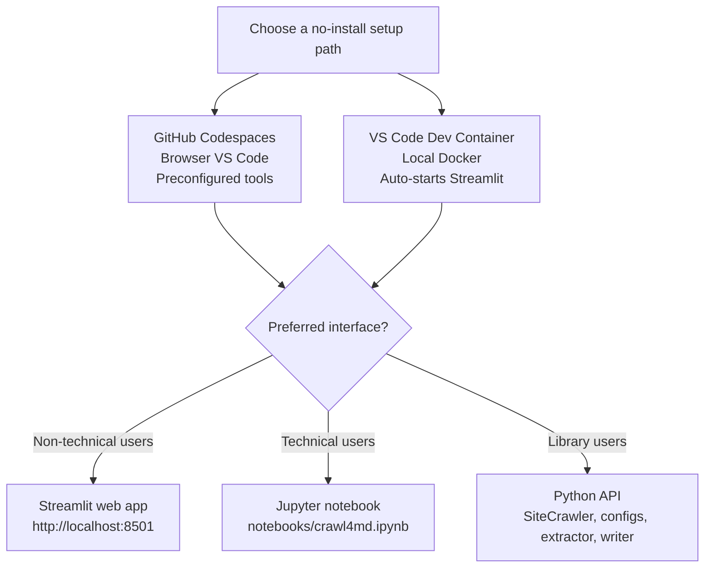
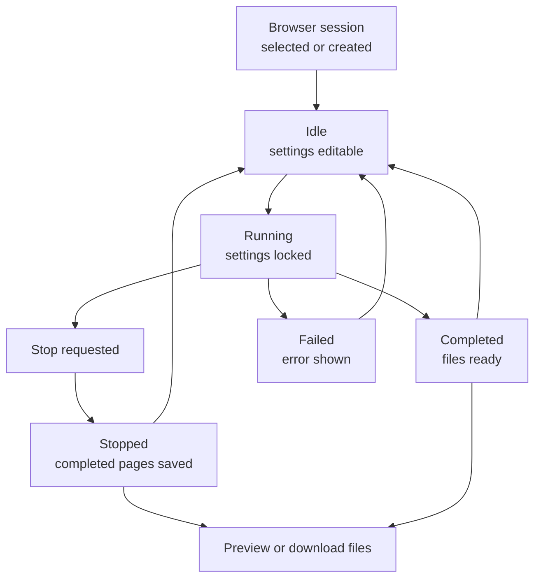
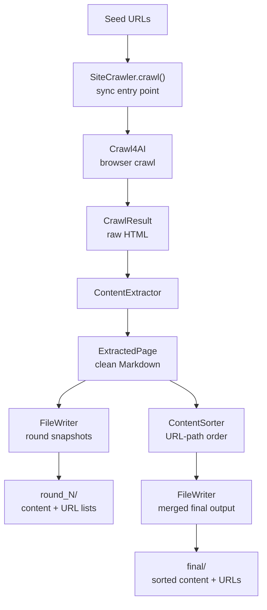
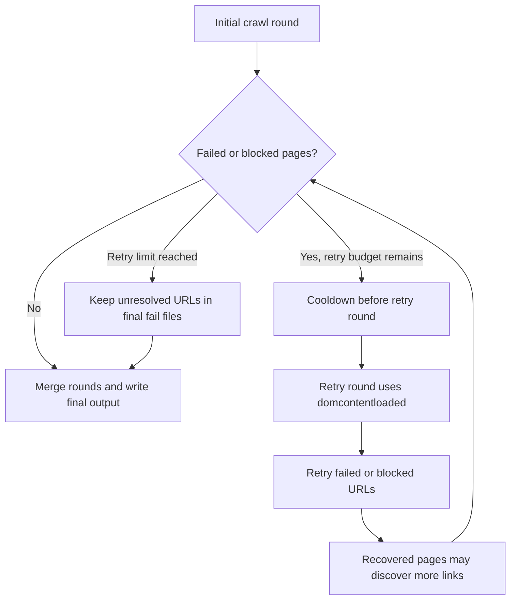
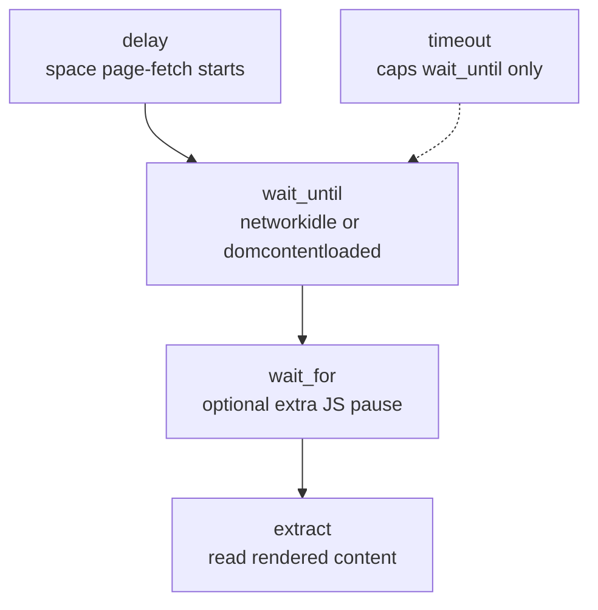
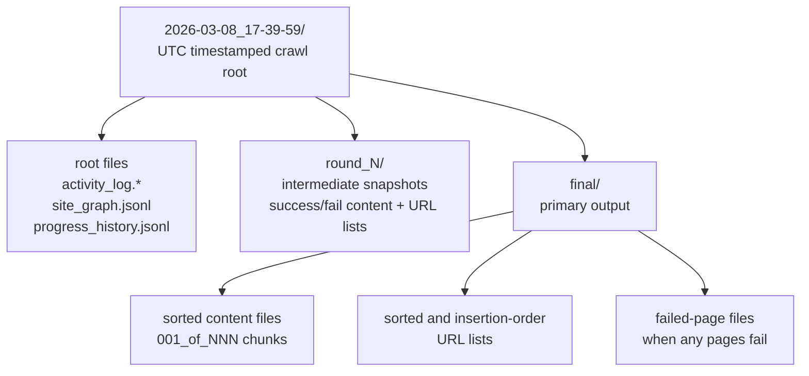
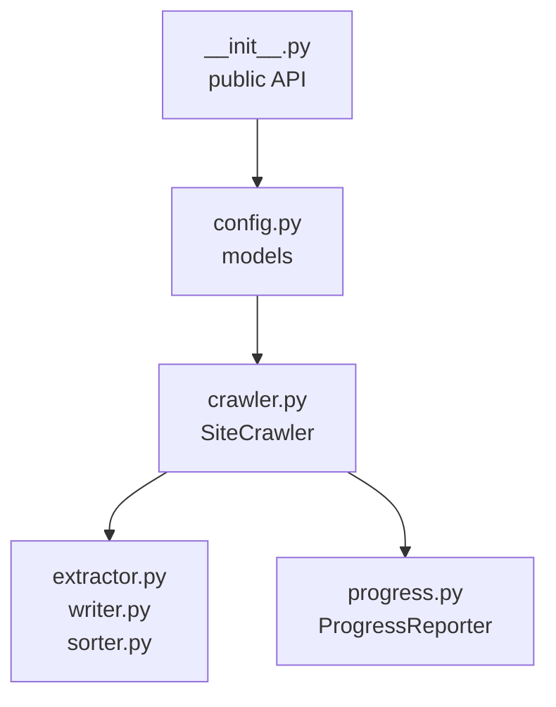
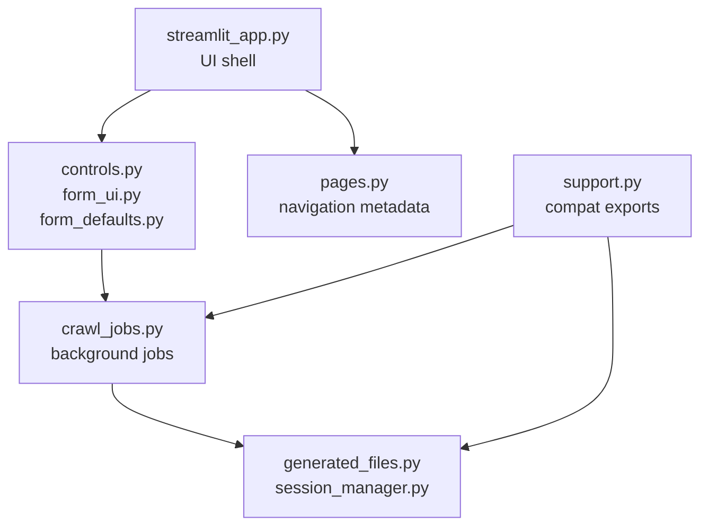
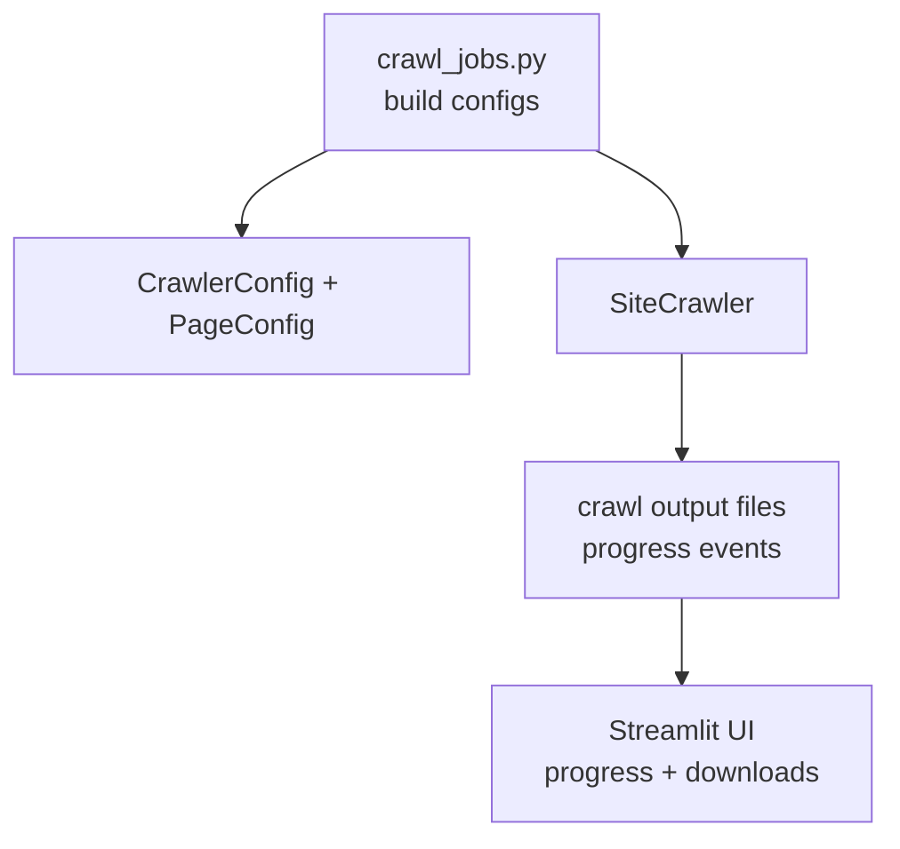

# crawl4md

[](https://codespaces.new/prakosd/rag-playground)

A Python library for crawling websites and extracting their content as Markdown-formatted text files. Wraps [Crawl4AI](https://github.com/unclecode/crawl4ai) with a synchronous Python API, a technical-user Jupyter Notebook, and a browser-based Streamlit app for non-technical users.

This repository is evolving into a practical RAG playground: crawl websites into clean Markdown now, then extend those outputs into vector embeddings, semantic search, RAG question answering, and conversational RAG experiments.

**Repo rename note:** the public GitHub repository is moving to `prakosd/rag-playground`. The Python package, imports, notebook name, and Streamlit helper package remain `crawl4md` / `crawl4md_streamlit` in this phase.

## Features

- **Synchronous API** — no `async`/`await` needed; works seamlessly in Jupyter Notebooks
- **PDF support** — automatically detects and extracts content from PDF URLs (via URL extension or Content-Type fallback), converting them to Markdown using pymupdf4llm. Scanned/image-only PDFs are handled via OCR (requires [Tesseract](https://github.com/tesseract-ocr/tesseract) installed on the system).
- **Smart content extraction** — trafilatura for main content (with automatic fallback to markdownify when coverage is below 15%), plus supplementary section recovery for FAQs, accordions, and product metadata
- **WAF / bot-detection handling** — two-stage detection (HTML block signatures + post-extraction content-length check) with automatic retry rounds and cooldown between rounds
- **Size-limited output files** — pages are never split across files; oversized pages get their own file
- **Real-time progress** — browser progress in Streamlit (including cumulative and pages/second line charts), animated spider progress widget in Jupyter, and plain-text ETA in terminal
- **Stop-safe output** — stopping a Streamlit crawl still writes the final output folder for pages completed so far
- **Configurable filtering** — include/exclude URL paths and HTML tags via regex
- **Structured item grouping** — auto-detects repeated elements (product cards, plan blocks) via DOM analysis and inserts `---` separators; supports custom CSS selectors
- **Markdown validation** — every extracted page is auto-fixed via mdformat (with GFM support) to ensure structurally correct, renderable Markdown; a content-preservation guard prevents any words, numbers, or punctuation from being lost
- **Sorted output** — final files are sorted by URL path for natural reading order

## Run Without Installing Anything

The easiest way to use crawl4md is via a pre-configured environment — no Python, Chromium, or Tesseract setup required.



**GitHub Codespaces (browser, zero local install)**
Click the badge above. GitHub spins up a fully configured VS Code environment in your browser. Free tier: 120 core-hours/month.

**VS Code Dev Container (local Docker)**
1. Install [Docker Desktop](https://www.docker.com/products/docker-desktop/) and the [Dev Containers](https://marketplace.visualstudio.com/items?itemName=ms-vscode-remote.remote-containers) VS Code extension.
2. Open this folder in VS Code.
3. Click **Reopen in Container** in the notification, or run `Cmd/Ctrl+Shift+P` → **Dev Containers: Reopen in Container**.
4. First start takes ~5 minutes (pulls base image, installs Tesseract, Chromium, and Python packages). Subsequent opens are fast.
5. For non-technical users, open the Streamlit web app at `http://localhost:8501`; it starts automatically when VS Code attaches to the container. Technical users can also open `notebooks/crawl4md.ipynb`, select the in-container Python 3.12 kernel, and run the cells.

## Streamlit Web App

A browser-based UI is included as a separate app package for non-technical users who prefer not to use a Jupyter Notebook. The app imports the `crawl4md` library just like any external Python app would, provides the normal crawl settings as a form, runs the crawl in the background, and lets users download the generated files from the browser. It also includes the first navigation pass for the crawl-to-RAG workflow: Step 1 is the existing crawler, while Steps 2-5 are placeholder workspaces for vector indexing, semantic search, single-turn RAG Q&A, and conversational RAG. Each workflow step now has a dedicated page module under `apps/streamlit/app_pages/`, while `streamlit_app.py` keeps the shared shell.

**Start the app:**

```bash
pip install -e . -e "apps/streamlit"
cd apps/streamlit && streamlit run
```

The app config lives in `apps/streamlit/.streamlit/config.toml` and sets `0.0.0.0:8501` when running from that directory. The explicit equivalent (from the repo root) is `python -m streamlit run apps/streamlit/streamlit_app.py --server.address=0.0.0.0 --server.port=8501`.

Then open `http://localhost:8501` in your browser.

When using the Dev Container or GitHub Codespaces, the app starts automatically on attach — no manual command needed.

**What it does:**



- Fill in the crawl URL, page limit, depth, parallel fetches, and optional filters via a form
- Click **Start** to run the crawl in the background
- While a crawl is running, settings are locked and the action changes to **Stop**
- Click **Stop** to request a cooperative stop; crawl4md writes final files for pages completed so far
- Start again after stopping to begin a fresh crawl from the form settings
- Reuse the newest browser session automatically, switch to older sessions from the searchable session selector, or create a new session manually; use **Load Session** (📁) to restore a session from another browser or device by pasting its session ID
- Watch live progress (pages crawled, estimated completion, active/next URL previews when parallel fetches are running, cumulative counters over time, and pages/second)
- Preview common text-based generated files and download files directly from the browser
- Move through the RAG workflow navigation while keeping the same page shell, session controls, language selector, footer, and crawl progress toasts; placeholder pages change only the page-specific work area until backend RAG features are implemented

Output files are saved under `outputs/streamlit_sessions/` (one subfolder per browser session and crawl run). The browser stores known session IDs and creation times in local storage so later page loads can select the newest existing session instead of creating a new one. Stopped crawls keep their generated files in that crawl folder, but no crawl state is kept for continuing later.

Development guidance in this repository uses external agent skills:

- Streamlit app: [Developing with Streamlit](https://skills.sh/streamlit/agent-skills/developing-with-streamlit)
- Async Python patterns: [async-python-patterns](https://www.skills.sh/wshobson/agents/async-python-patterns)
- crawl4md library performance: [python-performance-optimization](https://www.skills.sh/wshobson/agents/python-performance-optimization)
- Python design patterns: [python-design-patterns](https://www.skills.sh/wshobson/agents/python-design-patterns)
- Python testing patterns: [python-testing-patterns](https://www.skills.sh/wshobson/agents/python-testing-patterns)
- Python project structure: [python-project-structure](https://www.skills.sh/wshobson/agents/python-project-structure)

## Building Another UI

The bundled Streamlit app is a reference adapter over the `crawl4md` library, not a required runtime. Another UI stack such as React can reproduce the same crawl behavior and generated files by calling `crawl4md` from a Python backend or worker and letting the library keep ownership of crawling, extraction, file writing, final output generation, and YAML front matter.

To match the bundled app's behavior, build `CrawlerConfig` and `PageConfig`, create a `ContentExtractor` and `FileWriter` from that page config, then run `SiteCrawler` with the same optional integration hooks the Streamlit adapter uses: `output_base`, `session_id`, `progress_callback`, and `should_cancel`. Your UI can render progress from the emitted events and serve the generated files afterward, but it should not reimplement the crawl pipeline or output writer if you want the same result structure.

`SiteCrawler` also writes `progress_history.jsonl` in each crawl root as a chart-ready cumulative timeline (page limit, discovered pages, successful pages, failed pages, processed pages, elapsed seconds). UIs can read this file to restore chart history after page reloads.

Example adapter setup:

```python
from crawl4md import CrawlerConfig, PageConfig, SiteCrawler
from crawl4md.extractor import ContentExtractor
from crawl4md.writer import FileWriter

crawler_config = CrawlerConfig(urls=["https://example.com"], limit=20, max_depth=2)
page_config = PageConfig(output_extension=".md")

extractor = ContentExtractor(page_config)
writer = FileWriter(
  max_file_size_mb=page_config.max_file_size_mb,
  file_extension=page_config.output_extension,
)

crawler = SiteCrawler(
  crawler_config,
  page_config,
  output_base="outputs/my_ui/session_123/crawl_001",
  session_id="session_123",
  extractor=extractor,
  writer=writer,
  progress_callback=lambda event: print(event),
  should_cancel=lambda: False,
)

results = crawler.crawl()
```

`crawl4md` is still a Python library, so a browser-only frontend cannot run it directly. A different frontend stack needs a Python service, worker, or desktop shell to call the library.

## Installation

```bash
pip install -e .
crawl4ai-setup                         # one-time browser setup
playwright install --with-deps chromium # install Chromium for JS rendering
```

Requires Python 3.10+.

For library development, install the core development tools:

```bash
pip install -e ".[dev]"
```

For the bundled Streamlit app, install the app package too:

```bash
pip install -e ".[dev]" -e "apps/streamlit[dev]"
```

> **Warning — Python 3.14 users (discovered 2026-04-20):**
> `crawl4ai==0.8.6` pins `lxml~=5.3`, but no `lxml` 5.x pre-built wheel exists for Python 3.14.
> pip will try to compile lxml from source and fail with:
> `error: Microsoft Visual C++ 14.0 or greater is required.`
>
> **Recommended fix:** use Python 3.12 or 3.13, where lxml 5.x wheels are available.
>
> **Workaround if you must use Python 3.14:**
> ```bash
> pip install -e . --no-deps
> pip install --only-binary lxml crawl4ai trafilatura markdownify pydantic nest-asyncio "chardet<6,>=5.2.0" beautifulsoup4 mdformat mdformat-gfm pymupdf4llm httpx --no-deps
> # then install the remaining transitive deps via pip as needed
> ```
> lxml 6.x (already available for 3.14) is API-compatible and works at runtime despite the version conflict warning.

## Quick Start

```python
from crawl4md import SiteCrawler, CrawlerConfig, PageConfig

config = CrawlerConfig(urls=["https://example.com"], limit=20, max_depth=2)
page_config = PageConfig()

crawler = SiteCrawler(config, page_config)
results = crawler.crawl()

# Print a summary of results and output file locations
crawler.print_summary(results)
```

`SiteCrawler` handles crawling, extraction, and file writing automatically. Output is saved to a timestamped folder (e.g. `2026-03-07_14-01-02/`) in the current directory.

For step-by-step control, use the components individually:

```python
from crawl4md import ContentExtractor, ContentSorter, FileWriter

extractor = ContentExtractor(page_config)
pages = extractor.extract(results)

sorter = ContentSorter()
pages = sorter.sort(pages)

writer = FileWriter()
writer.write(pages, crawler.output_dir, page_config.max_file_size_mb)
```

## How It Works



1. **Crawl** — seed URLs are crawled with link discovery up to `max_depth`. Discovered links are queued up to `limit`.
2. **Retry** — failed/blocked pages are retried in subsequent rounds (up to `max_retries`), with a 30-second cooldown between rounds. Retry rounds automatically downgrade `wait_until` to `domcontentloaded` to avoid repeated timeouts. Link discovery continues in retry rounds — pages that recover on retry have their links discovered and crawled (respecting `max_depth` and `limit`).
3. **Extract** — HTML is converted to Markdown via trafilatura or markdownify, then cleaned through a 7-step post-processing pipeline.
4. **Write** — pages are written to numbered, size-limited files. Per-round files are produced during crawl; final merged and sorted files are written after all rounds complete.

The RAG expansion will build on those final `.md` / `.txt` outputs instead of changing the crawl pipeline. The planned backend flow is: select generated files or ZIP archives, chunk the text, generate embeddings, persist vectors in a local vector database such as ChromaDB, run semantic search, then use retrieved context for single-turn and conversational RAG. The Streamlit app currently exposes those later steps as placeholders so navigation can be validated before new backend dependencies are added.



## Configuration

### CrawlerConfig

| Parameter | Type | Default | Description |
|---|---|---|---|
| `urls` | `list[str]` | *(required)* | Seed URLs to crawl (comma-separated string also accepted) |
| `limit` | `int` | `1` | Maximum pages to crawl |
| `max_depth` | `int` | `1` | How many clicks deep to follow links |
| `max_concurrent` | `int` | `5` | Maximum simultaneous page fetches among URLs already discovered in the initial crawl. `5` is the default and can speed permissive sites; use `1` for strict or easily rate-limited sites. `delay` still spaces request starts. Retry rounds remain serial for WAF safety. |
| `exclude_paths` | `list[str]` | `[]` | Regex patterns for URLs to skip |
| `include_only_paths` | `list[str]` | `[]` | Regex patterns for URLs to keep (skip everything else) |
| `delay` | `float` | `0` | Seconds to space page-fetch starts — paces your crawl to avoid triggering bot detection (round 1: jitter 0.1x–1.0x; retries: jitter 0.3x–3.0x). WAF back-off (3–15 s) always applies on block detection. |
| `stealth` | `bool` | `True` | Enable bot-detection avoidance (random UA, stealth flags, full-page scan) |
| `headers` | `dict[str, str]` | `{}` | Custom HTTP headers passed to the browser |
| `max_retries` | `int` | `2` | Retry rounds for WAF-blocked pages (minimum 2) |
| `flush_interval` | `int` | `10` | Write generated files to disk every N pages |

### PageConfig

| Parameter | Type | Default | Description |
|---|---|---|---|
| `extract_main_content` | `bool` | `True` | `True` = trafilatura (main content only), `False` = markdownify (full HTML) |
| `exclude_tags` | `list[str]` | `["nav", "script", "form", "style"]` | HTML tags to remove before extraction |
| `include_only_tags` | `list[str]` | `[]` | Keep only these HTML tags (mutually exclusive with `exclude_tags`) |
| `wait_until` | `str` | `"networkidle"` | When to consider a page loaded. `"networkidle"` waits until network traffic stops (thorough, good for JS-heavy sites). `"domcontentloaded"` returns as soon as the HTML is parsed (faster, good for simple/static sites). Capped by `timeout`. Retry rounds automatically downgrade to `"domcontentloaded"` to avoid repeated timeouts. |
| `wait_for` | `float \| None` | `None` | Extra delay (seconds) **after** `wait_until` completes, before extracting content — gives slow JavaScript time to finish rendering. Runs on top of `wait_until`, not instead of it. |
| `timeout` | `float` | `30` | Hard limit (seconds) for the page load phase — if `wait_until` hasn't resolved within this time, the page is treated as loaded anyway. Does not include `wait_for`. |
| `max_file_size_mb` | `float` | `15.0` | Max size per output file in MB |
| `output_extension` | `".txt" \| ".md"` | `".txt"` | Output file format |
| `separate_items` | `bool` | `True` | Insert `---` separators between repeated items (e.g. product cards) |
| `item_selector` | `str` | `""` | CSS selector for items; empty = auto-detect |
| `js_code` | `list[str]` | `[]` | JavaScript snippets to execute before extraction (e.g. expand collapsibles) |
| `scan_full_page` | `bool` | `True` | Scroll through the full page before extraction (helps bypass lazy-load WAFs) |
| `scroll_delay` | `float` | `0.4` | Seconds to pause between scroll steps (used when `scan_full_page` is on) |
| `ocr_languages` | `list[str]` | `["eng", "msa"]` | Tesseract language codes for PDF OCR (e.g. `["eng", "fra"]`). Empty list disables OCR. Requires Tesseract installed. |
| `flatten_shadow_dom` | `bool` | `True` | Flatten Shadow DOM into the light DOM before extraction — helps discover links and content on sites using Web Components. |

### Page Timing

The timing parameters control different phases of each page crawl:



- **`delay`** (CrawlerConfig) — pause between page-fetch starts. Controls crawl speed to avoid bot detection. When `max_concurrent` is above `1`, slow pages may overlap, but new requests are still spaced by the delay.
- **`wait_until`** (PageConfig) — determines *when* a page is considered loaded. `"networkidle"` waits until all network requests finish (~500 ms of silence), which is thorough but can hang on analytics-heavy sites. `"domcontentloaded"` returns as soon as the HTML is parsed, which is faster but may miss JS-rendered content. On retry rounds, `wait_until` is automatically downgraded to `"domcontentloaded"` to avoid repeated timeouts.
- **`wait_for`** (PageConfig) — extra pause *after* `wait_until` completes. Use this when content appears slightly after the page load event (e.g., delayed AJAX calls). Runs on top of `wait_until`, not instead of it.
- **`timeout`** (PageConfig) — hard limit on the `wait_until` phase. If the load condition hasn't been met within this time, the page is treated as loaded anyway and extraction proceeds.

## Output Structure

Each crawl creates a UTC timestamped folder. Per-round subdirectories hold intermediate snapshots; the `final/` folder holds the primary output.



### Intermediate file cleanup

By default (`_CLEANUP_INTERMEDIATE_FILES = True` in `src/crawl4md/_internal/final_output.py`),
three categories of intermediate files are automatically removed once the final sorted output is written:

| Removed | Why |
|---------|-----|
| `round_N/success_pages.jsonl`, `round_N/fail_pages.jsonl` | JSONL sidecar files used during the crawl to keep memory usage low. No longer needed once sorted files exist. |
| `final/success_content_*.md`, `final/fail_content_*.md` | Unsorted merged content — superseded by `final/sorted_*` which contains the same pages in a better order. |
| `round_N/sorted_*` | Per-round sorted snapshots — superseded by the final merged sorted output. |

To keep every intermediate file on disk (useful for debugging), set:

```python
# src/crawl4md/_internal/final_output.py
_CLEANUP_INTERMEDIATE_FILES = False
```

Every generated content file (`*_content_*.txt` / `*_content_*.md`) starts with YAML front matter metadata.

Example:

```yaml
---
crawl_start_datetime: "2026-05-12T13:19:38+00:00"
session_id: "session_winter_apple"
stored_directory: "outputs\\streamlit_sessions\\session_winter_apple\\crawl_01_boulder\\2026-05-12_13-19-38\\round_1"
crawl_parameters:
  crawler_config:
    urls:
      - "https://www.ato.gov.au/"
    exclude_paths:
      - "ato.gov.au/api/"
    include_only_paths:
      - "ato.gov.au"
    limit: 2000
    max_depth: 5
    max_concurrent: 5
    flush_interval: 1
    delay: 3.0
    stealth: true
    strip_www: false
    headers: {}
    max_retries: 5
  page_config:
    exclude_tags:
      - "nav"
      - "script"
      - "form"
      - "style"
    include_only_tags: []
    wait_until: "networkidle"
    wait_for: 3.0
    timeout: 60.0
    max_file_size_mb: 10.0
    extract_main_content: true
    output_extension: ".md"
    separate_items: true
    item_selector: ""
    js_code: []
    scan_full_page: true
    scroll_delay: 0.4
    ocr_languages:
      - "eng"
      - "msa"
    absolute_links: true
    flatten_shadow_dom: true
status: "success"
---
```

### What to look at first

A crawl writes many files. Here is where to start.

**Primary output:** `final/sorted_success_content_001_of_NNN.md`. When a single file would exceed `max_file_size_mb`, content splits into `001_of_003`, `002_of_003`, `003_of_003`, … files. This contains all successfully extracted pages, merged across every retry round and sorted by URL path.

| I want… | File |
|---------|------|
| Extracted site content | `final/sorted_success_content_*.md` |
| Succeeded URLs | `final/sorted_success_urls.txt` |
| Pages that never succeeded | `final/sorted_fail_content_*.md` |
| Failed URLs | `final/sorted_fail_urls.txt` |
| Full site map (status + depth) | `site_graph.jsonl` |
| Timestamped crawl diary | `activity_log.txt` / `activity_log.csv` |
| Chart-ready progress timeline | `progress_history.jsonl` |

**Why `round_N/` folders?** crawl4md retries failed pages in separate rounds (controlled by `max_retries`). Each round folder is an intermediate snapshot written during the crawl. The `final/` folder merges every round and is what you normally use. If `max_retries = 0`, only `round_1/` exists.

**`sorted_` prefix vs. no prefix in `final/`.** `sorted_success_content_*.md` is sorted by URL path; `success_urls.txt` (no prefix) keeps insertion order. Use the `sorted_` files for reading or post-processing.

**`001_of_003` chunk numbers.** `NNN_of_TOTAL` — file index and total count share the same total, so `001_of_003`, `002_of_003`, `003_of_003` are the three parts of a 3-file split. Concatenate them in order for the full output.

**YAML front matter** at the top of every content file records the crawl start time, session ID, and full crawl parameters. It covers the entire file, not individual pages within it.

## Notebook Usage

The Jupyter Notebook is still available for technical users who want to inspect or adjust the Python workflow step by step. Non-technical users should use the Streamlit app instead.

See `notebooks/crawl4md.ipynb` for a guided, step-by-step notebook. You can also run it directly in Google Colab:

[](https://colab.research.google.com/github/prakosd/rag-playground/blob/master/notebooks/crawl4md.ipynb)

## Architecture

The architecture is easiest to read in layers: the core package owns the crawl pipeline and
generated outputs, while the Streamlit package adapts those APIs for browser sessions,
background jobs, and downloads.

**Core library:**



**Streamlit adapter:**



**Adapter boundary:**



## Development

```bash
pip install -e ".[dev]" -e "apps/streamlit[dev]"
python -m pytest tests/ -q
python -m pytest apps/streamlit/tests/ -q
python -m ruff check src/ tests/
python -m ruff check apps/streamlit/streamlit_app.py apps/streamlit/app_pages/ apps/streamlit/src/ apps/streamlit/tests/
```

Core tests live in `tests/`. Streamlit app helper tests live in `apps/streamlit/tests/`.

Tests use mocked HTTP calls — no real network requests are made.

## License

MIT
