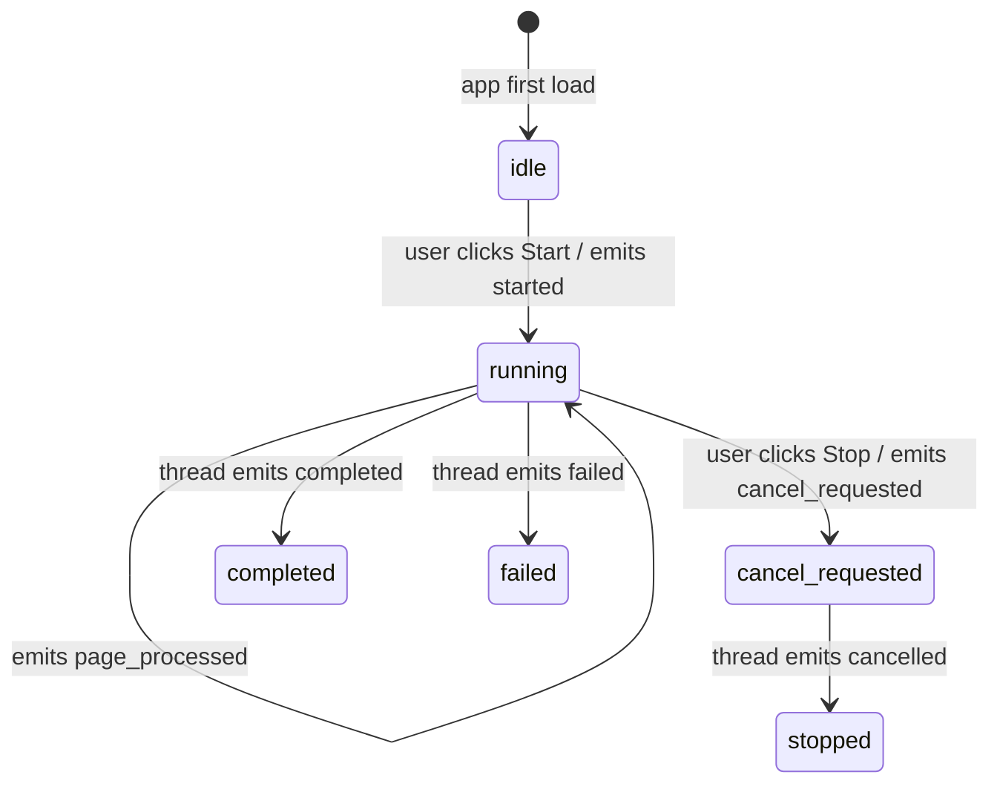
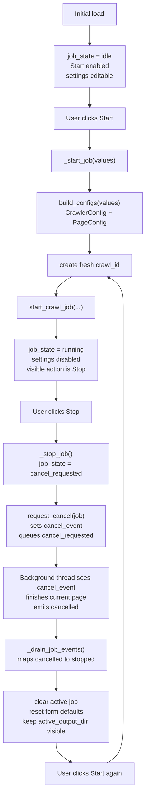
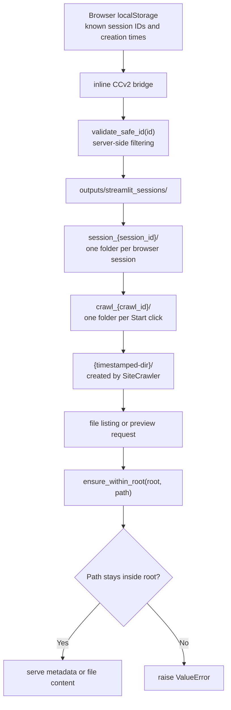
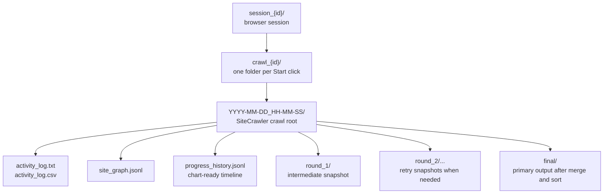
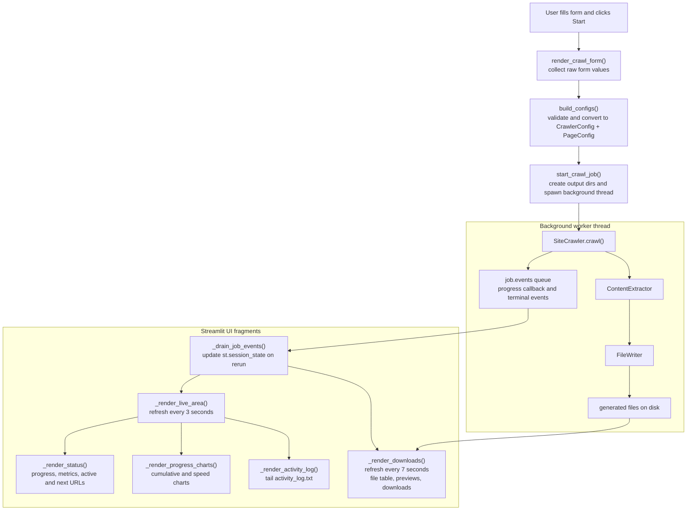

# Streamlit App — Developer Guide

A browser-based UI for the `crawl4md` library. Non-technical users fill in a form, click
**Start**, watch live progress, and download their Markdown files. This guide explains how
the code is organised, how the pieces connect, and where to look when extending or debugging.

---

## File Map

```mermaid
flowchart TD
  Root["apps/streamlit/"]
  Root --> App["streamlit_app.py<br/>UI entry point"]
  Root --> PackageConfig["pyproject.toml<br/>package definition and dependencies"]
  Root --> StreamlitConfig[".streamlit/config.toml<br/>server address and theme"]
  Root --> HelpersRoot["src/crawl4md_streamlit/"]
  Root --> TestsRoot["tests/"]

  subgraph Helpers["crawl4md_streamlit helper package"]
    Init["__init__.py<br/>installable package marker"]
    Controls["controls.py<br/>button definitions and state mapping"]
    CrawlJobs["crawl_jobs.py<br/>background jobs, config, progress"]
    FormDefaults["form_defaults.py<br/>default form payload"]
    FormUI["form_ui.py<br/>crawl settings form"]
    GeneratedFiles["generated_files.py<br/>output listing and previews"]
    SessionManager["session_manager.py<br/>safe IDs, records, paths, cleanup"]
    Support["support.py<br/>compatibility exports"]
  end

  subgraph Tests["Streamlit helper tests"]
    Smoke["test_app_smoke.py<br/>startup and preview CSS smoke coverage"]
    ControlsTest["test_controls.py<br/>button logic by crawl state"]
    DefaultsTest["test_form_defaults.py<br/>default form payload"]
    GeneratedTest["test_generated_files.py<br/>download-tree helpers"]
    ProgressChartTest["test_progress_chart.py<br/>chart helper behavior"]
    SupportTest["test_support.py<br/>jobs, paths, cleanup, progress"]
    FacadeTest["test_support_facade.py<br/>split helper exports"]
    BoundaryTest["test_streamlit_boundaries.py<br/>config and import boundaries"]
  end

  HelpersRoot --> Init
  HelpersRoot --> Controls
  HelpersRoot --> CrawlJobs
  HelpersRoot --> FormDefaults
  HelpersRoot --> FormUI
  HelpersRoot --> GeneratedFiles
  HelpersRoot --> SessionManager
  HelpersRoot --> Support
  TestsRoot --> Smoke
  TestsRoot --> ControlsTest
  TestsRoot --> DefaultsTest
  TestsRoot --> GeneratedTest
  TestsRoot --> ProgressChartTest
  TestsRoot --> SupportTest
  TestsRoot --> FacadeTest
  TestsRoot --> BoundaryTest
```



### Why a separate package?

`crawl4md_streamlit` (`src/crawl4md_streamlit/`) is installed as a proper Python package
(`pip install -e "apps/streamlit"`). This lets the helpers in `support.py`, `crawl_jobs.py`,
`form_defaults.py`, `generated_files.py`, `session_manager.py`, and `controls.py` be imported and unit-tested
independently of Streamlit — no Streamlit runtime needed in tests.
Streamlit imports are limited to UI modules such as `streamlit_app.py` and `form_ui.py`.

This package is a reference adapter over the core `crawl4md` library, not a second crawl engine.
The library owns crawling, extraction, file writing, sorted and final outputs, run metadata,
progress events, and cooperative cancellation hooks. The Streamlit package owns form rendering,
browser-session persistence, background thread orchestration, and generated-file presentation.
If a feature is UI-agnostic and needed by other frontends, add it to the core library instead of
reimplementing it here.

---

## Component Responsibilities

### `streamlit_app.py` — UI shell

Everything the user sees and interacts with. Responsibilities:

- Initialises `st.session_state` keys on first load (`_init_state`).
- Hydrates browser-local session records through the inline CCv2 localStorage bridge.
- Preserves portfolio-modal localStorage timestamps so the personal intro prompt is not shown too often.
- Renders the selected session ID, searchable session selector, create-session button, and language selector.
- Renders the settings form (`render_crawl_form`) and action buttons (delegated to `controls.py`).
- Translates button presses into job start / stop calls.
- Drains background-thread events every Streamlit rerun and maps them to UI state
  (`_drain_job_events`).
- Renders progress metrics, active/next URL previews, cumulative + speed line charts, and the
  activity log (`_render_live_area`, refreshed every 3 seconds via `@st.fragment(run_every="3s")`).
- Renders the selected session's generated-file table and a per-file download + preview tree separately
  (`_render_downloads`, refreshed every 7 seconds).
- Runs a one-time startup cleanup of old session folders (`_run_startup_cleanup`, cached with
  `@st.cache_resource`).
- Renders the global footer and browser-timed portfolio modal with translated copy.

### `controls.py` — button definitions

Pure logic; no Streamlit imports. `crawl_action_buttons(state, ...)` returns a tuple of
`CrawlActionButton` dataclasses describing which buttons to show, their labels, icons, and
disabled state. `streamlit_app.py` iterates the tuple and renders each one inside a
`st.form_submit_button`.

This separation makes it easy to unit-test state-machine transitions without needing a
Streamlit environment.

### `form_defaults.py` and `form_ui.py` — crawl settings

`form_defaults.py` is pure Python and owns the default crawl settings used when the form first
loads or resets after a terminal crawl state. That includes advanced crawler controls that map
directly into `CrawlerConfig`, such as the `max_concurrent` parallel fetch setting. `form_ui.py`
is a UI module: it imports Streamlit, renders the crawl settings form, and returns the submitted
values to `streamlit_app.py`.

`streamlit_app.py` still owns `st.session_state`; it passes the active strings, defaults, and
disabled state into `render_crawl_form()`.

### `support.py` — compatibility exports

No Streamlit imports. Keeps the existing `crawl4md_streamlit.support` import surface stable while
delegating implementation to smaller pure-Python modules:

| Group | Functions |
| --- | --- |
| **`session_manager.py`** | `SessionRecord`, ID generation, session serialization, safe paths, session cleanup |
| **`generated_files.py`** | `GeneratedFile`, `TextPreview`, output listing, download-tree building, activity-log lookup, text previews |
| **`crawl_jobs.py`** | `CrawlJob`, config building, progress estimates, crawl-thread lifecycle, event mapping |

New code can import from the focused module directly. Existing code may continue importing from
`support.py`.

---

## Event / State Lifecycle

Each crawl runs in a **background daemon thread**. The thread communicates with the UI through
a `queue.Queue[dict]` (the `CrawlJob.events` field). Events are drained on every Streamlit
rerun by `_drain_job_events`.



Full `job_state` values and the transitions that produce them:

| State | What triggered it |
| --- | --- |
| `idle` | App first load |
| `running` | User clicked **Start** |
| `cancel_requested` | User clicked **Stop** while running |
| `stopped` | Thread confirmed cancellation after a Stop request |
| `completed` | Thread finished all pages successfully |
| `failed` | Thread threw an unhandled exception |

Parallel crawl progress uses generic event fields from the core crawler. `active_url_count` and
`next_url_count` are authoritative counts; `active_urls` and `next_urls` are capped previews for
display. The app renders counts plus previews so any supported Parallel fetches value stays compact.
Activity logs record concurrent reads as batch entries such as `Reading page batch (5 concurrent)`.
Live charts are native Streamlit line charts rendered right before the Activity log panel:

- Cumulative counters over time: page limit, discovered pages, successful pages, failed pages
- Crawl speed over time: pages per second (derived from processed-page deltas)

For reload-safe chart history, the app prefers `progress_history.jsonl` written by the core crawler
and falls back to in-memory samples captured from live events when that file is not available yet.

---

## Start / Stop Sequence



Stop is cooperative: the worker is not force-killed. `SiteCrawler` owns sidecars and final
output regeneration so completed pages are still written into the final output folder. The
app does not persist crawl state and does not load any previous crawl when starting again.

---

## Session and Path Safety

Each browser stores known session IDs and UTC creation times in localStorage under a versioned
`crawl4md` key. The same payload also stores portfolio-modal `last shown` and `last dismissed`
UTC timestamps so the personal intro prompt can respect its repeat interval. The app reads those
records through a small inline `st.components.v2` bridge, validates session IDs server-side, and
selects the newest valid session on page load. If localStorage has no valid sessions, the server
creates one safe ID, sends it back to the bridge for storage, and selects it. Users can switch
sessions with the searchable `st.selectbox()` or create a new session with the adjacent button.

**Load Session dialog** — the 📁 button next to the session selector opens a modal dialog that
accepts a session ID typed or pasted by the user. This lets someone restore a session from
another browser, device, or after clearing browser cache. The dialog:

1. Validates the pasted ID against `^[a-z0-9_-]+$` — rejects empty or unsafe values.
2. Checks that `outputs/streamlit_sessions/session_<id>/` exists on the server.
3. If the session is already in the browser's records, shows a toast and switches to it without
   creating a duplicate.
4. If found but not yet local, registers the record in browser localStorage, then selects it.
5. Calls `touch_session()` to reset the session's mtime so the 7-day retention clock restarts.

The button is disabled while a crawl is running (`_STATE_RUNNING` / `_STATE_CANCEL_REQUESTED`)
to prevent switching sessions mid-job. Error messages are translated via the i18n catalog
(`DIALOG_LOAD_SESSION_INVALID_ID`, `DIALOG_LOAD_SESSION_NOT_FOUND`,
`DIALOG_LOAD_SESSION_ALREADY_LOADED`).

Session IDs use a readable format based on the EFF large wordlist. The pattern is controlled by
two constants in `session_manager.py`:

- `_READABLE_SESSION_WORD_COUNT` — number of EFF words per session ID (≥1)
- `_READABLE_ID_DIGITS` — digits appended after the words; `0` means words only

Examples: `2` words + `0` digits → `"boulder_river"` · `4` words + `6` digits →
`"stone_apple_river_oak_482917"` · `1` word + `2` digits → `"cedar_07"`.
Crawl IDs keep their timestamp prefix and append one readable word: `YYYYMMDD_HHMMSS_boulder`.
To revert to the legacy `token_urlsafe` IDs, set `_USE_READABLE_IDS = False`.
Wordlist provided by the Electronic Frontier Foundation (eff.org), licensed CC-BY 4.0.

All output lives inside:



`ensure_within_root(root, path)` is called before every file read or listing. It resolves
both paths and raises `ValueError` if `path` escapes `root`. This prevents path-traversal
attacks when any server-generated path is forwarded back into a file read. Browser-provided
session records are treated as untrusted input and filtered through `validate_safe_id()` before
they can affect any server-side path.

`validate_safe_id(id)` enforces that IDs only contain `[a-z0-9_-]` before they are
interpolated into directory names.

Session folders older than 7 days are removed by `cleanup_old_sessions_with_lock` after browser
session hydration (using a `.cleanup.lock` file so only one Streamlit worker runs the cleanup).
Session IDs known to the browser are passed as active IDs so the selector does not point to
folders removed during the same startup.

---

## Generated Files in the App

The files shown in the download tree are produced by the core `crawl4md` library — the app
presents them without transforming or filtering. For the full file reference (purposes, naming
conventions, and cleanup behavior), see [Output Structure](../../README.md#output-structure)
in the root README.

**Folder layout under `outputs/streamlit_sessions/`:**



**Why a new folder per Start click?** Each Start increments the crawl counter (`crawl_1`,
`crawl_2`, …) and `SiteCrawler` creates a fresh timestamped directory inside it. Previous
crawls keep their files and remain downloadable from the same session.

**Which files to open first:**

- `final/sorted_success_content_001_of_001.md` — the extracted content, sorted by URL path
- `final/sorted_success_urls.txt` — all URLs that succeeded
- `activity_log.csv` — timestamped crawl diary in spreadsheet format

The `round_N/` folders are intermediate per-round snapshots. They are useful when a crawl was
stopped early or when you need to inspect a specific retry round; for a completed crawl, use
the files in `final/` instead.

---

## Data Flow (one crawl from click to download)



---

## Testing Map

| Test file | What it covers |
| --- | --- |
| `tests/test_controls.py` | Every `job_state` value → correct buttons (label, disabled, type) |
| `tests/test_form_defaults.py` | Default crawl form payload and independent dict creation |
| `tests/test_generated_files.py` | Pure generated-file tree building for nested downloads |
| `tests/test_progress_chart.py` | Pure chart helper behavior: live sample append, persisted JSONL parsing, cumulative/speed row derivation |
| `tests/test_support.py` | ID safety, browser session records, path helpers, file listing, session cleanup, progress, job start/stop with a fake `SiteCrawler` |
| `tests/test_support_facade.py` | Compatibility exports from the split helper modules |
| `tests/test_app_smoke.py` | App import/startup smoke coverage and preview CSS guardrails |
| `tests/test_streamlit_boundaries.py` | `.streamlit/config.toml` sets the right address and port; no config leaks to repo root; helper package stays Streamlit-free |

Tests mock `SiteCrawler` — no real network calls are made. The split between `streamlit_app.py`
(Streamlit imports) and the pure helper modules is what makes pure-Python testing possible.

---

## Common Extension Points

| Task | Where to look |
| --- | --- |
| Add a new form field | `render_crawl_form()` in `form_ui.py` + `default_form_values()` in `form_defaults.py` + `build_configs()` in `crawl_jobs.py` |
| Change action buttons or states | `controls.py` (`CrawlActionButton`, `crawl_action_buttons`) + `test_controls.py` |
| Add a new event type from the crawler | `job_state_from_event()` in `crawl_jobs.py` + `_drain_job_events()` in `streamlit_app.py` |
| Add a new output panel | A new `_render_*` function in `streamlit_app.py`; use `_render_live_area` for crawl-status panels and a separate fragment for selected-session downloads |
| Change retention or cleanup logic | `cleanup_old_sessions()` in `session_manager.py` + `test_support.py` |
| Change the Load Session dialog | `_load_session_dialog()` + `_register_and_select_session()` in `streamlit_app.py`; update i18n keys in `en.py` / `id.py` |
| Change the server port or theme | `apps/streamlit/.streamlit/config.toml` |

---

## Running Locally

```bash
# From the repo root — install both packages (core + app):
pip install -e ".[dev]" -e "apps/streamlit[dev]"

# Run the app (from the apps/streamlit directory so config.toml is picked up):
cd apps/streamlit && streamlit run streamlit_app.py

# Or explicitly from the repo root:
python -m streamlit run apps/streamlit/streamlit_app.py --server.address=0.0.0.0 --server.port=8501
```

```bash
# Tests and lint:
python -m pytest apps/streamlit/tests/ -q
python -m ruff check apps/streamlit/streamlit_app.py apps/streamlit/src/ apps/streamlit/tests/
```
