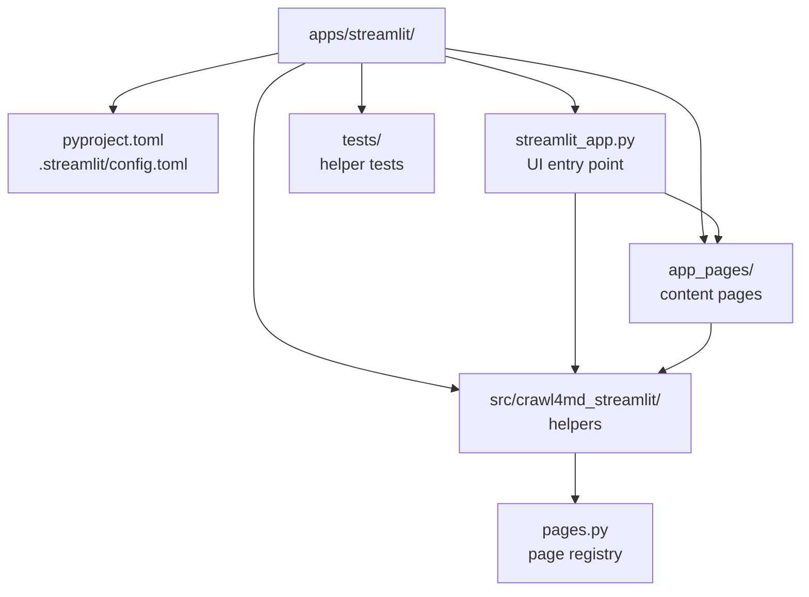
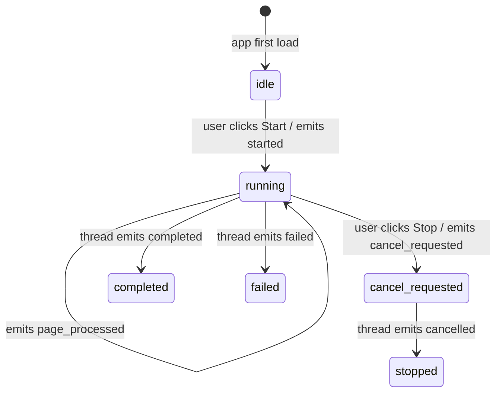
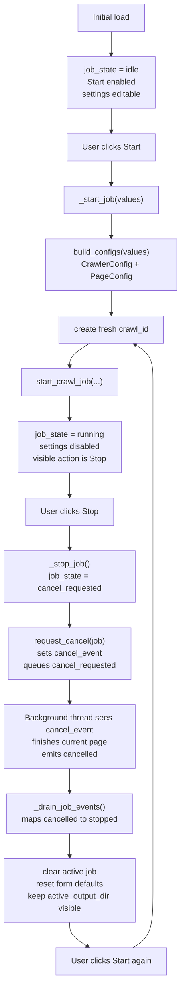
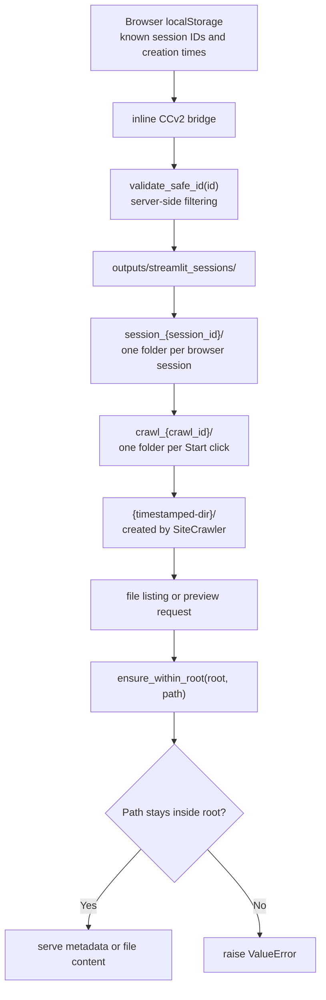
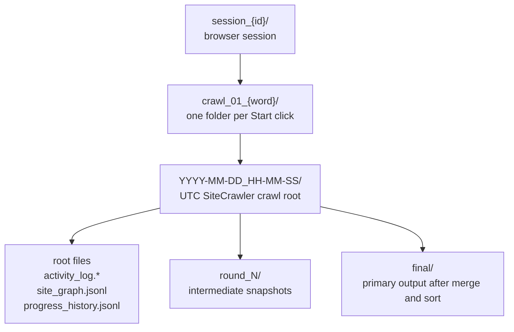
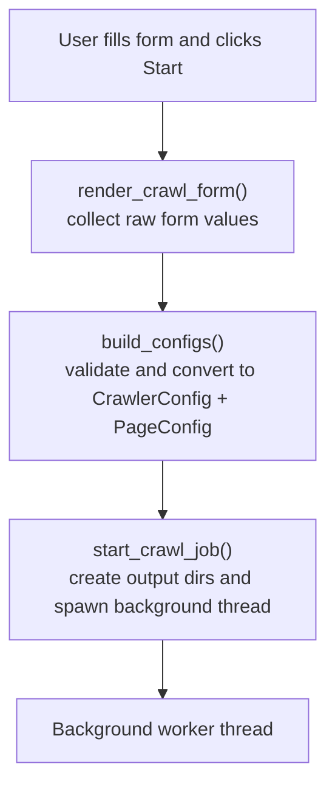
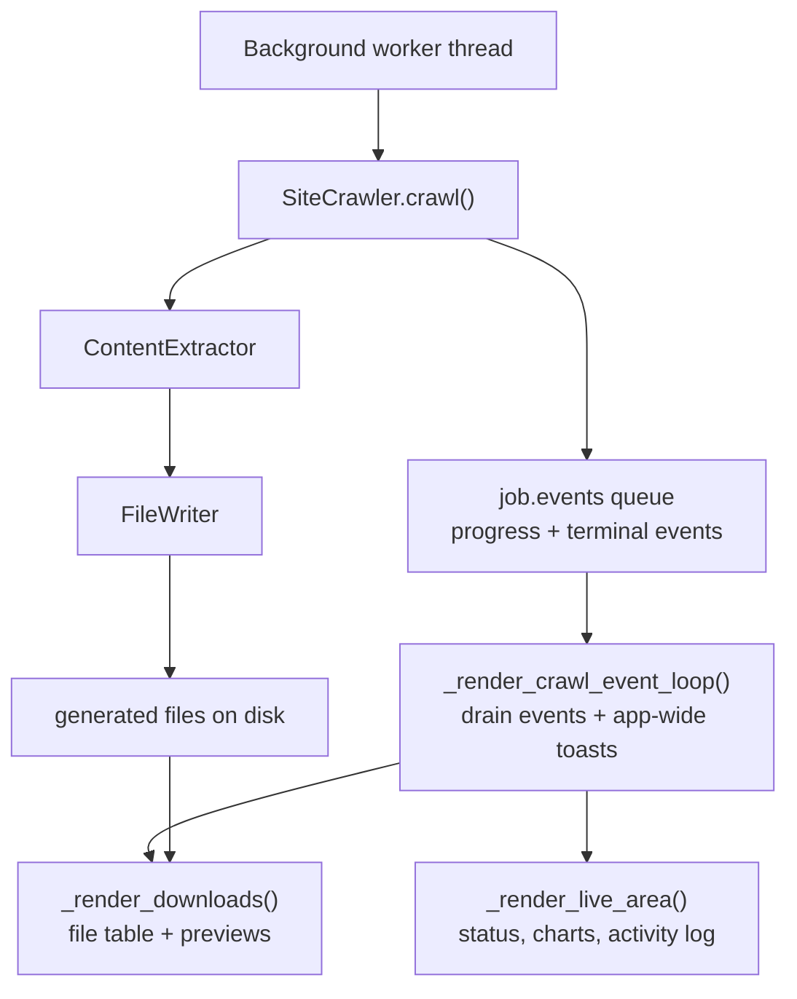

# Streamlit App — Developer Guide

A browser-based UI for the `crawl4md` library. Non-technical users fill in a form, click
**Start**, watch live progress, and download their Markdown files. This guide explains how
the code is organised, how the pieces connect, and where to look when extending or debugging.

---

## File Map

The top-level layout is compact enough for a diagram. The helper package details are easier
to scan as a table, and the test files are summarized in [Testing Map](#testing-map).



| Helper module | Responsibility |
| --- | --- |
| `__init__.py` | Installable package marker |
| `controls.py` | Button definitions and state mapping |
| `crawl_jobs.py` | Background jobs, config building, progress events |
| `form_defaults.py` | Default crawl form payload |
| `form_ui.py` | Crawl settings form renderer |
| `vector_form_ui.py` | Step 2 vector-index form renderer + pure option/validation helpers |
| `vector_index_jobs.py` | Step 2 background indexing job (mirrors `crawl_jobs.py`) |
| `generated_files.py` | Output listing, previews, and downloads |
| `pages.py` | Pure navigation metadata for the crawl-to-RAG workflow pages |
| `session_manager.py` | Safe IDs, session records, paths, and cleanup |
| `support.py` | Compatibility exports for the split helper modules |

Workflow content modules live in `app_pages/`. Each module exposes `render_page()` and renders only the content area for one navigation step. The shared page shell stays in `streamlit_app.py`.

### Why a separate package?

`crawl4md_streamlit` (`src/crawl4md_streamlit/`) is installed as a proper Python package
(`pip install -e "apps/streamlit"`). This lets the helpers in `support.py`, `crawl_jobs.py`,
`form_defaults.py`, `generated_files.py`, `session_manager.py`, and `controls.py` be imported and unit-tested
independently of Streamlit — no Streamlit runtime needed in tests.
Streamlit imports are limited to UI modules such as `streamlit_app.py` and `form_ui.py`.

This package is a reference adapter over the core `crawl4md` library, not a second crawl engine.
The library owns crawling, extraction, file writing, sorted and final outputs, run metadata,
progress events, and cooperative cancellation hooks. The Streamlit package owns form rendering,
browser-session persistence, background thread orchestration, and generated-file presentation.
If a feature is UI-agnostic and needed by other frontends, add it to the core library instead of
reimplementing it here.

---

## Component Responsibilities

### `streamlit_app.py` — UI shell

Everything the user sees and interacts with. Responsibilities:

- Initialises `st.session_state` keys on first load (`_init_state`).
- Hydrates browser-local session records through the inline CCv2 localStorage bridge.
- Preserves portfolio-modal localStorage timestamps so the personal intro prompt is not shown too often.
- Builds the top navigation with `st.navigation` from pure page metadata in `pages.py`.
- Renders the shared page shell: active page title/subtitle, session controls, language selector, selected `app_pages` content, footer, and portfolio modal.
- Renders the selected session ID, searchable session selector, create-session button, and language selector.
- Supplies the crawler page with shell-owned callbacks for job start / stop, ready results, live progress, and downloads.
- Runs the shell-level crawl event loop, drains background-thread events into UI state, and emits crawl progress toasts that remain visible while users navigate other workflow pages.
- Renders progress metrics, active/next URL previews, cumulative totals + pace charts, and the
  activity log (`_render_live_area`, refreshed every 3 seconds via `@st.fragment(run_every="3s")`).
- Renders the selected session's generated-file table and a per-file download + preview tree separately
  (`_render_downloads`, refreshed every 7 seconds).
- Runs a one-time startup cleanup of old session folders (`_run_startup_cleanup`, cached with
  `@st.cache_resource`).
- Renders the global footer and browser-timed portfolio modal with translated copy.

The current multipage pass uses dedicated modules in `app_pages/` for every workflow step. Step 1 (`app_pages/crawl4md.py`) renders the crawler content area and Step 2 (`app_pages/vector_index.py`) renders the vector-index content area, both through callbacks from the shared shell. Steps 3-5 are placeholder-only modules for now. They intentionally reuse the same width, title/subtitle placement, session-control row, language selector placement, footer, and restrained Streamlit-native styling as the crawler page so navigation feels continuous while the remaining RAG features are still being built.

### Toast Emission Model

App-wide toast notifications are emitted by the shared shell, not by page modules. This keeps background crawl updates visible while users navigate across workflow pages, because the shell runs before every selected page.

- Shell-owned toasts: crawl progress, background job completion/failure, session lifecycle, and other cross-page status.
- Page-local feedback: validation hints, inline warnings, and page-only status should render in the content area with `st.info`, `st.warning`, `st.success`, or a page-local panel.
- Future pages that need an app-wide toast should request it through a shell-provided callback or context instead of calling `st.toast()` directly.

### `app_pages/` — workflow content pages

Streamlit UI modules for individual workflow steps. These files may import Streamlit, but they should only render content that belongs between the shared session controls and footer. Do not add `st.title`, session controls, language selectors, footer UI, or direct `st.toast()` calls here.

| Page module | Responsibility |
| --- | --- |
| `crawl4md.py` | Step 1 crawler content area; receives shell callbacks through `CrawlPageContext` |
| `vector_index.py` | Step 2 vector-index content area; receives shell callbacks through `VectorIndexPageContext` |
| `semantic_search.py` | Step 3 semantic search workspace placeholder |
| `rag_qa.py` | Step 4 single-turn RAG Q&A workspace placeholder |
| `conversational_rag.py` | Step 5 conversational RAG workspace placeholder |

When a page grows complex, keep page-specific state keys prefixed with the page id and move reusable non-UI logic into `src/crawl4md_streamlit/` or the core `crawl4md` package instead of importing from `streamlit_app.py`.

### `pages.py` — workflow page registry

Pure logic; no Streamlit imports. `APP_PAGE_SPECS` defines the five workflow steps, translated navigation-label keys, title/subtitle keys, icons, URL paths, page module names, and placeholder-copy keys. `streamlit_app.py` turns these specs into `st.Page` entries and uses the selected spec to render the shared header.

Keep page metadata here when adding, renaming, or reordering workflow pages. Keep page content in `app_pages/`, and keep all visible page text in `i18n/en.py` and `i18n/id.py`.

### `controls.py` — button definitions

Pure logic; no Streamlit imports. `crawl_action_buttons(state, ...)` returns a tuple of
`CrawlActionButton` dataclasses describing which buttons to show, their labels, icons, and
disabled state. `streamlit_app.py` iterates the tuple and renders each one inside a
`st.form_submit_button`.

This separation makes it easy to unit-test state-machine transitions without needing a
Streamlit environment.

### `form_defaults.py` and `form_ui.py` — crawl settings

`form_defaults.py` is pure Python and owns the default crawl settings used when the form first
loads or resets after a terminal crawl state. That includes advanced crawler controls that map
directly into `CrawlerConfig`, such as the `max_concurrent` parallel fetch setting. `form_ui.py`
is a UI module: it imports Streamlit, renders the crawl settings form, and returns the submitted
values to `streamlit_app.py`.

`streamlit_app.py` still owns `st.session_state`; it passes the active strings, defaults, and
disabled state into `render_crawl_form()`.

### Step 2 — Build Vector Index

Step 2 mirrors Step 1's shell pattern and is backed by the UI-independent
`vector_indexer` library (chunking, embeddings, and a ChromaDB vector store behind an
interface). The app owns only input collection, the background job, and result display.

- `app_pages/vector_index.py` — content area; receives a `VectorIndexPageContext` from the shell and renders the form, the start/stop confirmation dialog, the live progress/result area, and the reused output-files panel.
- `vector_form_ui.py` — the form renderer plus pure, testable helpers: `crawl_result_options` (build the crawl-result multiselect) and `has_index_inputs` (validate that at least one file is selected or uploaded). Crawl inputs are discovered with `artifact_store.crawl_results.list_crawl_result_files`.
- `vector_index_jobs.py` — `start_vector_index_job` runs `VectorIndexer.run` in a daemon thread, saves uploaded files under the run directory, and emits `started` / `progress` / `completed` / `failed` / `cancelled` events through a queue. `request_cancel` sets a cooperative cancel flag; `drain_events` feeds the live area.

Session keys are prefixed with `vector_index_` and kept separate from crawl keys. The shell
provides `_start_vector_index_job`, `_stop_vector_index_job`, a `vector_index_`-scoped stop
dialog, and a live-area fragment, then reuses the existing `_render_downloads` panel so vector
outputs appear in the same file tree. Outputs are written under
`outputs/streamlit_sessions/session_<id>/vector_<id>/<timestamp>/`.

Cloud embedding providers (Amazon Titan default, OpenAI) read credentials from the environment
and fail gracefully when unconfigured — the default model falls back to an offline embedder with
a warning. See [../../src/vector_indexer/README.md](../../src/vector_indexer/README.md).

### `support.py` — compatibility exports

No Streamlit imports. Keeps the existing `crawl4md_streamlit.support` import surface stable while
delegating implementation to smaller pure-Python modules:

| Group | Functions |
| --- | --- |
| **`session_manager.py`** | `SessionRecord`, ID generation, session serialization, safe paths, session cleanup |
| **`generated_files.py`** | `GeneratedFile`, `TextPreview`, output listing, download-tree building, activity-log lookup, text previews |
| **`crawl_jobs.py`** | `CrawlJob`, config building, progress estimates, crawl-thread lifecycle, event mapping |

New code can import from the focused module directly. Existing code may continue importing from
`support.py`.

---

## Event / State Lifecycle

Each crawl runs in a **background daemon thread**. The thread communicates with the UI through
a `queue.Queue[dict]` (the `CrawlJob.events` field). Events are drained on every Streamlit
rerun by `_drain_job_events`.



Full `job_state` values and the transitions that produce them:

| State | What triggered it |
| --- | --- |
| `idle` | App first load |
| `running` | User clicked **Start** |
| `cancel_requested` | User clicked **Stop** while running |
| `stopped` | Thread confirmed cancellation after a Stop request |
| `completed` | Thread finished all pages successfully |
| `failed` | Thread threw an unhandled exception |

Parallel crawl progress uses generic event fields from the core crawler. `active_url_count` and
`next_url_count` are authoritative counts; `active_urls` and `next_urls` are capped previews for
display. The app renders counts plus previews so any supported Parallel fetches value stays compact.
Activity logs record concurrent reads as batch entries such as `Reading page batch (5 concurrent)`.
Live charts are native Streamlit charts rendered right before the Activity log panel:

- Crawl totals by second, minute, or hour: discovered, successful, and failed cumulative areas
  with the page limit shown as a line
- Processing pace over time: seconds per processed page attempt, excluding discovered-only URL
  events

For reload-safe chart history, the app prefers `progress_history.jsonl` written by the core crawler
and falls back to in-memory samples captured from live events when that file is not available yet.

---

## Start / Stop Sequence



Stop is cooperative: the worker is not force-killed. `SiteCrawler` owns sidecars and final
output regeneration so completed pages are still written into the final output folder. The
app does not persist crawl state and does not load any previous crawl when starting again.

---

## Session and Path Safety

Each browser stores known session IDs and UTC creation times in localStorage under a versioned
`crawl4md` key. The same payload also stores portfolio-modal `last shown` and `last dismissed`
UTC timestamps so the personal intro prompt can respect its repeat interval. The app reads those
records through a small inline `st.components.v2` bridge, validates session IDs server-side, and
selects the newest valid session on page load. If localStorage has no valid sessions, the server
creates one safe ID, sends it back to the bridge for storage, and selects it. Users can switch
sessions with the searchable `st.selectbox()` or create a new session with the adjacent button.

**Load Session dialog** — the 📁 button next to the session selector opens a modal dialog that
accepts a session ID typed or pasted by the user. This lets someone restore a session from
another browser, device, or after clearing browser cache. The dialog:

1. Validates the pasted ID against `^[a-z0-9_-]+$` — rejects empty or unsafe values.
2. Checks that `outputs/streamlit_sessions/session_<id>/` exists on the server.
3. If the session is already in the browser's records, shows a toast and switches to it without
   creating a duplicate.
4. If found but not yet local, registers the record in browser localStorage, then selects it.
5. Calls `touch_session()` to reset the session's mtime so the 7-day retention clock restarts.

The button is disabled while a crawl is running (`_STATE_RUNNING` / `_STATE_CANCEL_REQUESTED`)
to prevent switching sessions mid-job. Error messages are translated via the i18n catalog
(`DIALOG_LOAD_SESSION_INVALID_ID`, `DIALOG_LOAD_SESSION_NOT_FOUND`,
`DIALOG_LOAD_SESSION_ALREADY_LOADED`).

Session IDs use a readable format based on the EFF large wordlist. The pattern is controlled by
two constants in `session_manager.py`:

- `_READABLE_SESSION_WORD_COUNT` — number of EFF words per session ID (≥1)
- `_READABLE_ID_DIGITS` — digits appended after the words; `0` means words only

Examples: `2` words + `0` digits → `"boulder_river"` · `4` words + `6` digits →
`"stone_apple_river_oak_482917"` · `1` word + `2` digits → `"cedar_07"`.
Crawl IDs for Start clicks use a zero-padded sequence plus one readable word: `01_boulder`.
Existing timestamp-prefixed crawl IDs remain readable for older output folders.
To revert to the legacy `token_urlsafe` IDs, set `_USE_READABLE_IDS = False`.
Wordlist provided by the Electronic Frontier Foundation (eff.org), licensed CC-BY 4.0.

All output lives inside:



`ensure_within_root(root, path)` is called before every file read or listing. It resolves
both paths and raises `ValueError` if `path` escapes `root`. This prevents path-traversal
attacks when any server-generated path is forwarded back into a file read. Browser-provided
session records are treated as untrusted input and filtered through `validate_safe_id()` before
they can affect any server-side path.

`validate_safe_id(id)` enforces that IDs only contain `[a-z0-9_-]` before they are
interpolated into directory names.

Session folders older than 7 days are removed by `cleanup_old_sessions_with_lock` after browser
session hydration (using a `.cleanup.lock` file so only one Streamlit worker runs the cleanup).
Session IDs known to the browser are passed as active IDs so the selector does not point to
folders removed during the same startup.

---

## Generated Files in the App

The files shown in the download tree are produced by the core `crawl4md` library. The app
presents those files without transforming their content; when multiple successful content files
are ready, the ready-result button may create an app-owned `final/success_content.zip` archive
for a single download. For the full file reference (purposes, naming conventions, and cleanup
behavior), see [Output Structure](../../README.md#output-structure) in the root README.

**Folder layout under `outputs/streamlit_sessions/`:**



**Why a new folder per Start click?** Each Start uses the next highest crawl number
(`crawl_01_word`, `crawl_02_word`, …, `crawl_10_word`) and `SiteCrawler` creates a fresh
UTC timestamped directory inside it. Previous crawls keep their files and remain downloadable
from the same session. Existing legacy folders such as `crawl_1_word` remain readable.

The download tree shows the UTC timestamp folder with a local-time companion label when the
timestamp can be parsed from the run folder or `progress_history.jsonl`.

**Which files to open first:**

- `final/sorted_success_content_001_of_001.md` — the extracted content, sorted by URL path
- `final/sorted_success_urls.txt` — all URLs that succeeded
- `activity_log.csv` — timestamped crawl diary in spreadsheet format

The `round_N/` folders are intermediate per-round snapshots. They are useful when a crawl was
stopped early or when you need to inspect a specific retry round; for a completed crawl, use
the files in `final/` instead.

---

## Data Flow (one crawl from click to download)

First, the UI turns form values into configs and starts one background worker.



While the worker runs, queued events update live progress and generated files feed the
download area.



---

## Testing Map

| Test file | What it covers |
| --- | --- |
| `tests/test_controls.py` | Every `job_state` value → correct buttons (label, disabled, type) |
| `tests/test_form_defaults.py` | Default crawl form payload and independent dict creation |
| `tests/test_generated_files.py` | Pure generated-file tree building for nested downloads |
| `tests/test_progress_chart.py` | Pure chart helper behavior: live sample append, persisted JSONL parsing, cumulative/pace row derivation |
| `tests/test_pages.py` | Pure page-registry behavior for workflow ordering, placeholders, translated navigation labels, and importable page modules |
| `tests/test_support.py` | ID safety, browser session records, path helpers, file listing, session cleanup, progress, job start/stop with a fake `SiteCrawler` |
| `tests/test_support_facade.py` | Compatibility exports from the split helper modules |
| `tests/test_app_smoke.py` | App import/startup smoke coverage and preview CSS guardrails |
| `tests/test_streamlit_boundaries.py` | `.streamlit/config.toml` sets the right address and port; no config leaks to repo root; helper package stays Streamlit-free; page modules do not emit direct Streamlit toasts |

Tests mock `SiteCrawler` — no real network calls are made. The split between `streamlit_app.py`
(Streamlit imports) and the pure helper modules is what makes pure-Python testing possible.

---

## Common Extension Points

| Task | Where to look |
| --- | --- |
| Add a new form field | `render_crawl_form()` in `form_ui.py` + `default_form_values()` in `form_defaults.py` + `build_configs()` in `crawl_jobs.py` |
| Change action buttons or states | `controls.py` (`CrawlActionButton`, `crawl_action_buttons`) + `test_controls.py` |
| Add a new event type from the crawler | `job_state_from_event()` in `crawl_jobs.py` + `_drain_job_events()` in `streamlit_app.py` |
| Add a new output panel | A new page-local renderer in `app_pages/crawl4md.py` or a shell callback in `streamlit_app.py`; use `_render_live_area` for crawl-status panels and a separate fragment for selected-session downloads |
| Add or rename a workflow page | `app_pages/<page>.py` + `pages.py` + i18n keys in `en.py` / `id.py` + `tests/test_pages.py`; keep Steps 2-5 visually aligned with the crawler shell |
| Change retention or cleanup logic | `cleanup_old_sessions()` in `session_manager.py` + `test_support.py` |
| Change the Load Session dialog | `_load_session_dialog()` + `_register_and_select_session()` in `streamlit_app.py`; update i18n keys in `en.py` / `id.py` |
| Change the server port or theme | `apps/streamlit/.streamlit/config.toml` |

---

## Running Locally

```bash
# From the repo root — install both packages (core + app):
pip install -e ".[dev]" -e "apps/streamlit[dev]"

# Run the app (from the apps/streamlit directory so config.toml is picked up):
cd apps/streamlit && streamlit run streamlit_app.py

# Or explicitly from the repo root:
python -m streamlit run apps/streamlit/streamlit_app.py --server.address=0.0.0.0 --server.port=8501
```

```bash
# Tests and lint:
python -m pytest apps/streamlit/tests/ -q
python -m ruff check apps/streamlit/streamlit_app.py apps/streamlit/app_pages/ apps/streamlit/src/ apps/streamlit/tests/
```
