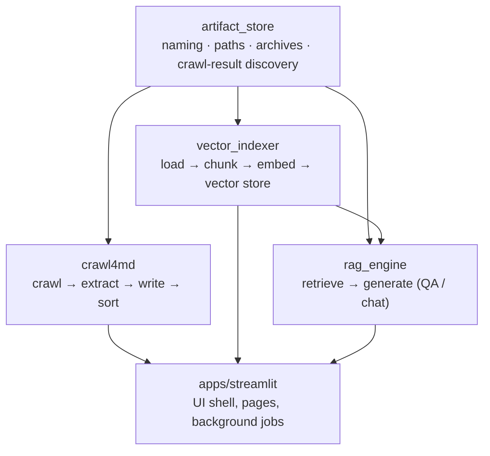
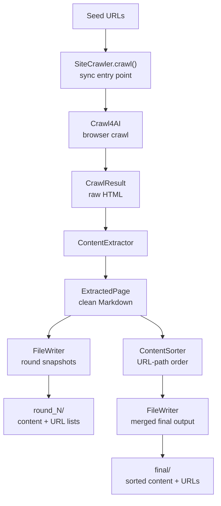
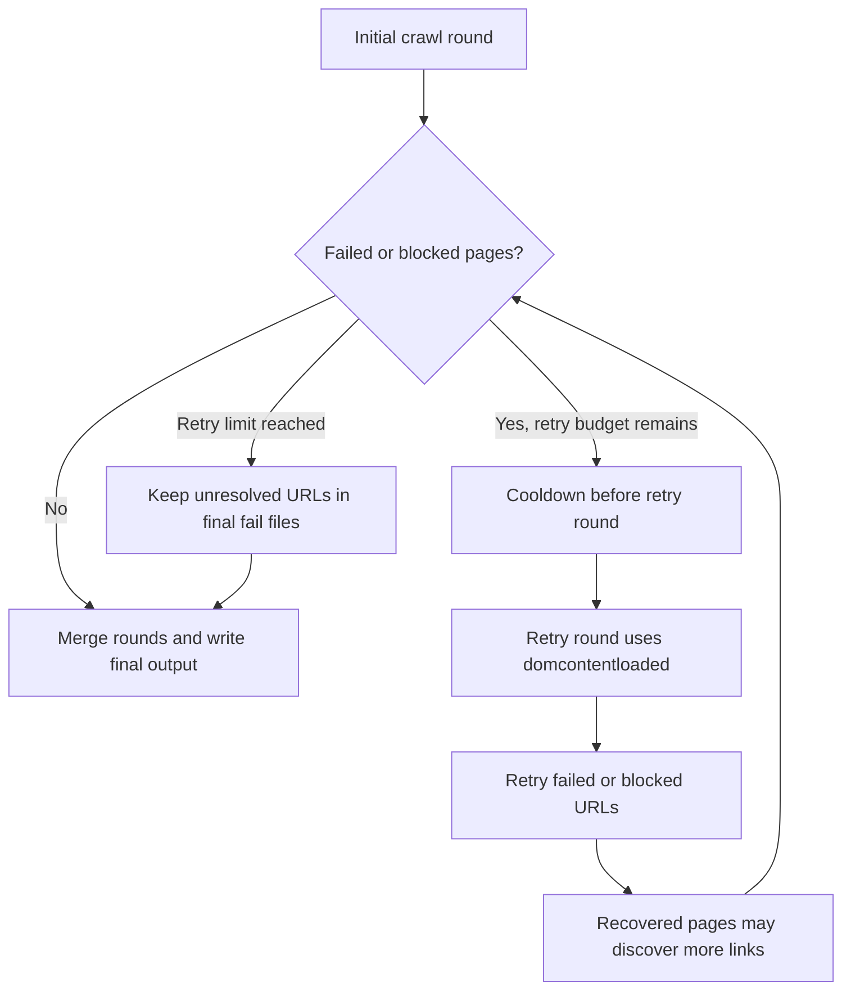
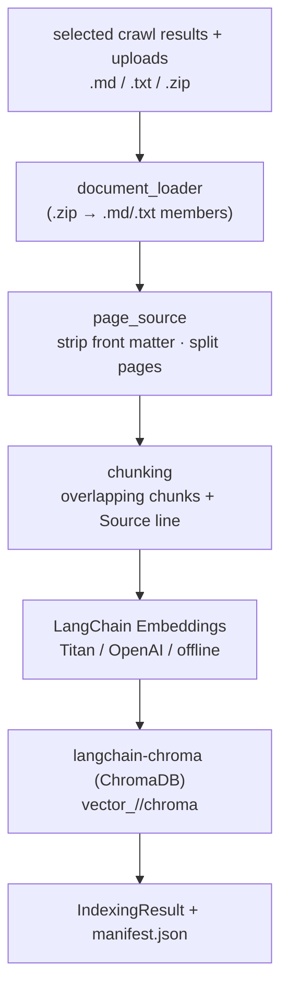
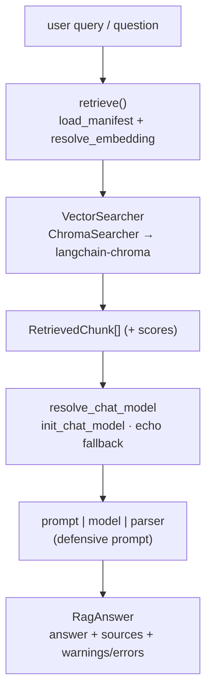
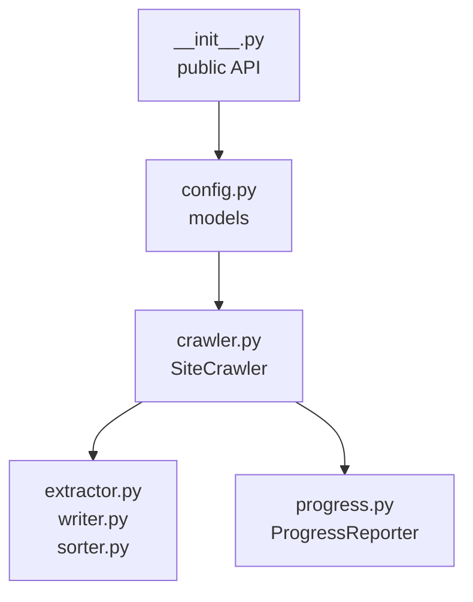
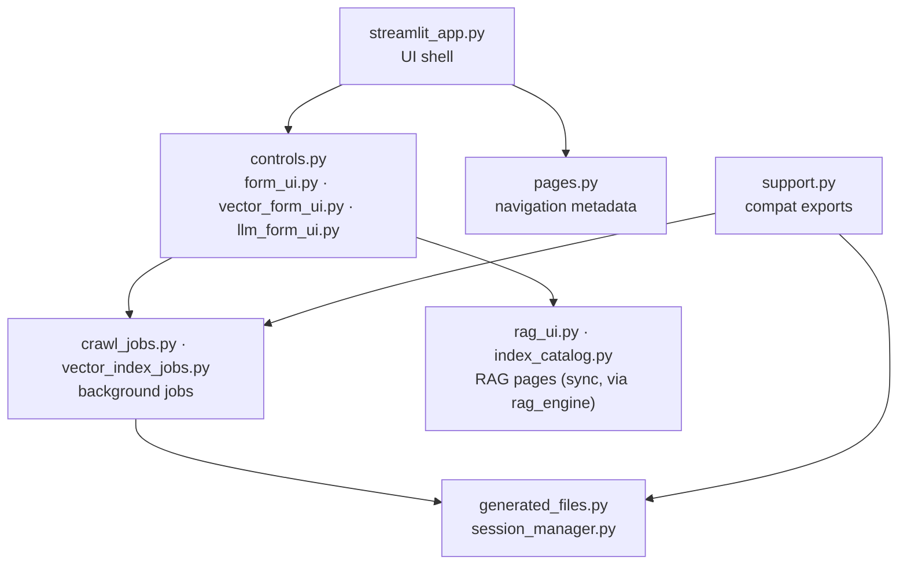

# Architecture

← Back to [README](../README.md)

The repository is organized in layers. A shared foundation (`artifact_store`) sits
under three independent libraries: `crawl4md` (crawling), `vector_indexer`
(indexing), and `rag_engine` (retrieval + answering, building on `vector_indexer`).
The Streamlit app is a UI adapter over those libraries and owns only rendering,
session/browser state, background jobs, and downloads.

## Step 1 — how crawling works

1. **Crawl** — seed URLs are crawled with link discovery up to `max_depth`. Discovered links are queued up to `limit`.
2. **Retry** — failed/blocked pages are retried in subsequent rounds (up to `max_retries`), with a 30-second cooldown between rounds. Retry rounds automatically downgrade `wait_until` to `domcontentloaded`. Link discovery continues in retry rounds.
3. **Extract** — HTML is converted to Markdown via trafilatura or markdownify, then cleaned through a 7-step post-processing pipeline.
4. **Write** — pages are written to numbered, size-limited files. Per-round files are produced during the crawl; final merged and sorted files are written after all rounds complete.

## Step 2 — how indexing works

Step 2 builds on the final `.md` / `.txt` outputs (or uploaded files) without
changing the crawl pipeline.

Embeddings are LangChain `Embeddings` objects and the store is langchain-chroma, so
a backend can change without touching the application layer. Before chunking, the
indexer strips each file's leading crawl run metadata (the YAML front matter) and
splits the body on the render-invisible page markers crawl4md emits, so run metadata
never reaches a chunk and every chunk is stamped with its page's
`Source: [title](url)` line (also carried as `source_title` / `source_url`
metadata). Files without markers degrade to a single untitled page. The `manifest.json`
records the embedding model, dimension, collection name, the run's `created_at`
timestamp, and the distinct `indexed_sources` (for the Step 3 source filter) so an index
can be reopened later. See
[src/vector_indexer/README.md](../src/vector_indexer/README.md).

## Steps 3-5 — how RAG works

Steps 3-5 read an index built by Step 2 without re-indexing. `rag_engine` reopens it
from the run directory (using the manifest), retrieves context, and generates an
answer with a chat model resolved through LangChain.

- **Step 3 (semantic search)** stops at `RetrievedChunk[]` — ranked snippets with
  scores and sources.
- **Step 4 (QA)** runs `answer_question` for a single-turn answer with citations.
- **Step 5 (conversational)** runs `chat_answer`, which first rewrites the follow-up
  into a standalone query via `condense_question` (history-aware), then retrieves and
  answers with the recent history in the prompt.

When a cloud chat model is unavailable, `resolve_chat_model` falls back to an offline
echo model (which repeats the question) and records a warning, so the workflow runs
with no credentials. See [src/rag_engine/README.md](../src/rag_engine/README.md).

## Library layers

**Core library (crawl4md):**

**Streamlit adapter:**

**Adapter boundary:** the app builds configs and runs the libraries, then renders
their emitted events and generated files. It does not reimplement crawling or
indexing.

The crawl adapter passes optional integration hooks into `SiteCrawler`
(`output_base`, `session_id`, `progress_callback`, `should_cancel`) and reads
`progress_history.jsonl` from each crawl root to restore chart history after page
reloads.
