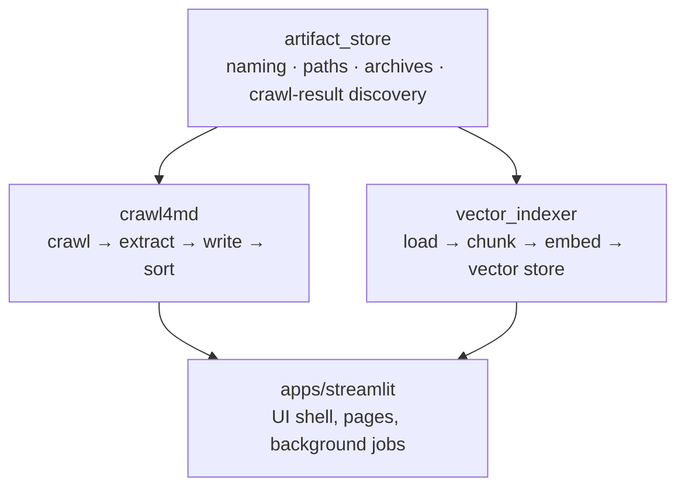
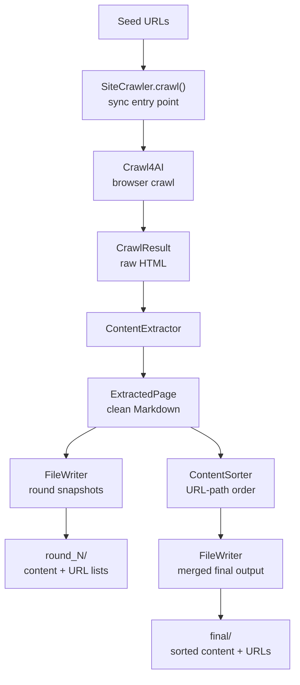
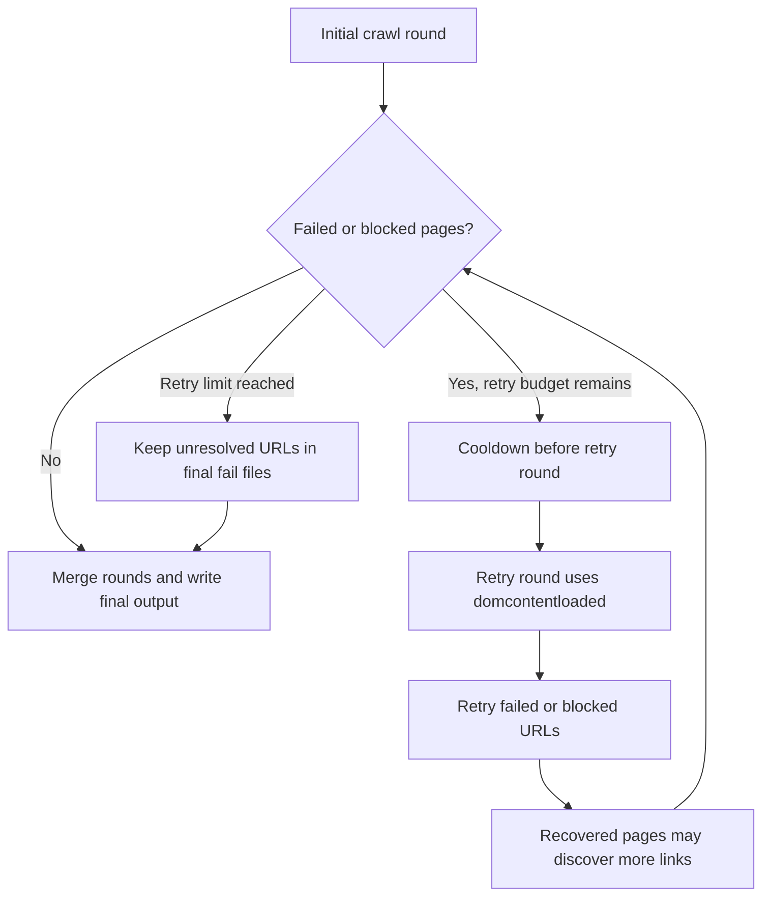
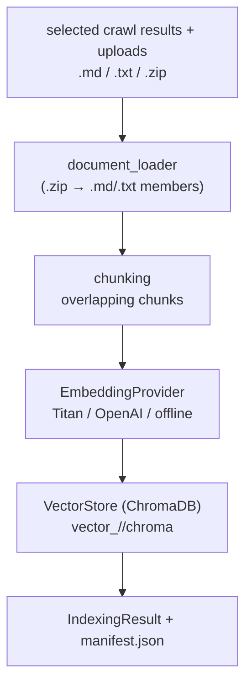
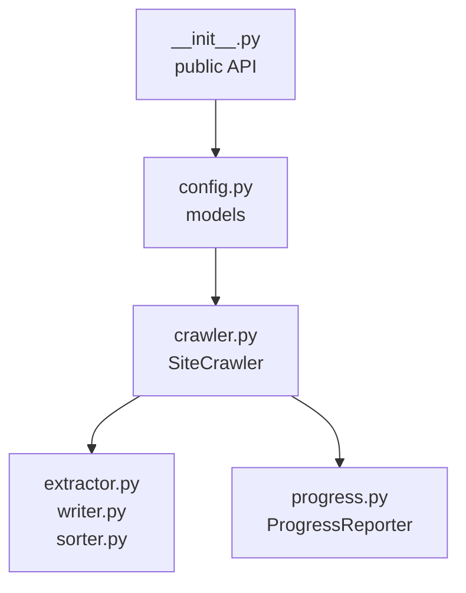
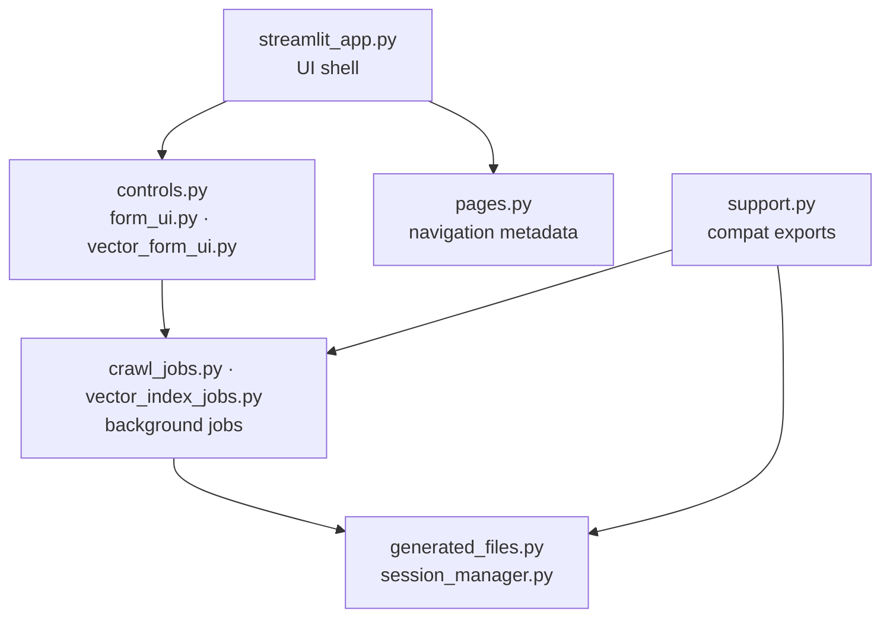

# Architecture

← Back to [README](../README.md)

The repository is organized in layers. A shared foundation (`artifact_store`) sits
under two independent libraries (`crawl4md` for crawling, `vector_indexer` for
indexing). The Streamlit app is a UI adapter over those libraries and owns only
rendering, session/browser state, background jobs, and downloads.

## Step 1 — how crawling works

1. **Crawl** — seed URLs are crawled with link discovery up to `max_depth`. Discovered links are queued up to `limit`.
2. **Retry** — failed/blocked pages are retried in subsequent rounds (up to `max_retries`), with a 30-second cooldown between rounds. Retry rounds automatically downgrade `wait_until` to `domcontentloaded`. Link discovery continues in retry rounds.
3. **Extract** — HTML is converted to Markdown via trafilatura or markdownify, then cleaned through a 7-step post-processing pipeline.
4. **Write** — pages are written to numbered, size-limited files. Per-round files are produced during the crawl; final merged and sorted files are written after all rounds complete.

## Step 2 — how indexing works

Step 2 builds on the final `.md` / `.txt` outputs (or uploaded files) without
changing the crawl pipeline.

The embedding provider and vector store are both behind interfaces, so a provider
or database can change without touching the application layer. See
[src/vector_indexer/README.md](../src/vector_indexer/README.md).

## Library layers

**Core library (crawl4md):**

**Streamlit adapter:**

**Adapter boundary:** the app builds configs and runs the libraries, then renders
their emitted events and generated files. It does not reimplement crawling or
indexing.

The crawl adapter passes optional integration hooks into `SiteCrawler`
(`output_base`, `session_id`, `progress_callback`, `should_cancel`) and reads
`progress_history.jsonl` from each crawl root to restore chart history after page
reloads.
