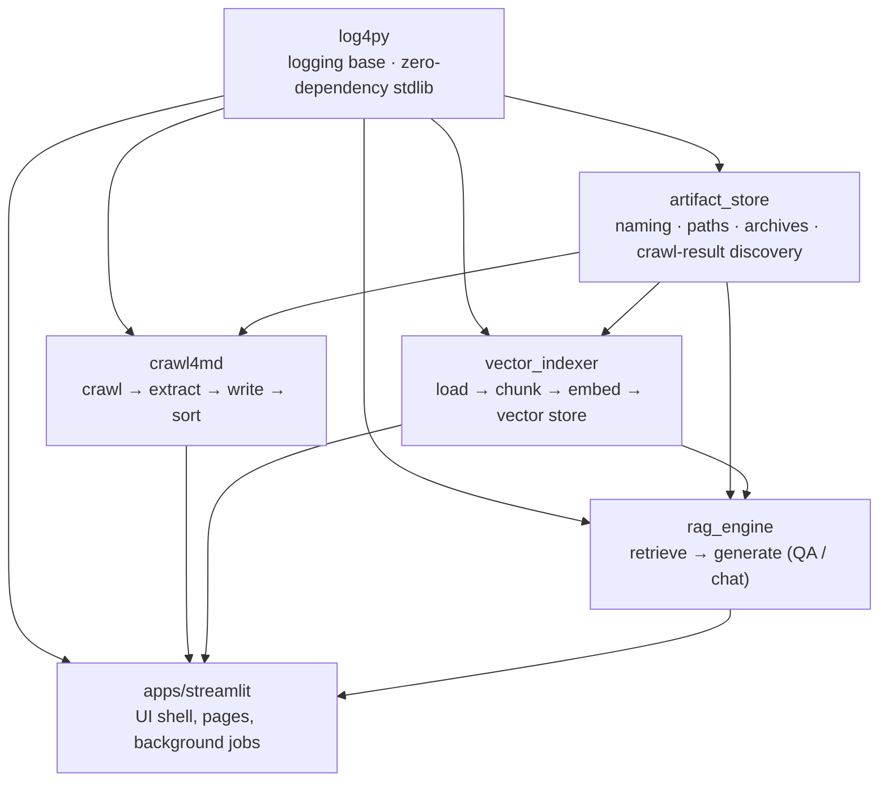
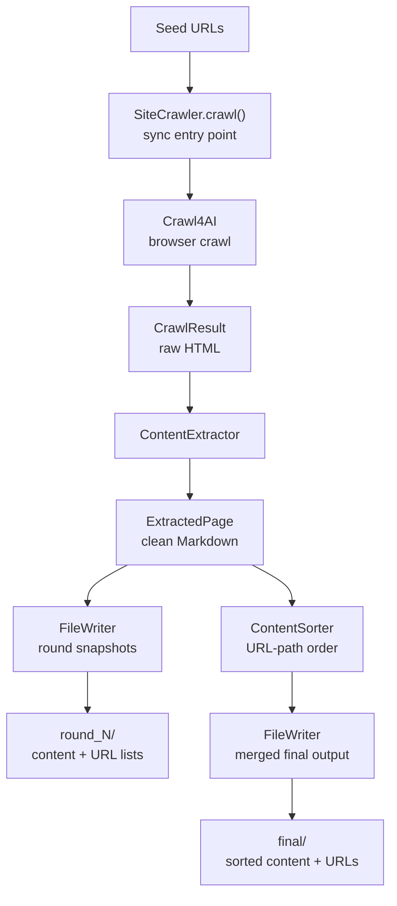
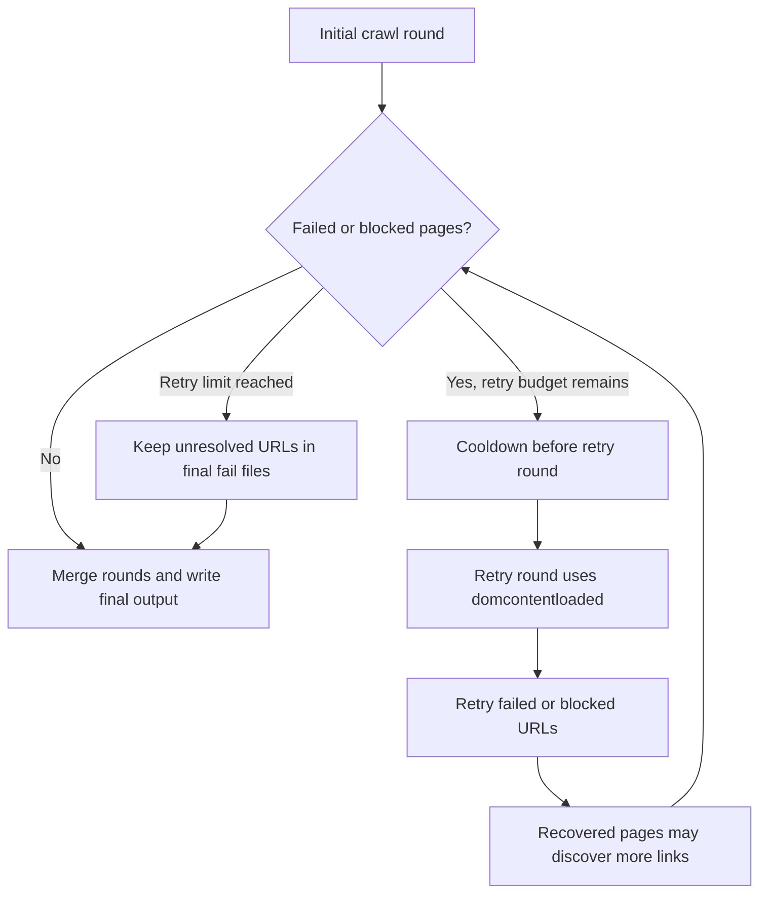
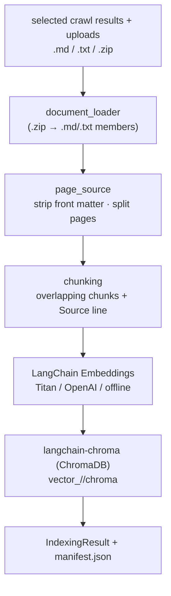
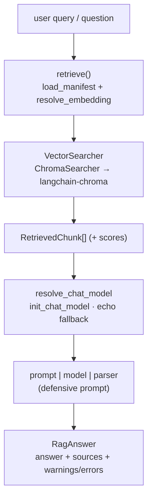
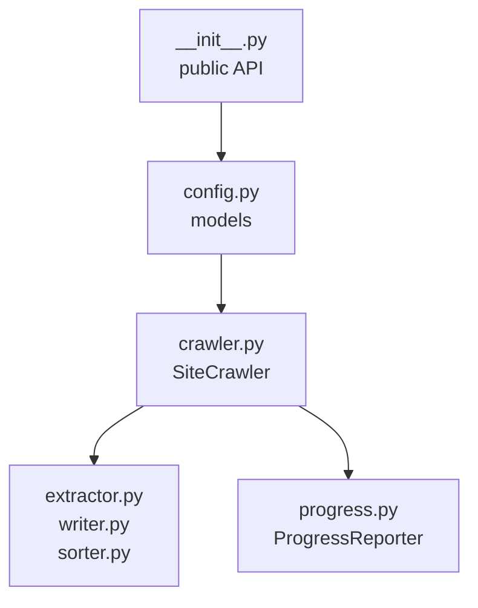
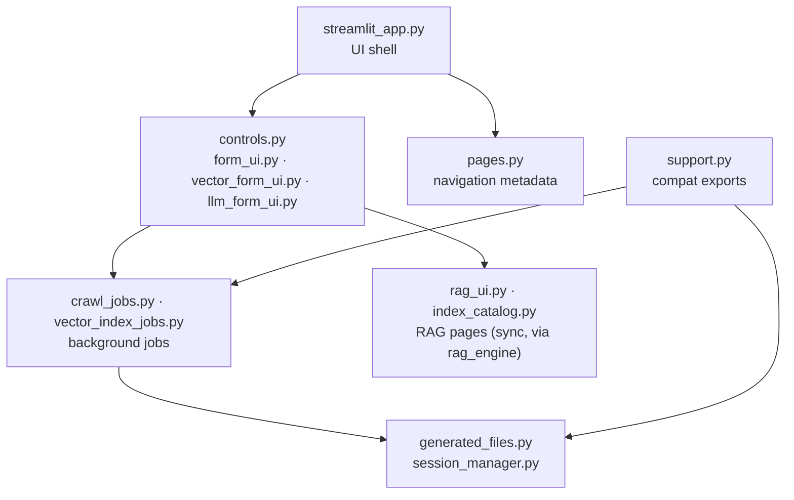

# Architecture

← Back to [README](../README.md)

The repository is organized in layers. A zero-dependency logging base (`log4py`)
sits beneath a shared foundation (`artifact_store`), which in turn sits under three
independent libraries: `crawl4md` (crawling), `vector_indexer` (indexing), and
`rag_engine` (retrieval + answering, building on `vector_indexer`). The Streamlit
app is a UI adapter over those libraries and owns only rendering, session/browser
state, background jobs, and downloads.

```mermaid
flowchart TD
  Log4py["log4py<br/>logging base · zero-dependency stdlib"]
  ArtifactStore["artifact_store<br/>naming · paths · archives · crawl-result discovery"]
  Crawl4md["crawl4md<br/>crawl → extract → write → sort"]
  VectorIndexer["vector_indexer<br/>load → chunk → embed → vector store"]
  RagEngine["rag_engine<br/>retrieve → generate (QA / chat)"]
  App["apps/streamlit<br/>UI shell, pages, background jobs"]
  Log4py --> ArtifactStore
  Log4py --> Crawl4md
  Log4py --> VectorIndexer
  Log4py --> RagEngine
  Log4py --> App
  ArtifactStore --> Crawl4md
  ArtifactStore --> VectorIndexer
  ArtifactStore --> RagEngine
  VectorIndexer --> RagEngine
  Crawl4md --> App
  VectorIndexer --> App
  RagEngine --> App
```

Every library only *emits* log records via `log4py.get_logger(__name__)`; the app
turns logging on once with `log4py.configure_logging` and routes each browser
session's records to its own file. See [src/log4py/README.md](../src/log4py/README.md).

## Step 1 — how crawling works

```mermaid
flowchart TD
  Seeds["Seed URLs"] --> SiteCrawler["SiteCrawler.crawl()<br/>sync entry point"]
  SiteCrawler --> Crawl4AI["Crawl4AI<br/>browser crawl"]
  Crawl4AI --> CrawlResult["CrawlResult<br/>raw HTML"]
  CrawlResult --> Extractor["ContentExtractor"]
  Extractor --> ExtractedPage["ExtractedPage<br/>clean Markdown"]
  ExtractedPage --> RoundWriter["FileWriter<br/>round snapshots"]
  RoundWriter --> RoundFiles["round_N/<br/>content + URL lists"]
  ExtractedPage --> Sorter["ContentSorter<br/>URL-path order"]
  Sorter --> FinalWriter["FileWriter<br/>merged final output"]
  FinalWriter --> FinalFiles["final/<br/>sorted content + URLs"]
```

1. **Crawl** — seed URLs are crawled with link discovery up to `max_depth`. Discovered links are queued up to `limit`.
2. **Retry** — failed/blocked pages are retried in subsequent rounds (up to `max_retries`), with a 30-second cooldown between rounds. Retry rounds automatically downgrade `wait_until` to `domcontentloaded`. Link discovery continues in retry rounds.
3. **Extract** — HTML is converted to Markdown via trafilatura or markdownify, then cleaned through a 7-step post-processing pipeline.
4. **Write** — pages are written to numbered, size-limited files. Per-round files are produced during the crawl; final merged and sorted files are written after all rounds complete.

```mermaid
flowchart TD
  Initial["Initial crawl round"] --> Failed{"Failed or blocked pages?"}
  Failed -->|No| Merge["Merge rounds and write final output"]
  Failed -->|Yes, retry budget remains| Cooldown["Cooldown before retry round"]
  Cooldown --> Downgrade["Retry round uses domcontentloaded"]
  Downgrade --> Retry["Retry failed or blocked URLs"]
  Retry --> Discover["Recovered pages may discover more links"]
  Discover --> Failed
  Failed -->|Retry limit reached| FinalFailures["Keep unresolved URLs in final fail files"]
  FinalFailures --> Merge
```

## Step 2 — how indexing works

Step 2 builds on the final `.md` / `.txt` outputs (or uploaded files) without
changing the crawl pipeline.

```mermaid
flowchart TD
  Inputs["selected crawl results + uploads<br/>.md / .txt / .zip"] --> Loader["document_loader<br/>(.zip → .md/.txt members)"]
  Loader --> Pages["page_source<br/>strip front matter · split pages"]
  Pages --> Chunker["chunking<br/>overlapping chunks + Source line"]
  Chunker --> Embed["LangChain Embeddings<br/>Titan / OpenAI / offline"]
  Embed --> Store["langchain-chroma (ChromaDB)<br/>vector_<id>/<timestamp>/chroma"]
  Store --> Result["IndexingResult + manifest.json"]
```

Embeddings are LangChain `Embeddings` objects and the store is langchain-chroma, so
a backend can change without touching the application layer. Before chunking, the
indexer strips each file's leading crawl run metadata (the YAML front matter) and
splits the body on the render-invisible page markers crawl4md emits, so run metadata
never reaches a chunk and every chunk is stamped with its page's
`Source: [title](url)` line (also carried as `source_title` / `source_url`
metadata). Files without markers degrade to a single untitled page. The `manifest.json`
records the embedding model, dimension, collection name, the run's `created_at`
timestamp, and the distinct `indexed_sources` (for the Step 3 source filter) so an index
can be reopened later. See
[src/vector_indexer/README.md](../src/vector_indexer/README.md).

## Steps 3-5 — how RAG works

Steps 3-5 read an index built by Step 2 without re-indexing. `rag_engine` reopens it
from the run directory (using the manifest), retrieves context, and generates an
answer with a chat model resolved through LangChain.

```mermaid
flowchart TD
  Query["user query / question"] --> Retrieve["retrieve()<br/>load_manifest + resolve_embedding"]
  Retrieve --> Chroma["VectorSearcher<br/>ChromaSearcher → langchain-chroma"]
  Chroma --> Chunks["RetrievedChunk[] (+ scores)"]
  Chunks --> Resolve["resolve_chat_model<br/>init_chat_model · echo fallback"]
  Resolve --> Generate["prompt | model | parser<br/>(defensive prompt)"]
  Generate --> Answer["RagAnswer<br/>answer + sources + warnings/errors"]
```

- **Step 3 (semantic search)** stops at `RetrievedChunk[]` — ranked snippets with
  scores and sources.
- **Step 4 (Basic RAG Q&A)** is a two-stage teaching flow: *Generate prompt* runs
  `retrieve` + `build_rag_prompt` to assemble an editable, injection-fenced prompt from
  the retrieved knowledge (the prompt template is operator-configurable via a file, with
  a built-in fallback); the editable field has an icon-only full-screen **Maximize**
  dialog, and *Send* streams the answer with `stream_prompt` into an **Answer** panel
  inside the prompt form and reports token usage + latency. `answer_question` remains a
  one-call convenience for other UIs.
- **Step 5 (conversational)** offers two entry points. `chat_answer` is the simple
  history-aware flow (rewrite the follow-up via `condense_question`, then retrieve and
  answer). The Streamlit page uses the advanced `conversational_answer` pipeline:
  `plan_queries` decomposes the question into standalone sub-questions (small auxiliary
  model from `resolve_auxiliary_model`), `retrieve_multi` searches each in parallel and
  de-dupes, `rerank_chunks` re-orders them (off / local cross-encoder / LLM),
  the answer is generated (the Streamlit page streams it token-by-token via the `conversational_answer_stream` variant, which returns a `ConversationalGeneration` and shares `_prepare_turn`/`_finalize_turn` with the blocking call, while follow-ups run concurrently), then `suggest_followups` + `validate_followups` propose only
  corpus-answerable follow-ups (written in the configured language) and `update_state` rolls conversation memory forward. It
  returns a `ConversationalAnswer` (answer + `QueryPlan` + sources + `ValidatedFollowup`s
  + next `ConversationState` + per-stage `timings` + per-process `token_usage`) that the
  UI renders as a per-turn inspection panel, disk-persisted per-session conversations (a
  New button + picker; a selected conversation's turns are replayed from the history log on
  session load), a Token usage panel (a shared renderer also
  used by Step 4), and the standard Output Files section. Every stage's built-in prompt is
  overridable through `ConversationalConfig.prompts` (a `ConversationalPrompts` model), and
  the Step 5 page exposes an editable prompt-template editor whose stage tabs hide when their
  feature is off (Query decomposition / Follow-ups / the LLM re-ranker), plus app-only message
  tabs — an editable **Welcome message** greeting, a **Follow-up intro** line, and a
  **No-suggestions** nudge, each holding one alternate per line and shown at random per turn;
  validated follow-ups render inside the chat panel as an integrated continuation bubble with
  inline, link-styled (blue, underlined) suggestions; a malformed override falls back to the built-in. Heavy chat/auxiliary
  models and the vector searcher are cached app-side (`rag_shared/resource_cache.py`,
  `@st.cache_resource`) and injected through `rag_engine`'s resolver/retriever hooks, so a chat
  session reuses one client per model/index while the library stays fresh-per-call. Every stage
  degrades safely (offline model, missing re-rank dependency, unparsable output) with a recorded
  warning, never an error.

Both Step 4 and Step 5 inject the active UI language (default English) into the answer
prompt, so generated replies match the selected UI language.

When a cloud chat model is unavailable, `resolve_chat_model` falls back to an offline
echo model (which repeats the question) and records a warning, so the workflow runs
with no credentials. See [src/rag_engine/README.md](../src/rag_engine/README.md).

## Library layers

**Core library (crawl4md):**

```mermaid
flowchart TD
  PublicAPI["__init__.py<br/>public API"] --> Config["config.py<br/>models"]
  Config --> Crawler["crawler.py<br/>SiteCrawler"]
  Crawler --> Pipeline["extractor.py<br/>writer.py<br/>sorter.py"]
  Crawler --> Progress["progress.py<br/>ProgressReporter"]
```

**Streamlit adapter:**

```mermaid
flowchart TD
  App["streamlit_app.py<br/>UI shell"] --> Inputs["controls.py<br/>form_ui.py · vector_form_ui.py · llm_form_ui.py"]
  App --> Pages["pages.py<br/>navigation metadata"]
  Inputs --> Jobs["crawl_jobs.py · vector_index_jobs.py<br/>background jobs"]
  Inputs --> Rag["rag_ui.py · index_catalog.py<br/>RAG pages (sync, via rag_engine)"]
  Jobs --> Outputs["generated_files.py<br/>session_manager.py"]
  Support["support.py<br/>compat exports"] --> Jobs
  Support --> Outputs
```

**Adapter boundary:** the app builds configs and runs the libraries, then renders
their emitted events and generated files. It does not reimplement crawling or
indexing.

The crawl adapter passes optional integration hooks into `SiteCrawler`
(`output_base`, `session_id`, `progress_callback`, `should_cancel`) and reads
`progress_history.jsonl` from each crawl root's `logs/` subdirectory to restore
chart history after page reloads.
