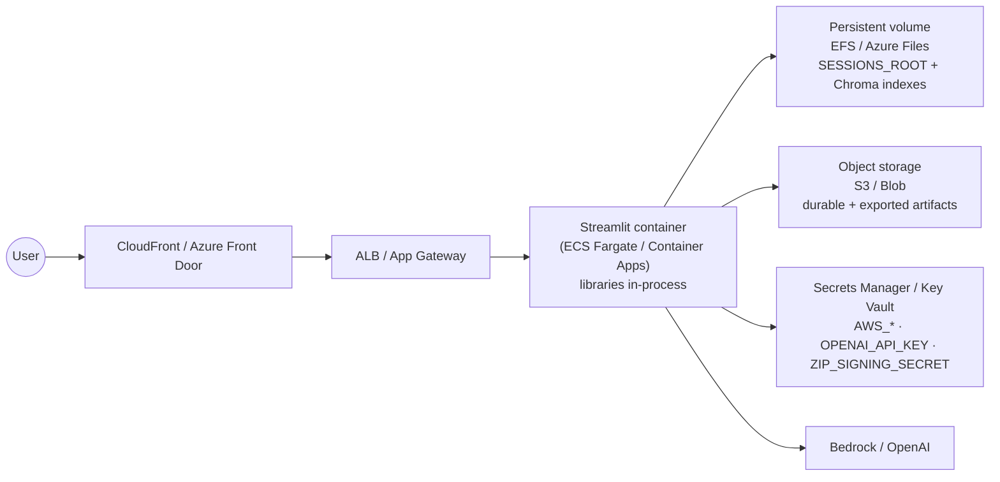
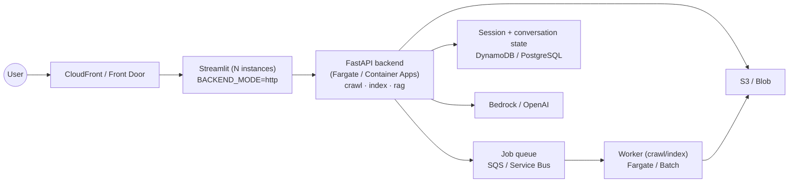
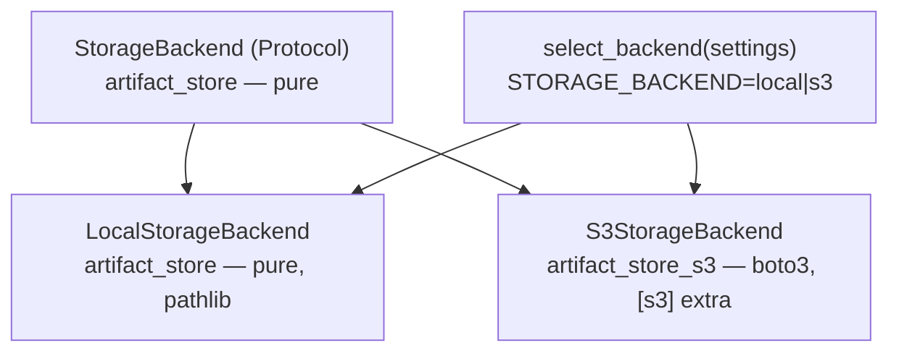

# Cloud Deployment & Architecture Readiness

← Back to [README](../README.md) · see also [ARCHITECTURE.md](ARCHITECTURE.md) · [CONFIGURATION.md](CONFIGURATION.md)

This document assesses how ready `rag-playground` is to run as a three-tier cloud
deployment — **frontend** (UI), **backend** (compute/LLM), and **storage**
(durable files) — validates the proposed split, corrects a few rough edges, and
lays out a staged, non-breaking roadmap. It is AWS-first, with Azure equivalents
noted inline.

> Status legend: ✅ done · 🟡 in progress / planned · ⬜ not started

---

## 1. The proposed split — validated, with corrections

The proposal is **sound and matches industry practice**: separate the UI, the
compute, and the durable storage so each scales and deploys independently. Three
clarifications keep it aligned with how this codebase is actually built:

| Proposal | Verdict | Correction / nuance |
| --- | --- | --- |
| **Backend** = "Python scripts/API doing the compute, LLM calls" on EC2 **or Lambda** | ✅ mostly | The five libraries (`log4py`, `artifact_store`, `crawl4md`, `vector_indexer`, `rag_engine`) **already are** the backend — pure Python, UI-independent, enforced by boundary tests. A FastAPI service is a thin *transport* wrapper, not a rewrite. **Lambda is a poor fit** for Step 1 (crawling drives a real Chromium via Playwright — needs ~2 GB shared memory, system libraries, and often runs longer than Lambda's 15-minute cap) and for heavy Step 2 indexing / local re-ranking (Torch). Prefer **containers** (ECS Fargate / EC2 / AWS Batch); Azure: **Container Apps** / **Container Instances**. Lightweight RAG queries *could* be serverless, but they share the same heavy dependency image, so one container backend is simpler. |
| **Storage** = persistent volume for Output Files, e.g. **S3** | ✅ with a caveat | S3 (Azure: **Blob Storage**) is right for **durable, exportable artifacts** — crawl Markdown, signed zips, exported folders. But the **vector index is a local ChromaDB** (SQLite + files); you **cannot point Chroma directly at S3**. Options: (a) a **persistent volume** (EFS / EBS; Azure **Files**) for single-instance — simplest; (b) **sync** the index directory to/from object storage around index/open; (c) a **managed/remote vector store**. Near-term target: volume for indexes **+** object storage for durable artifacts. |
| **Frontend** = Streamlit UI | ✅ | Correct. But Streamlit is **stateful** (`st.session_state`, background threads, `@st.cache_resource`, on-disk JSONL histories), so the simplest cloud shape is a **single frontend instance with a persistent volume**. True horizontal scale-out needs externalized state (see Tier 2). |

**Bottom line:** the hard architectural work — decoupling compute from the UI — is
**already done**. What remains is (1) making storage location-independent, (2)
optionally exposing the libraries over HTTP, and (3) containerizing.

---

## 2. What is already cloud-ready

- **Clean layering.** Libraries never import Streamlit; `tests/test_*_boundary.py`
  enforce it. Any backend (FastAPI, a worker, a Lambda) can call
  `SiteCrawler.crawl()`, `VectorIndexer.run()`, `retrieve()` / `answer_question()` /
  `conversational_answer()` directly. See [BUILDING_ANOTHER_UI.md](BUILDING_ANOTHER_UI.md).
- **Integration seams already exist.** The app passes `output_base`, `session_id`,
  `progress_callback`, and `should_cancel` into the libraries — exactly the hooks a
  remote worker needs.
- **Config is 12-factor.** Non-secret knobs load from `.env.defaults` → `.env` →
  environment (`app_support.settings`); secrets (`AWS_*`, `OPENAI_API_KEY`) stay
  environment-only and are read by their own SDKs. Streamlit Community Cloud already
  injects `secrets.toml` as environment variables.
- **Opt-in dependency extras.** `[crawl]`, `[vector]`, `[bedrock]`, `[openai]`,
  `[rag]`, `[rerank]`, `[all]` — a backend image installs only what it runs.
- **Structured, localizable messages.** Libraries emit `LibraryMessage` (stable
  `code` + English `default_text` + `params`), so an HTTP API can serialize
  errors/warnings as JSON without leaking UI strings.
- **Graceful model degradation.** The chat resolver falls back to an offline echo
  model and embeddings raise cause-specific errors — so a mis-configured cloud
  credential fails clearly instead of crashing.

---

## 3. Gaps that assume local disk (and the fix)

| Gap | Where | Fix (phase) |
| --- | --- | --- |
| Hardcoded sessions root | `session_manager`, `app_runtime` | ✅ **Done** — now `SESSIONS_ROOT` (B1); point it at a mounted volume. |
| Direct filesystem I/O for artifacts (crawl output, zips, histories, progress) | `crawl4md.writer`, `artifact_store.archives`, `*_history.jsonl`, `crawl4md.progress` | ✅ Seam added (B2); 🟡 consumers pending (B3). |
| Vector index persisted to a local Chroma dir | `vector_indexer.indexer` | 🟡 Keep ChromaDB on a volume (or sync to object storage); a **managed/distributed vector store** (OpenSearch, pgvector, Pinecone…) is pluggable via the `VectorStore`/`VectorSearcher` abstraction — record its `store_backend` in the manifest. |
| Session cleanup via local `mtime` + `shutil.rmtree` | `session_manager.cleanup_old_sessions` | ✅ Routed through the `StorageBackend` seam (default local); S3 via `STORAGE_BACKEND=s3`. |
| Background jobs are in-process threads | `crawl_jobs`, `vector_index_jobs` | 🟡 Fine for a single instance; a distributed queue is a Tier 2 item. |
| Per-session state cached in one process (`@st.cache_resource`) + browser `localStorage` | `resource_cache`, session records | ⬜ Externalize for multi-instance (Tier 2). |
| Shared secret in config default | `ZIP_SIGNING_SECRET` | ⬜ Move to a secrets manager per deployment. |

---

## 4. Reference architecture

### Tier 1 — single-instance container (near-term, lowest risk)

The whole app in one container, libraries embedded (today's in-process behavior),
with durable data on mounted/object storage. Achievable with B1 + storage backend
(B2–B4) + containers (B7); **no HTTP split required**.

### Tier 2 — split frontend + backend API (scale-out)

Stand up the FastAPI backend (B5) and flip the frontend to call it over HTTP
(`BACKEND_MODE=http`, B6). Externalize jobs and session/conversation state so the
frontend can run multiple instances.

---

## 5. Storage abstraction design (B2–B4)

Keep `artifact_store` **dependency-free** (stdlib + `log4py`); it defines only the
seam. Concrete cloud backends live in **separate, opt-in packages** so consumers
who never touch AWS pull no `boto3`.

- **Interface** (`StorageBackend`, `LocalStorageBackend`): a minimal, consumer-driven
  set of operations (`write_bytes` / `read_bytes` / `open` / `exists` / `mkdir` /
  `iterdir` / `stat_mtime` / `rmtree`). `LocalStorageBackend` preserves today's
  behavior exactly; it is the default.
- **`artifact_store_s3`** (new package, `[s3]` extra): the same interface over
  `boto3`, selected by `STORAGE_BACKEND=s3` (+ `STORAGE_S3_BUCKET` / prefix / region).
  Mocked in tests — **no real AWS calls**. Chroma indexes are synced to/from object
  storage around index/open rather than served in place.
- **Boundary preserved:** `tests/test_artifact_store_boundary.py` continues to prove
  `artifact_store` imports no third-party packages.

---

## 6. Backend API design (B5–B6)

The FastAPI service is **additive** — a new deployable that reuses the libraries and
the storage backend. It does **not** modify the running app.

- **Endpoints:** crawl / index as async jobs (submit → status → progress via SSE →
  cancel); retrieve / answer / conversational as request-response (+ SSE streaming).
- **Errors:** `LibraryMessage` → JSON `{code, default_text, params, severity}`, so any
  UI localizes exactly as the Streamlit app does today.
- **Non-breaking switch:** the frontend gains `BACKEND_MODE` (`inprocess` default =
  today; `http` = call the API). A thin adapter routes call sites; **the default keeps
  the app byte-for-byte unchanged** until an operator opts in.

---

## 7. Containerization notes (B7)

There is no production `Dockerfile` yet (only `.devcontainer`). A backend/frontend
image must reproduce the dev container's system setup:

- **Tesseract OCR** (`tesseract-ocr` + language packs) for PDF OCR.
- **Playwright Chromium** (`playwright install --with-deps chromium`) and
  `crawl4ai-setup` for Step 1 crawling.
- **`--shm-size=2g`** — Chromium crashes on the 64 MB Docker default.
- Expose **8501** for Streamlit; the backend picks its own port.
- A crawl-capable image is large; a **query-only** backend image can skip
  Playwright/Tesseract to stay small.

---

## 8. Security checklist

- Put `AWS_*`, `OPENAI_API_KEY`, and `ZIP_SIGNING_SECRET` in a **secrets manager**
  (AWS Secrets Manager / Azure Key Vault), injected as environment variables — never
  baked into an image or committed.
- Terminate TLS at the CDN/load balancer; keep the container ports private.
- Scope object-storage and volume access with least-privilege IAM roles.
- The `SSL: CERTIFICATE_VERIFY_FAILED` error some users see comes from a
  TLS-intercepting proxy; fix it with a correct CA bundle in the backend
  environment rather than disabling verification.

---

## 9. Staged roadmap

| Phase | Deliverable | Risk | Status |
| --- | --- | --- | --- |
| B1 | `SESSIONS_ROOT` setting (point at a volume) | none | ✅ Done |
| B2 | `StorageBackend` interface + `LocalStorageBackend` (behavior identical) | low | ✅ Done |
| B3 | Migrate disk consumers behind the seam (writer, archives, histories, cleanup, index sync) | medium | 🟡 Session cleanup migrated; library writes still local |
| B4 | `artifact_store_s3` package + `[s3]` extra + `STORAGE_BACKEND` selector | medium | ✅ Done |
| B5 | FastAPI backend service (additive, standalone) | medium | ✅ Done — `/health`, `/rag/search`, `/rag/answer` |
| B6 | `BACKEND_MODE=http` client path in the frontend (default `inprocess`) | higher | 🟡 Retrieval offload done; streaming/conversational pending |
| B7 | Production Dockerfiles + `docker-compose` (local 3-tier with MinIO/LocalStack) | low | ✅ Done |
| Tier 2 | Distributed job queue + DB-backed session/conversation state for multi-instance | higher | ⬜ (future) |

Each phase keeps the app working with today's **local, in-process defaults**; cloud
behavior is opt-in via configuration.
