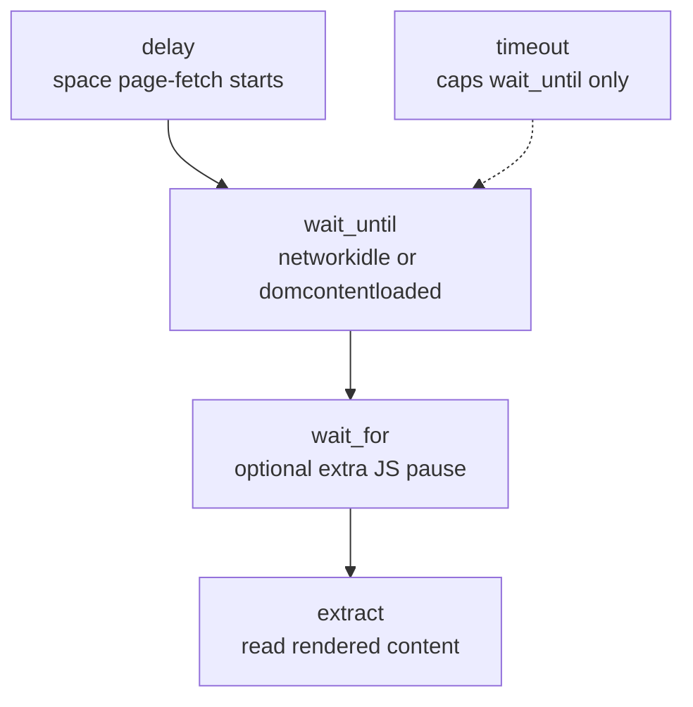
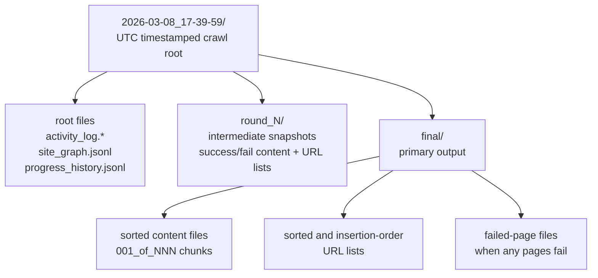

# Configuration & Output

← Back to [README](../README.md)

This page documents the crawl configuration models and the output structure. For
vector-index (Step 2) configuration, see
[src/vector_indexer/README.md](../src/vector_indexer/README.md). For RAG (Steps 3-5)
configuration — `RagConfig` (`llm_model`, `temperature` 0–2 default `0.0`, `max_tokens`
default `1024`, `top_k` default `4`) and the chat-model catalog (`CHAT_MODEL_OPTIONS`:
Bedrock Claude / Amazon Nova Lite, OpenAI GPT-4o / GPT-4o mini, and the offline echo
model) — see [src/rag_engine/README.md](../src/rag_engine/README.md).

## CrawlerConfig

| Parameter | Type | Default | Description |
|---|---|---|---|
| `urls` | `list[str]` | *(required)* | Seed URLs to crawl (comma-separated string also accepted) |
| `limit` | `int` | `1` | Maximum pages to crawl |
| `max_depth` | `int` | `1` | How many clicks deep to follow links |
| `max_concurrent` | `int` | `5` | Maximum simultaneous page fetches among URLs already discovered in the initial crawl. `5` is the default and can speed permissive sites; use `1` for strict or easily rate-limited sites. `delay` still spaces request starts. Retry rounds remain serial for WAF safety. |
| `exclude_paths` | `list[str]` | `[]` | Regex patterns for URLs to skip |
| `include_only_paths` | `list[str]` | `[]` | Regex patterns for URLs to keep (skip everything else) |
| `delay` | `float` | `0` | Seconds to space page-fetch starts — paces your crawl to avoid triggering bot detection (round 1: jitter 0.1x–1.0x; retries: jitter 0.3x–3.0x). WAF back-off (3–15 s) always applies on block detection. |
| `stealth` | `bool` | `True` | Enable bot-detection avoidance (random UA, stealth flags, full-page scan) |
| `headers` | `dict[str, str]` | `{}` | Custom HTTP headers passed to the browser |
| `max_retries` | `int` | `2` | Retry rounds for WAF-blocked pages (minimum 2) |
| `flush_interval` | `int` | `10` | Write generated files to disk every N pages |

## PageConfig

| Parameter | Type | Default | Description |
|---|---|---|---|
| `extract_main_content` | `bool` | `True` | `True` = trafilatura (main content only), `False` = markdownify (full HTML) |
| `exclude_tags` | `list[str]` | `["nav", "script", "form", "style"]` | HTML tags to remove before extraction |
| `include_only_tags` | `list[str]` | `[]` | Keep only these HTML tags (mutually exclusive with `exclude_tags`) |
| `wait_until` | `str` | `"networkidle"` | When to consider a page loaded. `"networkidle"` waits until network traffic stops (thorough, good for JS-heavy sites). `"domcontentloaded"` returns as soon as the HTML is parsed (faster, good for simple/static sites). Capped by `timeout`. Retry rounds automatically downgrade to `"domcontentloaded"` to avoid repeated timeouts. |
| `wait_for` | `float \| None` | `None` | Extra delay (seconds) **after** `wait_until` completes, before extracting content — gives slow JavaScript time to finish rendering. Runs on top of `wait_until`, not instead of it. |
| `timeout` | `float` | `30` | Hard limit (seconds) for the page load phase — if `wait_until` hasn't resolved within this time, the page is treated as loaded anyway. Does not include `wait_for`. |
| `max_file_size_mb` | `float` | `15.0` | Max size per output file in MB |
| `output_extension` | `".txt" \| ".md"` | `".txt"` | Output file format |
| `separate_items` | `bool` | `True` | Insert `---` separators between repeated items (e.g. product cards) |
| `item_selector` | `str` | `""` | CSS selector for items; empty = auto-detect |
| `js_code` | `list[str]` | `[]` | JavaScript snippets to execute before extraction (e.g. expand collapsibles) |
| `scan_full_page` | `bool` | `True` | Scroll through the full page before extraction (helps bypass lazy-load WAFs) |
| `scroll_delay` | `float` | `0.4` | Seconds to pause between scroll steps (used when `scan_full_page` is on) |
| `ocr_languages` | `list[str]` | `["eng", "msa"]` | Tesseract language codes for PDF OCR (e.g. `["eng", "fra"]`). Empty list disables OCR. Requires Tesseract installed. |
| `flatten_shadow_dom` | `bool` | `True` | Flatten Shadow DOM into the light DOM before extraction — helps discover links and content on sites using Web Components. |

## Page timing

The timing parameters control different phases of each page crawl:

- **`delay`** (CrawlerConfig) — pause between page-fetch starts. Controls crawl speed to avoid bot detection. When `max_concurrent` is above `1`, slow pages may overlap, but new requests are still spaced by the delay.
- **`wait_until`** (PageConfig) — determines *when* a page is considered loaded. `"networkidle"` waits until all network requests finish (~500 ms of silence), which is thorough but can hang on analytics-heavy sites. `"domcontentloaded"` returns as soon as the HTML is parsed, which is faster but may miss JS-rendered content. On retry rounds, `wait_until` is automatically downgraded to `"domcontentloaded"` to avoid repeated timeouts.
- **`wait_for`** (PageConfig) — extra pause *after* `wait_until` completes. Use this when content appears slightly after the page load event (e.g., delayed AJAX calls). Runs on top of `wait_until`, not instead of it.
- **`timeout`** (PageConfig) — hard limit on the `wait_until` phase. If the load condition hasn't been met within this time, the page is treated as loaded anyway and extraction proceeds.

## Output structure

Each crawl creates a UTC timestamped folder. Per-round subdirectories hold
intermediate snapshots; the `final/` folder holds the primary output.

### Intermediate file cleanup

By default (`_CLEANUP_INTERMEDIATE_FILES = True` in `src/crawl4md/_internal/final_output.py`),
three categories of intermediate files are automatically removed once the final sorted output is written:

| Removed | Why |
|---------|-----|
| `round_N/success_pages.jsonl`, `round_N/fail_pages.jsonl` | JSONL sidecar files used during the crawl to keep memory usage low. No longer needed once sorted files exist. |
| `final/success_content_*.md`, `final/fail_content_*.md` | Unsorted merged content — superseded by `final/sorted_*` which contains the same pages in a better order. |
| `round_N/sorted_*` | Per-round sorted snapshots — superseded by the final merged sorted output. |

To keep every intermediate file on disk (useful for debugging), set
`_CLEANUP_INTERMEDIATE_FILES = False` in `src/crawl4md/_internal/final_output.py`.

Every generated content file (`*_content_*.txt` / `*_content_*.md`) starts with YAML
front matter recording the crawl start time, session ID, stored directory, full
crawl parameters, and status. It covers the entire file, not individual pages within it.

### What to look at first

A crawl writes many files. The primary output is
`final/sorted_success_content_001_of_NNN.md` — all successfully extracted pages,
merged across every retry round and sorted by URL path. When a single file would
exceed `max_file_size_mb`, content splits into `001_of_003`, `002_of_003`, … files.

| I want… | File |
|---------|------|
| Extracted site content | `final/sorted_success_content_*.md` |
| Succeeded URLs | `final/sorted_success_urls.txt` |
| Pages that never succeeded | `final/sorted_fail_content_*.md` |
| Failed URLs | `final/sorted_fail_urls.txt` |
| Full site map (status + depth) | `site_graph.jsonl` |
| Timestamped crawl diary | `activity_log.txt` / `activity_log.csv` |
| Chart-ready progress timeline | `progress_history.jsonl` |

**Why `round_N/` folders?** crawl4md retries failed pages in separate rounds
(controlled by `max_retries`). Each round folder is an intermediate snapshot. The
`final/` folder merges every round and is what you normally use.

**`sorted_` prefix vs. no prefix in `final/`.** `sorted_success_content_*.md` is
sorted by URL path; `success_urls.txt` (no prefix) keeps insertion order. Use the
`sorted_` files for reading or post-processing.

**`001_of_003` chunk numbers.** `NNN_of_TOTAL` — concatenate the parts in order for
the full output.
