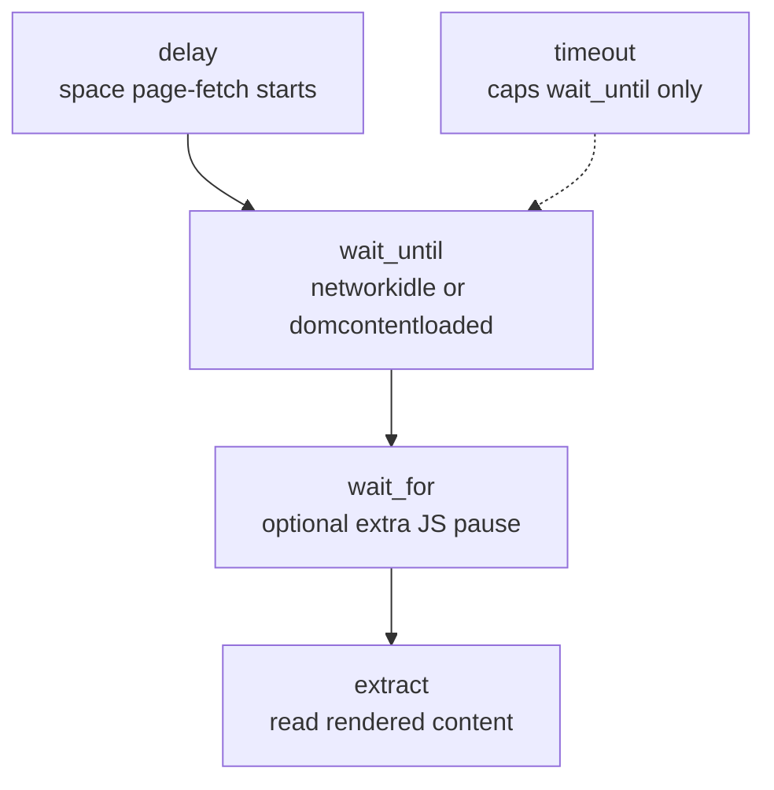
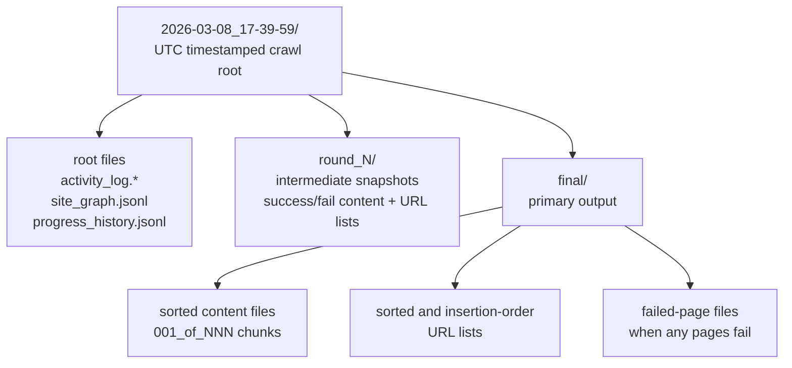

# Configuration & Output

← Back to [README](../README.md)

This page documents the crawl configuration models and the output structure. For
vector-index (Step 2) configuration, see
[src/vector_indexer/README.md](../src/vector_indexer/README.md). For RAG (Steps 3-5)
configuration — `RagConfig` (`llm_model`, `temperature` 0–2 default `0.0`, `max_tokens`
default `1024`, `top_k` default `4`) and the chat-model catalog (`CHAT_MODEL_OPTIONS`:
Bedrock Claude / Amazon Nova Lite, OpenAI GPT-4o / GPT-4o mini, and the offline echo
model) — see [src/rag_engine/README.md](../src/rag_engine/README.md).

## Environment configuration & secrets (Streamlit app)

The Streamlit app reads deployment-tunable, **non-secret** defaults from a typed
settings layer (`crawl4md_streamlit.settings`, built on `pydantic-settings`) so an
operator can change them per environment **without editing code or redeploying** —
update the value and restart. Values load in increasing precedence from:

1. `.env.defaults` — committed defaults (documented inline), the source of truth.
2. `.env` — local, git-ignored overrides **and secrets**.
3. the process environment — used by Streamlit Community Cloud, which exposes
   root-level `secrets.toml` keys as environment variables.

`settings` declares each key with **no in-code fallback**, so `.env.defaults`
must define every value — it is the one place defaults live, and a missing key
fails fast at startup.

The libraries stay pure: only the app reads these and feeds them into the
crawl/index/RAG config models.

### Settings (non-secret)

| Variable | Default | What it does |
|---|---|---|
| `CRAWL_LIMIT` | `10` | Default pages-to-crawl in the form |
| `CRAWL_MAX_DEPTH` | `5` | Default link depth |
| `CRAWL_MAX_CONCURRENT` | `5` | Default parallel page fetches |
| `CRAWL_FLUSH_INTERVAL` | `5` | Pages buffered before each disk flush |
| `CRAWL_DELAY` | `3.0` | Default polite delay (s) between fetches |
| `CRAWL_MAX_RETRIES` | `5` | Default retry rounds (minimum 2) |
| `CRAWL_WAIT_FOR` | `3.0` | Extra wait (s) for late content |
| `CRAWL_TIMEOUT` | `60.0` | Per-page load timeout (s) |
| `CRAWL_MAX_FILE_SIZE_MB` | `10.0` | Max size per output file (MB) |
| `CRAWL_ACTIVITY_LOG_SIZE` | `10` | Live activity-log lines retained |
| `VECTOR_CHUNK_SIZE` | `600` | Tokens per chunk |
| `VECTOR_CHUNK_OVERLAP` | `100` | Overlap between chunks |
| `VECTOR_INDEX_WORKERS` | `4` | Parallel embedding workers (1-8); cloud models only — local ONNX forced to 1 |
| `VECTOR_EMBEDDING_DIMENSION` | `512` | Default embedding vector size |
| `VECTOR_EMBEDDING_MODELS` | `all-MiniLM-L6-v2,amazon.titan-embed-text-v2:0,text-embedding-3-small` | Embedding models offered in the dropdown, in display order |
| `VECTOR_DEFAULT_EMBEDDING_MODEL` | `all-MiniLM-L6-v2` | Embedding model pre-selected in the dropdown |
| `RAG_TOP_K` | `4` | Chunks retrieved as context (Steps 4-5) |
| `SEMANTIC_SEARCH_TOP_N` | `5` | Ranked matches shown on the Search page |
| `SEMANTIC_SEARCH_DEFAULT_TAB` | `raw` | Default open tab on each result card (`raw` or `preview`) |
| `SEMANTIC_SEARCH_DEFAULT_MODE` | `similarity` | Default search mode (`similarity` or `mmr`) |
| `SEMANTIC_SEARCH_MIN_SCORE_PERCENT` | `0` | Default minimum-similarity filter (percent; 0 keeps all) |
| `SEMANTIC_SEARCH_FETCH_K` | `20` | Default MMR candidate-pool size |
| `SEMANTIC_SEARCH_MMR_LAMBDA` | `0.5` | Default MMR diversity (0 = variety, 1 = relevance) |
| `SESSION_RETENTION_DAYS` | `7` | Days an inactive browser session's files are kept before startup cleanup deletes them (loading or crawling resets the clock) |
| `UI_DOWNLOAD_LIMIT_MB` | `500` | Largest file or folder-zip served as a download |
| `UI_PREVIEW_LIMIT_KB` | `256` | Largest inline text preview |
| `UI_LIVE_REFRESH_SEC` | `3` | Seconds between live crawl/index progress refreshes |
| `UI_DOWNLOADS_REFRESH_SEC` | `7` | Seconds between Output Files panel refreshes |
| `ZIP_SIGNING_SECRET` | `crawl4md-dev-zip-key` | Shared key that signs downloaded zips so a folder can be re-uploaded to an instance using the same key; override per deployment |

These are *starting defaults* for the forms; users can still override most of them
per crawl/index in the UI. See `.env.defaults` for the inline documentation.

### Secrets (kept separate)

Credentials never live in `.env.defaults` or `settings`. They are plain
environment variables read by their SDKs:

| Variable | Used for |
|---|---|
| `AWS_ACCESS_KEY_ID` / `AWS_SECRET_ACCESS_KEY` / `AWS_REGION` | Amazon Bedrock (Titan embeddings + Claude/Nova chat) |
| `OPENAI_API_KEY` | OpenAI embeddings + chat |
| `CRAWL_PROXIES` | Optional comma-separated proxy URLs (direct-first escalation) for Step 1 crawling |
| `CRAWL_FALLBACK_API_URL` / `CRAWL_FALLBACK_API_TOKEN` | Optional last-resort scraping API, fetched with the page URL when every browser + proxy attempt is still blocked |

Locally, copy `.env.example` to `.env` (git-ignored) and fill them in. Leave them
blank to run fully offline (local embeddings + echo chat model).

### Anti-bot escalation (Step 1 crawling)

For sites that block the crawler, three opt-in escalations layer on top of the
default stealth browser + retry rounds (all off by default):

- **Proxies** — set the `CRAWL_PROXIES` secret (comma-separated URLs). They are
  tried direct-first, then in order, on blocked requests. Used **only on retry
  rounds** (not the initial crawl) to save cost, since proxies are a paid service.
  Residential proxies are usually required for hard `403`s (e.g. Akamai); data-center
  proxies are often blocked too.
- **Undetected browser** — retry rounds automatically escalate to Crawl4AI's
  undetected adapter; the **initial** crawl uses the standard stealth browser to
  focus on discovering pages, and it falls back to stealth if the adapter is
  unavailable. No setting to toggle.
- **Scraping-API fallback** — set `CRAWL_FALLBACK_API_URL` (and optional
  `CRAWL_FALLBACK_API_TOKEN`) to fetch the page from an external scraping service
  as a last resort, after every browser + proxy attempt is still blocked.

Proxies and the fallback API are **secrets** (env / Cloud Secrets only — never in
`.env.defaults` or logs). They are honest mitigations, not guarantees: a hard
Akamai/DataDome block may still fail. Always respect each site's robots.txt and
terms of service.

### Streamlit Community Cloud

The deployed app reads secrets from the Cloud **Secrets** console (TOML).
Root-level keys are exposed automatically as environment variables, so the same
`AWS_*` / `OPENAI_API_KEY` reads work unchanged. Copy
`.streamlit/secrets.toml.example` into **Manage app → Settings → Secrets**, fill in
real values, and save (changes propagate in ~1 minute). You can also override any
non-secret setting there. Never commit a real `.streamlit/secrets.toml` — it is
git-ignored.

## CrawlerConfig

| Parameter | Type | Default | Description |
|---|---|---|---|
| `urls` | `list[str]` | *(required)* | Seed URLs to crawl (comma-separated string also accepted) |
| `limit` | `int` | `1` | Maximum pages to crawl |
| `max_depth` | `int` | `1` | How many clicks deep to follow links |
| `max_concurrent` | `int` | `5` | Maximum simultaneous page fetches among URLs already discovered in the initial crawl. `5` is the default and can speed permissive sites; use `1` for strict or easily rate-limited sites. `delay` still spaces request starts. Retry rounds remain serial for WAF safety. |
| `exclude_paths` | `list[str]` | `[]` | Regex patterns for URLs to skip |
| `include_only_paths` | `list[str]` | `[]` | Regex patterns for URLs to keep (skip everything else) |
| `delay` | `float` | `0` | Seconds to space page-fetch starts — paces your crawl to avoid triggering bot detection (round 1: jitter 0.1x–1.0x; retries: jitter 0.3x–3.0x). WAF back-off (3–15 s) always applies on block detection. |
| `stealth` | `bool` | `True` | Enable bot-detection avoidance (random UA, stealth flags, full-page scan) |
| `headers` | `dict[str, str]` | `{}` | Custom HTTP headers passed to the browser |
| `max_retries` | `int` | `2` | Retry rounds for WAF-blocked pages (minimum 2) |
| `flush_interval` | `int` | `10` | Write generated files to disk every N pages |
| `proxies` | `list[str]` | `[]` | Proxy URLs tried in order (direct first) when blocked; feeds Crawl4AI's `proxy_config`. Set via the `CRAWL_PROXIES` secret in the app — never logged (`repr=False`). |

## PageConfig

| Parameter | Type | Default | Description |
|---|---|---|---|
| `extract_main_content` | `bool` | `True` | `True` = trafilatura (main content only), `False` = markdownify (full HTML) |
| `exclude_tags` | `list[str]` | `["nav", "script", "form", "style"]` | HTML tags to remove before extraction |
| `include_only_tags` | `list[str]` | `[]` | Keep only these HTML tags (mutually exclusive with `exclude_tags`) |
| `wait_until` | `str` | `"networkidle"` | When to consider a page loaded. `"networkidle"` waits until network traffic stops (thorough, good for JS-heavy sites). `"domcontentloaded"` returns as soon as the HTML is parsed (faster, good for simple/static sites). Capped by `timeout`. Retry rounds automatically downgrade to `"domcontentloaded"` to avoid repeated timeouts. |
| `wait_for` | `float \| None` | `None` | Extra delay (seconds) **after** `wait_until` completes, before extracting content — gives slow JavaScript time to finish rendering. Runs on top of `wait_until`, not instead of it. |
| `timeout` | `float` | `30` | Hard limit (seconds) for the page load phase — if `wait_until` hasn't resolved within this time, the page is treated as loaded anyway. Does not include `wait_for`. |
| `max_file_size_mb` | `float` | `15.0` | Max size per output file in MB |
| `output_extension` | `".txt" \| ".md"` | `".txt"` | Output file format |
| `separate_items` | `bool` | `True` | Insert `---` separators between repeated items (e.g. product cards) |
| `item_selector` | `str` | `""` | CSS selector for items; empty = auto-detect |
| `js_code` | `list[str]` | `[]` | JavaScript snippets to execute before extraction (e.g. expand collapsibles) |
| `scan_full_page` | `bool` | `True` | Scroll through the full page before extraction (helps bypass lazy-load WAFs) |
| `scroll_delay` | `float` | `0.4` | Seconds to pause between scroll steps (used when `scan_full_page` is on) |
| `ocr_languages` | `list[str]` | `["eng", "msa"]` | Tesseract language codes for PDF OCR (e.g. `["eng", "fra"]`). Empty list disables OCR. Requires Tesseract installed. |
| `flatten_shadow_dom` | `bool` | `True` | Flatten Shadow DOM into the light DOM before extraction — helps discover links and content on sites using Web Components. |

## Page timing

The timing parameters control different phases of each page crawl:

- **`delay`** (CrawlerConfig) — pause between page-fetch starts. Controls crawl speed to avoid bot detection. When `max_concurrent` is above `1`, slow pages may overlap, but new requests are still spaced by the delay.
- **`wait_until`** (PageConfig) — determines *when* a page is considered loaded. `"networkidle"` waits until all network requests finish (~500 ms of silence), which is thorough but can hang on analytics-heavy sites. `"domcontentloaded"` returns as soon as the HTML is parsed, which is faster but may miss JS-rendered content. On retry rounds, `wait_until` is automatically downgraded to `"domcontentloaded"` to avoid repeated timeouts.
- **`wait_for`** (PageConfig) — extra pause *after* `wait_until` completes. Use this when content appears slightly after the page load event (e.g., delayed AJAX calls). Runs on top of `wait_until`, not instead of it.
- **`timeout`** (PageConfig) — hard limit on the `wait_until` phase. If the load condition hasn't been met within this time, the page is treated as loaded anyway and extraction proceeds.

## Output structure

Each crawl creates a UTC timestamped folder. Per-round subdirectories hold
intermediate snapshots; the `final/` folder holds the primary output.

### Intermediate file cleanup

By default (`_CLEANUP_INTERMEDIATE_FILES = True` in `src/crawl4md/_internal/final_output.py`),
three categories of intermediate files are automatically removed once the final sorted output is written:

| Removed | Why |
|---------|-----|
| `round_N/success_pages.jsonl`, `round_N/fail_pages.jsonl` | JSONL sidecar files used during the crawl to keep memory usage low. No longer needed once sorted files exist. |
| `final/success_content_*.md`, `final/fail_content_*.md` | Unsorted merged content — superseded by `final/sorted_*` which contains the same pages in a better order. |
| `round_N/sorted_*` | Per-round sorted snapshots — superseded by the final merged sorted output. |

To keep every intermediate file on disk (useful for debugging), set
`_CLEANUP_INTERMEDIATE_FILES = False` in `src/crawl4md/_internal/final_output.py`.

Every generated content file (`*_content_*.txt` / `*_content_*.md`) starts with YAML
front matter recording the crawl start time, session ID, stored directory, full
crawl parameters, and status. It covers the entire file, not individual pages within it.

Each page's human-readable header (the title heading and `*Source: <url>*` line) is
wrapped in render-invisible HTML-comment markers (`<!-- crawl4md:source -->` …
`<!-- /crawl4md:source -->`). They do not show when the Markdown is rendered; the
`vector_indexer` library uses them to recover each page's source and to keep both the
front matter and the header out of indexed chunk text.

### What to look at first

A crawl writes many files. The primary output is
`final/sorted_success_content_001_of_NNN.md` — all successfully extracted pages,
merged across every retry round and sorted by URL path. When a single file would
exceed `max_file_size_mb`, content splits into `001_of_003`, `002_of_003`, … files.

| I want… | File |
|---------|------|
| Extracted site content | `final/sorted_success_content_*.md` |
| Succeeded URLs | `final/sorted_success_urls.txt` |
| Pages that never succeeded | `final/sorted_fail_content_*.md` |
| Failed URLs | `final/sorted_fail_urls.txt` |
| Full site map (status + depth) | `site_graph.jsonl` |
| Timestamped crawl diary | `activity_log.txt` / `activity_log.csv` |
| Chart-ready progress timeline | `progress_history.jsonl` |

**Why `round_N/` folders?** crawl4md retries failed pages in separate rounds
(controlled by `max_retries`). Each round folder is an intermediate snapshot. The
`final/` folder merges every round and is what you normally use.

**`sorted_` prefix vs. no prefix in `final/`.** `sorted_success_content_*.md` is
sorted by URL path; `success_urls.txt` (no prefix) keeps insertion order. Use the
`sorted_` files for reading or post-processing.

**`001_of_003` chunk numbers.** `NNN_of_TOTAL` — concatenate the parts in order for
the full output.
