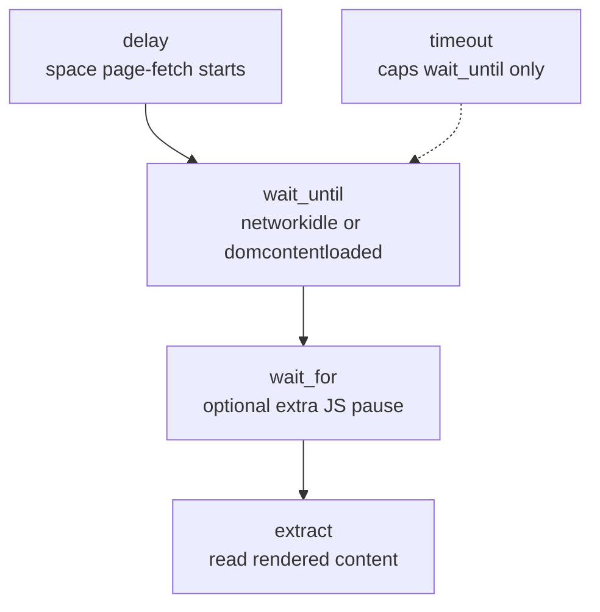
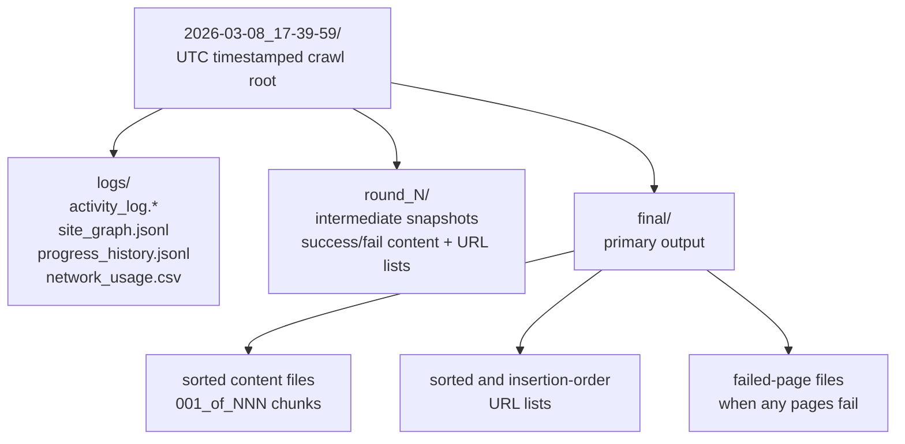

# Configuration & Output

← Back to [README](../README.md)

This page documents the crawl configuration models and the output structure. For
vector-index (Step 2) configuration, see
[src/vector_indexer/README.md](../src/vector_indexer/README.md). For RAG (Steps 3-5)
configuration — `RagConfig` (`llm_model`, `temperature` 0–2 default `0.0`, `max_tokens`
default `1024`, `top_k` default `4`) and the chat-model catalog (`CHAT_MODEL_OPTIONS`:
Bedrock Claude / Amazon Nova / Qwen3, the OpenAI Direct API set (e.g. GPT-4o mini), and
the offline echo model) — see [src/rag_engine/README.md](../src/rag_engine/README.md).

## Environment configuration & secrets (Streamlit app)

The Streamlit app reads deployment-tunable, **non-secret** defaults from a typed
settings layer (`app_support.settings`, built on `pydantic-settings`) so an
operator can change them per environment **without editing code or redeploying** —
update the value and restart. Values load in increasing precedence from:

1. `.env.defaults` — committed defaults (documented inline), the source of truth.
2. `.env` — local, git-ignored overrides **and secrets**.
3. the process environment — used by Streamlit Community Cloud, which exposes
   root-level `secrets.toml` keys as environment variables.

`settings` declares each key with **no in-code fallback**, so `.env.defaults`
must define every value — it is the one place defaults live, and a missing key
fails fast at startup.

The libraries stay pure: only the app reads these and feeds them into the
crawl/index/RAG config models.

### Settings (non-secret)

| Variable | Default | What it does |
|---|---|---|
| `CRAWL_LIMIT` | `100` | Default pages-to-crawl in the form |
| `CRAWL_MAX_DEPTH` | `5` | Default link depth |
| `CRAWL_MAX_CONCURRENT` | `5` | Default parallel page fetches |
| `CRAWL_FLUSH_INTERVAL` | `5` | Pages buffered before each disk flush |
| `CRAWL_DELAY` | `1.0` | Default polite delay (s) between fetches |
| `CRAWL_MAX_RETRIES` | `3` | Default retry rounds (minimum 3) |
| `CRAWL_WAIT_FOR` | `3.0` | Extra wait (s) for late content |
| `CRAWL_TIMEOUT` | `60.0` | Per-page load timeout (s) |
| `CRAWL_MAX_FILE_SIZE_MB` | `10.0` | Max size per output file (MB) |
| `CRAWL_ACTIVITY_LOG_SIZE` | `10` | Live activity-log lines retained |
| `CRAWL_DEFAULT_URLS` | `https://www.ato.gov.au/` | Seed URL(s) pre-filled in the crawl form (comma-separated for more than one) |
| `CRAWL_INCLUDE_ONLY_PATHS` | `ato.gov.au` | Default "only include" URL filter(s), comma-separated (substring or regex) |
| `CRAWL_EXCLUDE_PATHS` | `ato.gov.au/api/` | Default "skip" URL filter(s), comma-separated (substring or regex) |
| `CRAWL_EXCLUDE_TAGS` | `nav, script, form, style` | Default HTML tags stripped before extraction, comma-separated |
| `CRAWL_DEFAULT_OUTPUT_EXTENSION` | `.md` | Default output file extension for extracted pages (`.md` or `.txt`) |
| `CRAWL_PROXY_ON_INITIAL` | `false` | When true, also route the **initial** crawl through the configured proxies (needs the `CRAWL_PROXIES` secret); otherwise proxies apply only to retry rounds |
| `VECTOR_CHUNK_SIZE` | `600` | Tokens per chunk |
| `VECTOR_CHUNK_OVERLAP` | `100` | Overlap between chunks |
| `VECTOR_INDEX_WORKERS` | `4` | Parallel embedding workers (1-8); cloud models only — local ONNX forced to 1 |
| `VECTOR_EMBEDDING_DIMENSION` | `512` | Default embedding vector size |
| `VECTOR_EMBEDDING_MODELS` | `all-MiniLM-L6-v2,amazon.titan-embed-text-v2:0,text-embedding-3-small` | Embedding models offered in the dropdown, in display order |
| `VECTOR_DEFAULT_EMBEDDING_MODEL` | `all-MiniLM-L6-v2` | Embedding model pre-selected in the dropdown |
| `RAG_TOP_K` | `5` | Chunks retrieved as context (Step 5 conversational) |
| `BASIC_RAG_QA_TOP_RESULTS` | `5` | Top matches retrieved as knowledge on Step 4 (Basic RAG Q&A) |
| `BASIC_RAG_QA_TONES` | `Neutral,Formal,Friendly,…` | Tones offered on the Step 4 and Step 5 Tone selectors (comma-separated, in order) |
| `BASIC_RAG_QA_DEFAULT_TONE` | `Neutral` | Tone pre-selected on the Step 4 selector |
| `BASIC_RAG_QA_PROMPT_TEMPLATE_FILE` | `apps/streamlit/config/basic_rag_qa_prompt.txt` | Path (relative to the repo root) to the Step 4 default prompt template (a customer-service persona); edit it to reword the generated prompt without a code change. A per-session template saved from the app's **Edit template** editor takes precedence; a missing/empty file, or one missing a `{question}`/`{start}`/`{knowledge}`/`{end}`/`{tone}`/`{language}` field, falls back to the built-in library default. The active UI language fills `{language}` so the generated answer follows the UI language. |
| `BASIC_RAG_QA_SESSION_TOKEN_QUOTA` | `5700000` | Per-session token budget shown on the Step 4 Token usage panel (drives Quota and Usage). Set to ~`BASIC_RAG_QA_SESSION_COST_QUOTA` worth of tokens at the average small-model price (~$0.176/1M) so the token % and $ % roughly agree; display-only — it never blocks sending |
| `BASIC_RAG_QA_SESSION_COST_QUOTA` | `1.0` | Per-session USD cost budget shown beside the token quota (drives the panel's `$` Usage %); display-only — it never blocks sending. Override per deploy via env or `secrets.toml` |
| `RAG_LLM_MODELS` | `apac.amazon.nova-micro-v1:0,…,qwen.qwen3-32b-v1:0,…,gpt-4o` | **Fallback** language-model list for the RAG pages (comma-separated `rag_engine` catalog ids, in order). The picker is normally driven by `apps/streamlit/config/model_pricing.yaml` filtered to `RAG_LLM_SIZE_BANDS`; this list is used only when that config is missing/empty. The offline echo model is the silent fallback and is intentionally not listed |
| `RAG_DEFAULT_LLM_MODEL` | `apac.amazon.nova-lite-v1:0` | Language model pre-selected on the RAG pages |
| `RAG_LLM_SIZE_BANDS` | `XS,Small` | Size bands shown in the RAG model picker (comma-separated: XS, Small, Medium, Large, XL, Frontier); models outside these bands are hidden. Per-model metadata + pricing live in `apps/streamlit/config/model_pricing.yaml` |
| `SEMANTIC_SEARCH_TOP_N` | `5` | Ranked matches shown on the Search page |
| `SEMANTIC_SEARCH_DEFAULT_TAB` | `raw` | Default open tab on each result card (`raw` or `preview`) |
| `CONV_RAG_RERANKER` | `llm` | Step 5 default re-ranking: `off`, `local` (on-device cross-encoder, needs the `[rerank]` extra + torch), or `llm` (reuses the auxiliary model). Defaults to `llm` so memory-limited hosts (e.g. Streamlit Cloud) never load the heavy local model (torch) unless a user opts in per session |
| `CONV_RAG_RERANK_TOP_N` | `5` | Passages kept after re-ranking as answer context (Step 5) |
| `CONV_RAG_MAX_LIVE_TURNS` | `30` | Most recent Step 5 turns kept fully in memory; older turns keep their question/answer text but shed retrieved-chunk payloads (they stay on disk and reload via the conversation picker). Bounds a long conversation's memory |
| `CONV_RAG_AUX_MODELS` | `apac.amazon.nova-micro-v1:0,gpt-4o-mini,google.gemma-3-4b-it` | Small helper models offered as the Step 5 **Auxiliary model** (decomposition / state / follow-ups / LLM re-rank), which may span providers (e.g. Amazon, OpenAI, Google); the list is filtered to the `CONV_RAG_AUX_SIZE_BANDS` pricing bands, so oversized or unpriced ids are dropped even if listed |
| `CONV_RAG_DEFAULT_AUX_MODEL` | `apac.amazon.nova-micro-v1:0` | Auxiliary model pre-selected on Step 5 |
| `CONV_RAG_AUX_SIZE_BANDS` | `XS,Small` | Size bands the Step 5 **Auxiliary model** list is filtered to (via `resolve_offered_from_pricing` against `config/model_pricing.yaml`); models outside these bands are dropped even if listed in `CONV_RAG_AUX_MODELS` |
| `CONV_RAG_DECOMPOSITION_ENABLED` | `true` | Whether query decomposition starts on (users can toggle it) |
| `CONV_RAG_FOLLOWUPS_ENABLED` | `true` | Whether follow-up suggestions start on (users can toggle them) |
| `CONV_RAG_FOLLOWUP_MIN_SCORE` | `0.60` | A follow-up is kept outright at/above this similarity |
| `CONV_RAG_FOLLOWUP_DROP_SCORE` | `0.40` | A follow-up is dropped outright at/below this similarity (in between → the model checks) |
| `CONV_RAG_FOLLOWUP_SHOW_COUNT` | `3` | Validated follow-up buttons shown on Step 5 |
| `CONV_RAG_PROMPT_TEMPLATE_DIR` | `apps/streamlit/config` | Directory (relative to the repo root) holding the six Step 5 default prompt files (`conversational_{answer,decompose,rerank,followups,answerability,state}_prompt.txt`). Edit them to reword a default without a code change; a per-session edit from the app's prompt editor takes precedence, and a missing/empty/invalid file falls back to the built-in library template |
| `CONV_RAG_SESSION_TOKEN_QUOTA` | `5700000` | Per-session token budget shown on the Step 5 Token usage panel (its % Usage). Display-only; never blocks a send |
| `CONV_RAG_SESSION_COST_QUOTA` | `1.0` | Per-session USD cost budget shown beside the Step 5 token quota. Display-only; overridable per deploy |
| `SESSIONS_ROOT` | `outputs/streamlit_sessions` | Filesystem root for all per-session files (crawls, indexes, histories, logs). Relative paths resolve against the app's working directory; set an absolute path (e.g. a mounted volume) for a containerized/cloud deployment — see [CLOUD_DEPLOYMENT.md](CLOUD_DEPLOYMENT.md) |
| `SESSION_RETENTION_DAYS` | `7` | Days an inactive browser session's files are kept before startup cleanup deletes them (loading or crawling resets the clock) |
| `UI_DOWNLOAD_LIMIT_MB` | `500` | Largest file or folder-zip served as a download |
| `UI_PREVIEW_LIMIT_KB` | `256` | Largest inline text preview |
| `UI_LIVE_REFRESH_SEC` | `3` | Seconds between live crawl/index progress refreshes |
| `UI_DOWNLOADS_REFRESH_SEC` | `7` | Seconds between Output Files panel refreshes |
| `LOG_LEVEL` | `INFO` | Minimum log level for the terminal + log file (threshold: DEBUG < INFO < WARNING < ERROR; `WARN` accepted) |
| `LOG_FILE` | `logs/app.log` | Per-session developer log path (relative to each session's folder); surfaced as a preview/download in the Files & folders panel |
| `ZIP_SIGNING_SECRET` | `crawl4md-dev-zip-key` | Shared key that signs downloaded zips so a folder can be re-uploaded to an instance using the same key; override per deployment |

These are *starting defaults* for the forms; users can still override most of them
per crawl/index in the UI. See `.env.defaults` for the inline documentation.

### Model pricing & cost estimates

The Step 4/5 language-model picker and the **Token usage** cost estimates read
`apps/streamlit/config/model_pricing.yaml` — per-model display metadata (provider,
cloud service, size band) plus USD prices per 1M input/output tokens, with the price
capture date and sources. Edit this file to add models, change size bands, or refresh
prices without a code change; a model with no published price simply shows `n/a` for
cost. A new model must also exist in the `rag_engine` catalog to be callable. Costs
shown in the app are rough estimates for guidance only.

### Secrets (kept separate)

Credentials never live in `.env.defaults` or `settings`. They are plain
environment variables read by their SDKs:

| Variable | Used for |
|---|---|
| `AWS_ACCESS_KEY_ID` / `AWS_SECRET_ACCESS_KEY` / `AWS_REGION` | Amazon Bedrock (Titan embeddings + Claude/Nova chat) |
| `OPENAI_API_KEY` | OpenAI embeddings + chat |
| `CRAWL_PROXIES` | Optional comma-separated proxy URLs (direct-first escalation) for Step 1 crawling; used on every retry round (not the initial crawl) |

Locally, copy `.env.example` to `.env` (git-ignored) and fill them in. Leave them
blank to run fully offline (local embeddings + echo chat model).

**Bedrock model access & IDs.** The Bedrock chat-model IDs are Region-specific: Nova
and Claude use APAC cross-Region inference profiles (`apac.*`) and Qwen3 is offered
in-Region (plain `qwen.*` ids) for `ap-southeast-2` (Sydney). Before a model works
you must enable it under **Bedrock → Model access** in that Region and confirm the
exact inference-profile/model ID on the model's card (or via
`aws bedrock list-inference-profiles` / `aws bedrock list-foundation-models`). A model
that is unavailable in your Region returns *"The provided model identifier is
invalid"*; a model the provider has marked **Legacy** returns an *"upgrade to an
active model"* error — replace it with a currently-active model in `RAG_LLM_MODELS`
and `RAG_DEFAULT_LLM_MODEL`.

### Anti-bot escalation (Step 1 crawling)

For sites that block the crawler, two escalations layer on top of the default
stealth browser + retry rounds:

- **Proxies** — set the `CRAWL_PROXIES` secret (comma-separated URLs). They are
  tried direct-first, then in order, on blocked requests. By default the **initial**
  crawl runs direct (no proxy) and **every retry round** routes through the proxies.
  Set `CRAWL_PROXY_ON_INITIAL=true` to also proxy the initial crawl, for sites that
  block the very first unproxied request. Every URL attempted in a proxied round is
  logged to `logs/network_usage.csv` (URL, method, round, status, size) so you can
  track spend — proxy credentials are never written. Residential proxies are usually
  required for hard `403`s (e.g. Akamai); data-center proxies are often blocked too.
- **Undetected browser** — retry rounds automatically escalate to Crawl4AI's
  undetected adapter; the **initial** crawl uses the standard stealth browser to
  focus on discovering pages, and it falls back to stealth if the adapter is
  unavailable. No setting to toggle.

Proxies are a **secret** (env / Cloud Secrets only — never in `.env.defaults` or
logs). They are honest mitigations, not guarantees: a hard
Akamai/DataDome block may still fail. Always respect each site's robots.txt and
terms of service.

### Streamlit Community Cloud

The deployed app reads secrets from the Cloud **Secrets** console (TOML).
Root-level keys are exposed automatically as environment variables, so the same
`AWS_*` / `OPENAI_API_KEY` reads work unchanged. Copy
`.streamlit/secrets.toml.example` into **Manage app → Settings → Secrets**, fill in
real values, and save (changes propagate in ~1 minute). You can also override any
non-secret setting there. Never commit a real `.streamlit/secrets.toml` — it is
git-ignored.

## CrawlerConfig

| Parameter | Type | Default | Description |
|---|---|---|---|
| `urls` | `list[str]` | *(required)* | Seed URLs to crawl (comma-separated string also accepted) |
| `limit` | `int` | `1` | Maximum pages to crawl per seed URL (soft; discovery can overshoot and isn't trimmed) |
| `max_depth` | `int` | `1` | How many clicks deep to follow links |
| `max_concurrent` | `int` | `5` | Maximum simultaneous page fetches among URLs already discovered in the initial crawl. `5` is the default and can speed permissive sites; use `1` for strict or easily rate-limited sites. `delay` still spaces request starts. Retry rounds remain serial for WAF safety. |
| `exclude_paths` | `list[str]` | `[]` | Regex patterns for URLs to skip |
| `include_only_paths` | `list[str]` | `[]` | Regex patterns for URLs to keep (skip everything else) |
| `delay` | `float` | `0` | Seconds to space page-fetch starts — paces your crawl to avoid triggering bot detection (round 1: jitter 0.1x–1.0x; retries: jitter 0.3x–3.0x). WAF back-off (3–15 s) always applies on block detection. |
| `stealth` | `bool` | `True` | Enable bot-detection avoidance (random UA, stealth flags, full-page scan) |
| `headers` | `dict[str, str]` | `{}` | Custom HTTP headers passed to the browser; they also override the browser-like defaults sent on direct PDF/DOCX downloads (see note below) |
| `max_retries` | `int` | `3` | Retry rounds for WAF-blocked pages (minimum 3) |
| `flush_interval` | `int` | `10` | Write generated files to disk every N pages |
| `proxies` | `list[str]` | `[]` | Proxy URLs tried in order (direct first) when blocked; feeds Crawl4AI's `proxy_config` on the first retry round only. Set via the `CRAWL_PROXIES` secret in the app — never logged (`repr=False`). |

> **Direct document downloads (PDF/DOCX).** These are fetched with `httpx`, not the browser,
> so the crawler sends a real desktop-browser `User-Agent` + same-origin `Referer` and
> validates TLS against the **OS certificate store** (via `truststore`) — the same trust the
> browser and `pip` use, so downloads succeed behind a corporate TLS-intercepting proxy
> (httpx's default `certifi` bundle would raise `CERTIFICATE_VERIFY_FAILED`). Set `headers`
> to override any of these defaults (e.g. a custom `User-Agent`).
>
> **Same-domain only.** The crawler follows links within the seed domain(s) (and their
> subdomains), so a PDF/DOCX hosted on a **different** domain (e.g. a `cdn.…` host) is
> skipped even when linked from a crawled page. To capture it, add that host to the seed
> `urls` (or crawl the file URL directly). `.docx` is supported; legacy binary `.doc` is not.

## PageConfig

| Parameter | Type | Default | Description |
|---|---|---|---|
| `extract_main_content` | `bool` | `True` | `True` = trafilatura (main content only), `False` = markdownify (full HTML) |
| `exclude_tags` | `list[str]` | `["nav", "script", "form", "style"]` | HTML tags to remove before extraction |
| `include_only_tags` | `list[str]` | `[]` | Keep only these HTML tags (mutually exclusive with `exclude_tags`) |
| `wait_until` | `str` | `"networkidle"` | When to consider a page loaded. `"networkidle"` waits until network traffic stops (thorough, good for JS-heavy sites). `"domcontentloaded"` returns as soon as the HTML is parsed (faster, good for simple/static sites). Capped by `timeout`. Retry rounds automatically downgrade to `"domcontentloaded"` to avoid repeated timeouts. |
| `wait_for` | `float \| None` | `None` | Extra delay (seconds) **after** `wait_until` completes, before extracting content — gives slow JavaScript time to finish rendering. Runs on top of `wait_until`, not instead of it. |
| `timeout` | `float` | `30` | Hard limit (seconds) for the page load phase — if `wait_until` hasn't resolved within this time, the page is treated as loaded anyway. Does not include `wait_for`. |
| `max_file_size_mb` | `float` | `15.0` | Max size per output file in MB |
| `output_extension` | `".txt" \| ".md"` | `".txt"` | Output file format |
| `separate_items` | `bool` | `True` | Insert `---` separators between repeated items (e.g. product cards) |
| `item_selector` | `str` | `""` | CSS selector for items; empty = auto-detect |
| `js_code` | `list[str]` | `[]` | JavaScript snippets to execute before extraction (e.g. expand collapsibles) |
| `scan_full_page` | `bool` | `True` | Scroll through the full page before extraction (helps bypass lazy-load WAFs) |
| `scroll_delay` | `float` | `0.4` | Seconds to pause between scroll steps (used when `scan_full_page` is on) |
| `ocr_languages` | `list[str]` | `["eng", "msa"]` | Tesseract language codes for PDF OCR (e.g. `["eng", "fra"]`). Empty list disables OCR. Requires Tesseract installed. |
| `flatten_shadow_dom` | `bool` | `True` | Flatten Shadow DOM into the light DOM before extraction — helps discover links and content on sites using Web Components. |

## Page timing

The timing parameters control different phases of each page crawl:

```mermaid
flowchart TD
  Delay["delay<br/>space page-fetch starts"] --> WaitUntil["wait_until<br/>networkidle or domcontentloaded"]
  Timeout["timeout<br/>caps wait_until only"] -.-> WaitUntil
  WaitUntil --> WaitFor["wait_for<br/>optional extra JS pause"]
  WaitFor --> Extract["extract<br/>read rendered content"]
```

- **`delay`** (CrawlerConfig) — pause between page-fetch starts. Controls crawl speed to avoid bot detection. When `max_concurrent` is above `1`, slow pages may overlap, but new requests are still spaced by the delay.
- **`wait_until`** (PageConfig) — determines *when* a page is considered loaded. `"networkidle"` waits until all network requests finish (~500 ms of silence), which is thorough but can hang on analytics-heavy sites. `"domcontentloaded"` returns as soon as the HTML is parsed, which is faster but may miss JS-rendered content. On retry rounds, `wait_until` is automatically downgraded to `"domcontentloaded"` to avoid repeated timeouts.
- **`wait_for`** (PageConfig) — extra pause *after* `wait_until` completes. Use this when content appears slightly after the page load event (e.g., delayed AJAX calls). Runs on top of `wait_until`, not instead of it.
- **`timeout`** (PageConfig) — hard limit on the `wait_until` phase. If the load condition hasn't been met within this time, the page is treated as loaded anyway and extraction proceeds.

## Output structure

Each crawl creates a UTC timestamped folder. Per-round subdirectories hold
intermediate snapshots; the `final/` folder holds the primary output.

```mermaid
flowchart TD
  Root["2026-03-08_17-39-59/<br/>UTC timestamped crawl root"]
  Root --> Logs["logs/<br/>activity_log.*<br/>site_graph.jsonl<br/>progress_history.jsonl<br/>network_usage.csv"]
  Root --> Rounds["round_N/<br/>intermediate snapshots<br/>success/fail content + URL lists"]
  Root --> Final["final/<br/>primary output"]
  Final --> SortedContent["sorted content files<br/>001_of_NNN chunks"]
  Final --> UrlLists["sorted and insertion-order<br/>URL lists"]
  Final --> Failures["failed-page files<br/>when any pages fail"]
```

### Intermediate file cleanup

By default (`_CLEANUP_INTERMEDIATE_FILES = True` in `src/crawl4md/_internal/final_output.py`),
three categories of intermediate files are automatically removed once the final sorted output is written:

| Removed | Why |
|---------|-----|
| `round_N/success_pages.jsonl`, `round_N/fail_pages.jsonl` | JSONL sidecar files used during the crawl to keep memory usage low. No longer needed once sorted files exist. |
| `final/success_content_*.md`, `final/fail_content_*.md` | Unsorted merged content — superseded by `final/sorted_*` which contains the same pages in a better order. |
| `round_N/sorted_*` | Per-round sorted snapshots — superseded by the final merged sorted output. |

To keep every intermediate file on disk (useful for debugging), set
`_CLEANUP_INTERMEDIATE_FILES = False` in `src/crawl4md/_internal/final_output.py`.

Every generated content file (`*_content_*.txt` / `*_content_*.md`) starts with YAML
front matter recording the crawl start time, session ID, stored directory, full
crawl parameters, and status. It covers the entire file, not individual pages within it.

Each page's human-readable header (the title heading and `*Source: <url>*` line) is
wrapped in render-invisible HTML-comment markers (`<!-- crawl4md:source -->` …
`<!-- /crawl4md:source -->`). They do not show when the Markdown is rendered; the
`vector_indexer` library uses them to recover each page's source and to keep both the
front matter and the header out of indexed chunk text.

### What to look at first

A crawl writes many files. The primary output is
`final/sorted_success_content_001_of_NNN.md` — all successfully extracted pages,
merged across every retry round and sorted by URL path. When a single file would
exceed `max_file_size_mb`, content splits into `001_of_003`, `002_of_003`, … files.

| I want… | File |
|---------|------|
| Extracted site content | `final/sorted_success_content_*.md` |
| Succeeded URLs | `final/sorted_success_urls.txt` |
| Pages that never succeeded | `final/sorted_fail_content_*.md` |
| Failed URLs | `final/sorted_fail_urls.txt` |
| Full site map (status + depth) | `logs/site_graph.jsonl` |
| Timestamped crawl diary | `logs/activity_log.txt` / `logs/activity_log.csv` |
| Chart-ready progress timeline | `logs/progress_history.jsonl` |
| Proxy usage (cost) | `logs/network_usage.csv` (only when a proxied round runs) |

**Why `round_N/` folders?** crawl4md retries failed pages in separate rounds
(controlled by `max_retries`). Each round folder is an intermediate snapshot. The
`final/` folder merges every round and is what you normally use.

**`sorted_` prefix vs. no prefix in `final/`.** `sorted_success_content_*.md` is
sorted by URL path; `success_urls.txt` (no prefix) keeps insertion order. Use the
`sorted_` files for reading or post-processing.

**`001_of_003` chunk numbers.** `NNN_of_TOTAL` — concatenate the parts in order for
the full output.
