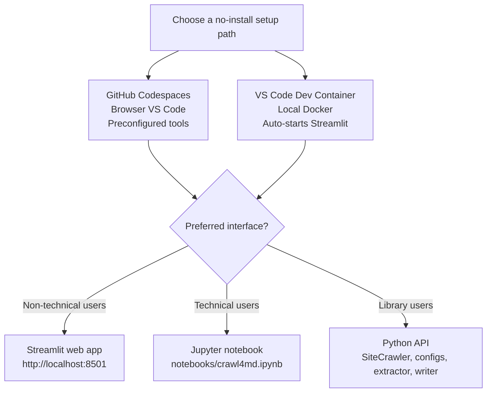

# Installation

← Back to [README](../README.md)

Requires Python 3.10+ (3.12 or 3.13 recommended).

## Run without installing anything

The easiest way to get started is via a pre-configured environment — no Python,
Chromium, or Tesseract setup required.



**GitHub Codespaces (browser, zero local install)**
Click the Codespaces badge in the [README](../README.md). GitHub spins up a fully
configured VS Code environment in your browser. Free tier: 120 core-hours/month.

**VS Code Dev Container (local Docker)**
1. Install [Docker Desktop](https://www.docker.com/products/docker-desktop/) and the [Dev Containers](https://marketplace.visualstudio.com/items?itemName=ms-vscode-remote.remote-containers) VS Code extension.
2. Open this folder in VS Code.
3. Click **Reopen in Container** in the notification, or run `Cmd/Ctrl+Shift+P` → **Dev Containers: Reopen in Container**.
4. First start takes ~5 minutes (pulls base image, installs Tesseract, Chromium, and Python packages). Subsequent opens are fast.
5. For non-technical users, open the Streamlit web app at `http://localhost:8501`; it starts automatically when VS Code attaches to the container. Technical users can also open `notebooks/crawl4md.ipynb`, select the in-container Python 3.12 kernel, and run the cells.

## Local install

The pip distribution is `rag-playground`. Install it from a clone. The **base
install pulls no third-party packages** (the `artifact_store` library is pure
standard library) — add the extra(s) for the component you need.

```bash
# Everything (all libraries + dev tools) plus the Streamlit app:
pip install -e ".[dev,all]" -e "apps/streamlit[dev]"
```

If you installed the `crawl` or `all` extra, finish the **crawler** setup once (it
drives a real browser):

```bash
crawl4ai-setup                          # one-time browser setup
playwright install --with-deps chromium # install Chromium for JS rendering
```

### Install only what you need

Each component is opt-in, so you never download the crawler's browser stack just to
build a vector index:

| Install | Gives you | Heavy crawler stack? |
|---|---|---|
| `pip install -e .` | `artifact_store` helpers (pure stdlib) | No |
| `pip install -e ".[crawl]"` | `crawl4md` crawler | Yes |
| `pip install -e ".[vector]"` | `vector_indexer` + offline embeddings | No |
| `pip install -e ".[vector,bedrock]"` | + Amazon Titan embeddings | No |
| `pip install -e ".[vector,openai]"` | + OpenAI embeddings | No |
| `pip install -e ".[vector,rag]"` | `rag_engine` — RAG Q&A / chat (offline echo model) | No |
| `pip install -e ".[all]"` | every library + backend | Yes |

Remember to import the library names (`crawl4md`, `vector_indexer`, `rag_engine`,
`artifact_store`), not the distribution name. Add `dev` to any of the above for
pytest/ruff, e.g. `pip install -e ".[dev,vector]"`.

### Optional extras

Every library is an opt-in extra so each install stays lightweight:

| Extra | Adds | Used for |
|---|---|---|
| `crawl` | `crawl4ai`, `trafilatura`, `markdownify`, `beautifulsoup4`, `mdformat`, `mdformat-gfm`, `nest-asyncio`, `httpx`, `pydantic`, `pymupdf4llm` | crawling + Markdown extraction (Step 1) |
| `vector` | `langchain-chroma` (pulls `chromadb`), `langchain-text-splitters`, `langchain-core`, `pydantic` | chunking + vector store (Step 2) |
| `bedrock` | `langchain-aws` (pulls `boto3`) | Amazon Titan embeddings **and** Bedrock chat models |
| `openai` | `langchain-openai` (pulls `openai`) | OpenAI embeddings **and** chat models |
| `rag` | `langchain` (umbrella), `langchain-core`, `pydantic` | retrieval + QA + conversational RAG (Steps 3-5) |
| `all` | `crawl` + `vector` + `bedrock` + `openai` + `rag` | the full playground |
| `dev` | `pytest`, `pytest-asyncio`, `pytest-cov`, `ruff`, `ipykernel` | tests, lint, notebook kernel |

Cloud credentials are read from the environment. Copy
[`.env.example`](../.env.example) to `.env` and set `AWS_*` / `OPENAI_API_KEY`; the
Streamlit app loads the repo-root `.env` automatically on startup. In Codespaces/CI,
provide them as environment secrets/variables instead. The offline default embedding
model needs no credentials, and without chat credentials `rag_engine` falls back to an
offline echo model so Steps 3-5 still run end-to-end.

> **Warning — Python 3.14 users (discovered 2026-04-20):**
> `crawl4ai==0.8.6` pins `lxml~=5.3`, but no `lxml` 5.x pre-built wheel exists for Python 3.14.
> pip will try to compile lxml from source and fail with:
> `error: Microsoft Visual C++ 14.0 or greater is required.`
>
> **Recommended fix:** use Python 3.12 or 3.13, where lxml 5.x wheels are available.
>
> **Workaround if you must use Python 3.14:**
> ```bash
> pip install -e ".[crawl]" --no-deps
> pip install --only-binary lxml crawl4ai trafilatura markdownify pydantic nest-asyncio "chardet<6,>=5.2.0" beautifulsoup4 mdformat mdformat-gfm pymupdf4llm httpx --no-deps
> # then install the remaining transitive deps via pip as needed
> ```
> lxml 6.x (already available for 3.14) is API-compatible and works at runtime despite the version conflict warning.

## Notebook usage

The Jupyter Notebook is available for technical users who want to inspect or adjust
the Python workflow step by step. Non-technical users should use the Streamlit app
instead.

See `notebooks/crawl4md.ipynb` for a guided, step-by-step notebook. You can also run
it directly in Google Colab:

[](https://colab.research.google.com/github/prakosd/rag-playground/blob/master/notebooks/crawl4md.ipynb)
