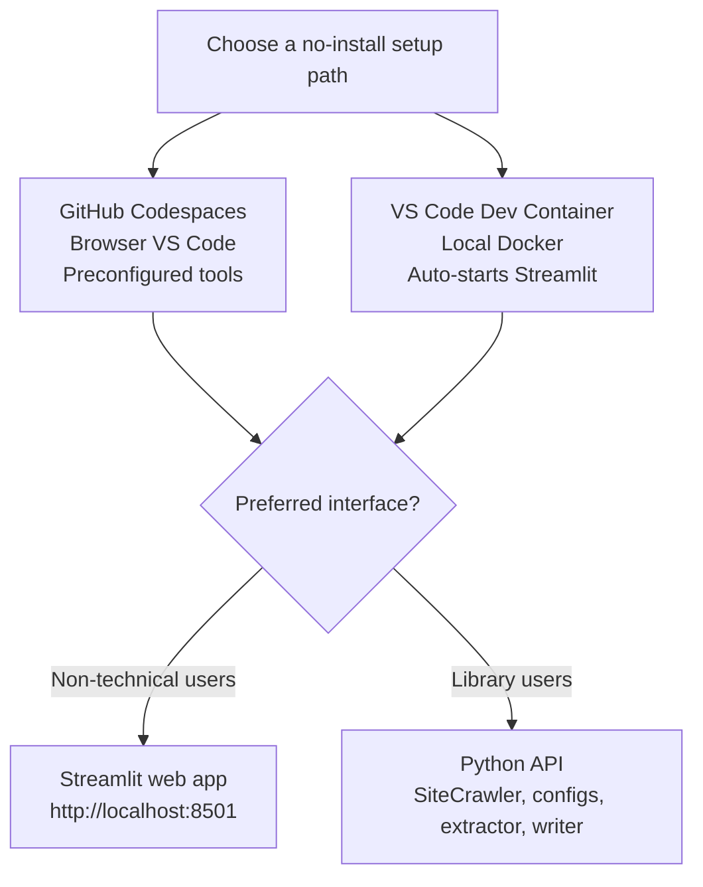

# Installation

← Back to [README](../README.md)

Requires Python 3.10+ (3.12 or 3.13 recommended).

## Try the hosted demo (no install)

A hosted instance runs on Streamlit Community Cloud at
**<https://rag-playground-prakosd.streamlit.app/>** — open it in a browser to try Steps 1–5 with
no setup. It answers with the offline echo model unless cloud credentials are configured, and its
resources are shared and limited, so keep to a small crawl and index for a quick tour. To skip
crawling and indexing entirely, use the in-app **Output Files → Sample data** panel to import a
ready-made crawl or vector index and jump straight to Steps 3–5.

## Run without installing anything

The easiest way to get started is via a pre-configured environment — no Python,
Chromium, or Tesseract setup required.


```mermaid
flowchart TD
  Start["Choose a no-install setup path"] --> Codespaces["GitHub Codespaces<br/>Browser VS Code<br/>Preconfigured tools"]
  Start --> DevContainer["VS Code Dev Container<br/>Local Docker<br/>Auto-starts Streamlit"]
  Codespaces --> UseCase{"Preferred interface?"}
  DevContainer --> UseCase
  UseCase -->|Non-technical users| Streamlit["Streamlit web app<br/>http://localhost:8501"]
  UseCase -->|Library users| PythonAPI["Python API<br/>SiteCrawler, configs, extractor, writer"]
```

**GitHub Codespaces (browser, zero local install)**
Click the Codespaces badge in the [README](../README.md). GitHub spins up a fully
configured VS Code environment in your browser. Free tier: 120 core-hours/month.

**VS Code Dev Container (local Docker)**
1. Install [Docker Desktop](https://www.docker.com/products/docker-desktop/) and the [Dev Containers](https://marketplace.visualstudio.com/items?itemName=ms-vscode-remote.remote-containers) VS Code extension.
2. Open this folder in VS Code.
3. Click **Reopen in Container** in the notification, or run `Cmd/Ctrl+Shift+P` → **Dev Containers: Reopen in Container**.
4. First start takes ~5 minutes (pulls base image, installs Tesseract, Chromium, and Python packages). Subsequent opens are fast.
5. For non-technical users, open the Streamlit web app at `http://localhost:8501`; it starts automatically when VS Code attaches to the container.

## Local install

The pip distribution is `rag-playground`. Install it from a clone. The **base
install pulls no third-party packages** (the `artifact_store` library is pure
standard library) — add the extra(s) for the component you need.

### One-command setup

For the full development environment (all libraries + the Streamlit app + the
crawler browser), the bundled task runner does every step below in one go:

```bash
python dev.py install   # create .venv, pip install, playwright, crawl4ai-setup
python dev.py run       # launch the Streamlit app
```

`dev.py` uses only the standard library, so it runs before any dependency is
installed. The manual steps below are the equivalent for a partial install or
when you want more control.

### Manual install

Work in an isolated virtualenv so the editable installs stay separate from any
system or Conda environment:

```bash
python3 -m venv .venv          # Python 3.10+ (3.12/3.13 recommended)
source .venv/bin/activate      # Windows: .venv\Scripts\activate
python -m pip install --upgrade pip
```

```bash
# Everything (all libraries + dev tools) plus the Streamlit app:
pip install -e ".[dev,all]" -e "apps/streamlit[dev]"
```

If you installed the `crawl` or `all` extra, finish the **crawler** setup once (it
drives a real browser):

```bash
crawl4ai-setup                          # one-time browser setup
playwright install --with-deps chromium # install Chromium for JS rendering
```

> On **macOS** (and other non-Debian hosts) drop `--with-deps` — it installs
> Debian/Ubuntu system packages and is not supported there, so run
> `playwright install chromium` instead.

### Install only what you need

Each component is opt-in, so you never download the crawler's browser stack just to
build a vector index:

| Install | Gives you | Heavy crawler stack? |
|---|---|---|
| `pip install -e .` | `artifact_store` helpers (pure stdlib) | No |
| `pip install -e ".[crawl]"` | `crawl4md` crawler | Yes |
| `pip install -e ".[vector]"` | `vector_indexer` + offline embeddings | No |
| `pip install -e ".[vector,bedrock]"` | + Amazon Titan embeddings | No |
| `pip install -e ".[vector,openai]"` | + OpenAI embeddings | No |
| `pip install -e ".[vector,rag]"` | `rag_engine` — RAG Q&A / chat (offline echo model) | No |
| `pip install -e ".[vector,rag,rerank]"` | + Step 5 local cross-encoder re-ranker | Yes (model) |
| `pip install -e ".[all]"` | every library + backend | Yes |

Remember to import the library names (`crawl4md`, `vector_indexer`, `rag_engine`,
`artifact_store`), not the distribution name. Add `dev` to any of the above for
pytest/ruff, e.g. `pip install -e ".[dev,vector]"`.

### Optional extras

Every library is an opt-in extra so each install stays lightweight:

| Extra | Adds | Used for |
|---|---|---|
| `crawl` | `crawl4ai`, `trafilatura`, `markdownify`, `beautifulsoup4`, `mdformat`, `mdformat-gfm`, `httpx`, `truststore`, `pydantic`, `pymupdf4llm` (pulls `pymupdf`), `mammoth` | crawling + Markdown extraction, incl. PDF/DOCX (Step 1) |
| `vector` | `langchain-chroma` (pulls `chromadb`), `langchain-text-splitters`, `langchain-core`, `pydantic` | chunking + vector store (Step 2) |
| `bedrock` | `langchain-aws` (pulls `boto3`) | Amazon Titan embeddings **and** Bedrock chat models |
| `openai` | `langchain-openai` (pulls `openai`) | OpenAI embeddings **and** chat models |
| `rag` | `langchain` (umbrella), `langchain-core`, `pydantic` | retrieval + QA + conversational RAG (Steps 3-5) |
| `rerank` | `sentence-transformers` (pulls `torch`) | Step 5 local cross-encoder re-ranker (heavy; the LLM/off re-rankers need it not) |
| `all` | `crawl` + `vector` + `bedrock` + `openai` + `rag` + `rerank` + `s3` | the full playground |
| `dev` | `pytest`, `pytest-asyncio`, `pytest-cov`, `ruff` | tests, lint |

The extras are **audited to stay atomic**: every package listed above is imported by
the component it belongs to (no unused dependencies), and each feature's libraries
live only in its own extra — so the base install stays dependency-free and you never
pull a library a component doesn't use.

Cloud credentials are read from the environment. Copy
[`.env.example`](../.env.example) to `.env` (git-ignored) and set `AWS_*` /
`OPENAI_API_KEY`; the Streamlit app loads the repo-root `.env` automatically on
startup. Non-secret, deployment-tunable defaults live separately in the committed
[`.env.defaults`](../.env.defaults) (loaded by `app_support.settings`) — see
[CONFIGURATION.md](CONFIGURATION.md#environment-configuration--secrets-streamlit-app).
In Codespaces/CI, provide credentials as environment secrets/variables instead; on
Streamlit Community Cloud, paste them into the Secrets console (template:
[`.streamlit/secrets.toml.example`](../.streamlit/secrets.toml.example)). The offline
default embedding model needs no credentials, and without chat credentials
`rag_engine` falls back to an offline echo model so Steps 3-5 still run end-to-end.

> **Note — protobuf/chromadb on Streamlit Cloud:** vector indexing can abort with
> "Descriptors cannot be created directly" when a fresh build resolves a `protobuf`
> runtime newer than the chromadb/opentelemetry generated `*_pb2` code. To prevent
> this, [`apps/streamlit/requirements.txt`](../apps/streamlit/requirements.txt) pins
> `protobuf` to the supported range (`>=5,<7`). The app also sets
> `PROTOCOL_BUFFERS_PYTHON_IMPLEMENTATION=python` at the top of
> `apps/streamlit/streamlit_app.py` as a best-effort fallback — effective only when that
> module is imported before protobuf; under `streamlit run` Streamlit imports protobuf
> first, so the pin is the reliable fix (which is why module imports in that file follow
> the env-var statement and ruff `E402` is ignored there). Both are handled for you — no
> action needed.

> **Warning — Python 3.14 users (discovered 2026-04-20):**
> `crawl4ai==0.8.6` pins `lxml~=5.3`, but no `lxml` 5.x pre-built wheel exists for Python 3.14.
> pip will try to compile lxml from source and fail with:
> `error: Microsoft Visual C++ 14.0 or greater is required.`
>
> **Recommended fix:** use Python 3.12 or 3.13, where lxml 5.x wheels are available.
>
> **Workaround if you must use Python 3.14:**
> ```bash
> pip install -e ".[crawl]" --no-deps
> pip install --only-binary lxml crawl4ai trafilatura markdownify pydantic "chardet<6,>=5.2.0" beautifulsoup4 mdformat mdformat-gfm pymupdf4llm httpx --no-deps
> # then install the remaining transitive deps via pip as needed
> ```
> lxml 6.x (already available for 3.14) is API-compatible and works at runtime despite the version conflict warning.
